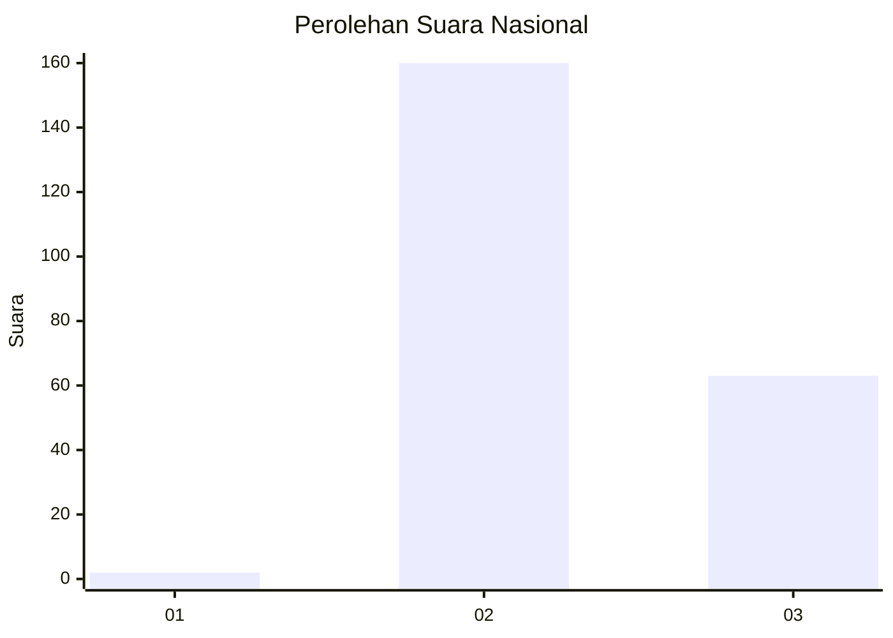
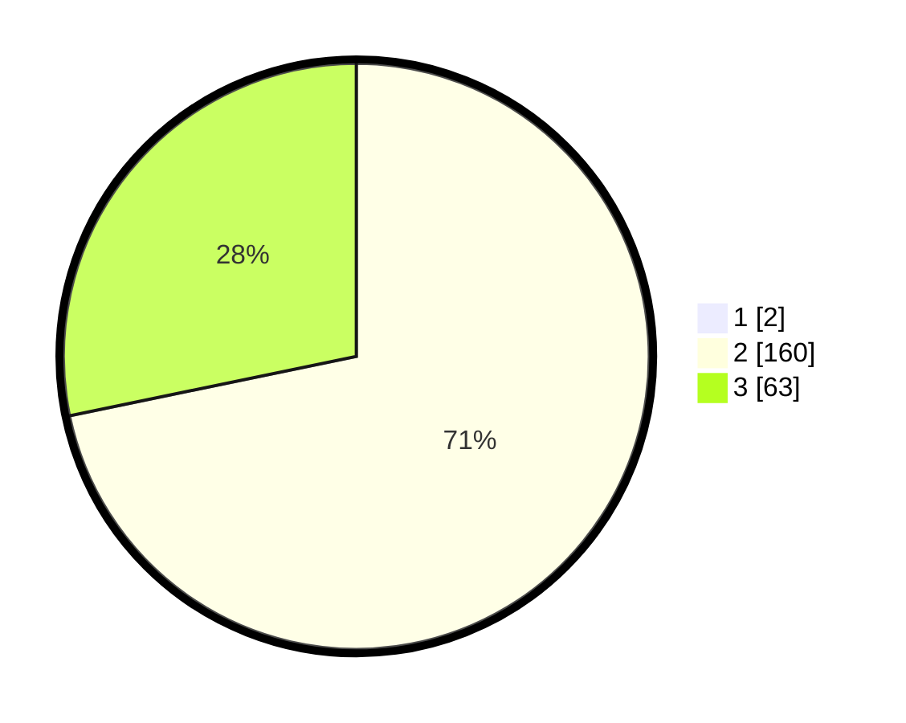

# Hasil

## Grafik

## Tabel

| No. | Nama Paslon    | Suara | Suara (raw) | Persentase |
|:--- |:-------------- | -----:| -----------:| ----------:|
| 1   | ANIES MUHAIMIN | 2     | [2][p-1]    | 0,89       |
| 2   | PRABOWO GIBRAN | 160   | [160][p-2]  | 71,11      |
| 3   | GANJAR MAHFUD  | 63    | [63][p-3]   | 28,00      |

[p-1]: https://github.com/gigit-pemilu/pemilu-2024/blob/main/pilpres/hitung-suara/sub/51-bali/sub/08-buleleng/sub/06-buleleng/sub/1019-banyuning/sub/010-tps/sub/paslon-1.txt
[p-2]: https://github.com/gigit-pemilu/pemilu-2024/blob/main/pilpres/hitung-suara/sub/51-bali/sub/08-buleleng/sub/06-buleleng/sub/1019-banyuning/sub/010-tps/sub/paslon-2.txt
[p-3]: https://github.com/gigit-pemilu/pemilu-2024/blob/main/pilpres/hitung-suara/sub/51-bali/sub/08-buleleng/sub/06-buleleng/sub/1019-banyuning/sub/010-tps/sub/paslon-3.txt

## Foto C Plano

https://sirekap-obj-formc.kpu.go.id/81a8/pemilu/ppwp/51/08/06/10/19/5108061019010-20240214-232539--2b42bc42-d6af-43c9-93d1-cc6236f17229.jpg

https://sirekap-obj-formc.kpu.go.id/81a8/pemilu/ppwp/51/08/06/10/19/5108061019010-20240214-232708--dea59e0f-e96a-4f83-a258-7af47ad2f637.jpg

https://sirekap-obj-formc.kpu.go.id/81a8/pemilu/ppwp/51/08/06/10/19/5108061019010-20240214-232751--60b6b201-9e11-434f-bf35-e0c24d9a1300.jpg

## Metadata

| Key        | Value               |
| ---------- | ------------------- |
| Time Stamp | 2024-02-15 12:00:28 |

