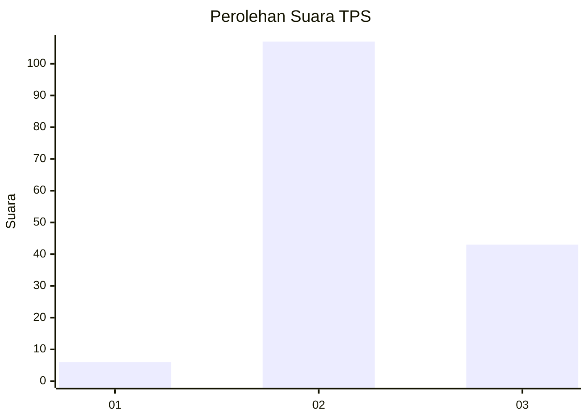
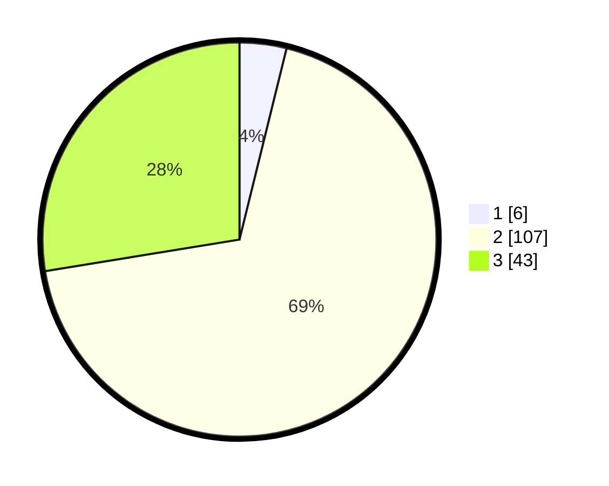

# Hasil

## Grafik

## Tabel

| No. | Nama Paslon    | Suara | Suara (raw) | Persentase |
|:--- |:-------------- | -----:| -----------:| ----------:|
| 1   | ANIES MUHAIMIN | 6     | [6][p-1]    | 3,85       |
| 2   | PRABOWO GIBRAN | 107   | [107][p-2]  | 68,59      |
| 3   | GANJAR MAHFUD  | 43    | [43][p-3]   | 27,56      |

[p-1]: https://github.com/gigit-pemilu/pemilu-2024-51-bali/blob/main/pilpres/hitung-suara/sub/51-bali/sub/08-buleleng/sub/06-buleleng/sub/1019-banyuning/sub/018-tps/sub/paslon-1.txt
[p-2]: https://github.com/gigit-pemilu/pemilu-2024-51-bali/blob/main/pilpres/hitung-suara/sub/51-bali/sub/08-buleleng/sub/06-buleleng/sub/1019-banyuning/sub/018-tps/sub/paslon-2.txt
[p-3]: https://github.com/gigit-pemilu/pemilu-2024-51-bali/blob/main/pilpres/hitung-suara/sub/51-bali/sub/08-buleleng/sub/06-buleleng/sub/1019-banyuning/sub/018-tps/sub/paslon-3.txt

## Foto C Plano

https://sirekap-obj-formc.kpu.go.id/e03f/pemilu/ppwp/51/08/06/10/19/5108061019018-20240214-233505--f9d9c35b-99d7-405d-bfe4-9d07942442d5.jpg

https://sirekap-obj-formc.kpu.go.id/e03f/pemilu/ppwp/51/08/06/10/19/5108061019018-20240214-233619--d9d1750d-b6d8-484c-a125-66a71c558fe9.jpg

https://sirekap-obj-formc.kpu.go.id/e03f/pemilu/ppwp/51/08/06/10/19/5108061019018-20240214-233738--75dddc39-77f4-41ed-a9b1-e5ac0d11a339.jpg

## Metadata

| Key        | Value               |
| ---------- | ------------------- |
| Time Stamp | 2024-02-24 22:31:28 |

