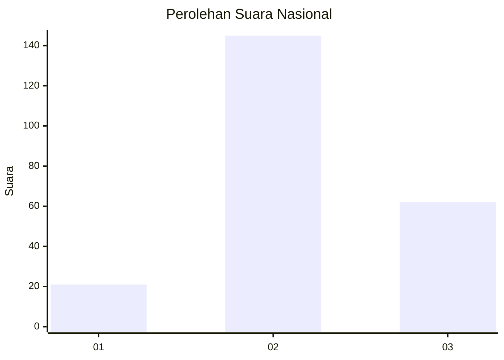
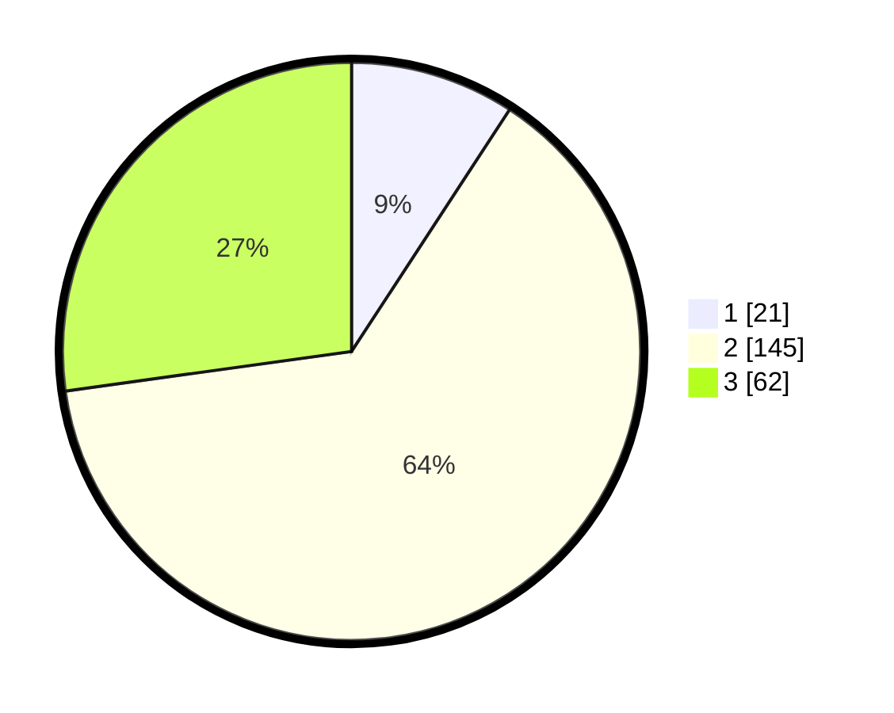

# Hasil

## Grafik

## Tabel

| No. | Nama Paslon    | Suara | Suara (raw) | Persentase |
|:--- |:-------------- | -----:| -----------:| ----------:|
| 1   | ANIES MUHAIMIN | 21    | [21][p-1]   | 9,21       |
| 2   | PRABOWO GIBRAN | 145   | [145][p-2]  | 63,60      |
| 3   | GANJAR MAHFUD  | 62    | [62][p-3]   | 27,19      |

[p-1]: https://github.com/gigit-pemilu/pemilu-2024/blob/main/pilpres/hitung-suara/sub/51-bali/sub/08-buleleng/sub/06-buleleng/sub/1019-banyuning/sub/021-tps/sub/paslon-1.txt
[p-2]: https://github.com/gigit-pemilu/pemilu-2024/blob/main/pilpres/hitung-suara/sub/51-bali/sub/08-buleleng/sub/06-buleleng/sub/1019-banyuning/sub/021-tps/sub/paslon-2.txt
[p-3]: https://github.com/gigit-pemilu/pemilu-2024/blob/main/pilpres/hitung-suara/sub/51-bali/sub/08-buleleng/sub/06-buleleng/sub/1019-banyuning/sub/021-tps/sub/paslon-3.txt

## Foto C Plano

https://sirekap-obj-formc.kpu.go.id/90cd/pemilu/ppwp/51/08/06/10/19/5108061019021-20240214-221323--662d947e-c25d-488d-8770-2c35758b29ee.jpg

https://sirekap-obj-formc.kpu.go.id/90cd/pemilu/ppwp/51/08/06/10/19/5108061019021-20240214-221410--74235e93-c144-40c5-acdc-4da980aea89b.jpg

https://sirekap-obj-formc.kpu.go.id/90cd/pemilu/ppwp/51/08/06/10/19/5108061019021-20240214-221427--adee58bb-1b56-4f75-b51e-377f240c12ec.jpg

## Metadata

| Key        | Value               |
| ---------- | ------------------- |
| Time Stamp | 2024-02-15 20:30:46 |

## DATA PEMILIH TETAP

Jumlah pemilih dalam DPT: **284**.
 * L: **141**.
 * P: **143**.

## DATA PENGGUNA HAK PILIH

Jumlah pengguna hak pilih dalam DPT: **216**.
 * L: **108**.
 * P: **108**.

Jumlah pengguna hak pilih dalam DPTb: **8**.
 * L: **2**.
 * P: **6**.

Jumlah pengguna hak pilih dalam DPK: **5**.
 * L: **1**.
 * P: **4**.

Jumlah pengguna hak pilih: **229**.
 * L: **111**.
 * P: **118**.

## JUMLAH SUARA SAH DAN TIDAK SAH

JUMLAH SELURUH SUARA SAH: **228**.

JUMLAH SUARA TIDAK SAH: **1**.

JUMLAH SELURUH SUARA SAH DAN SUARA TIDAK SAH: **229**.

