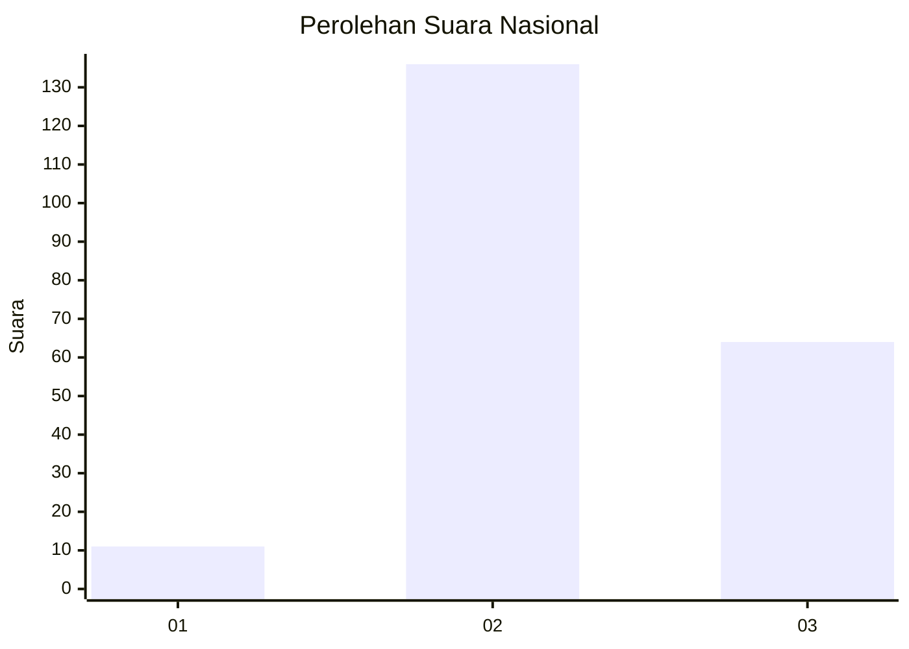

# Hasil

## Grafik

## Tabel

| No. | Nama Paslon    | Suara | Suara (raw) | Persentase |
|:--- |:-------------- | -----:| -----------:| ----------:|
| 1   | ANIES MUHAIMIN | 11    | [11][p-1]   | 5,21       |
| 2   | PRABOWO GIBRAN | 136   | [136][p-2]  | 64,45      |
| 3   | GANJAR MAHFUD  | 64    | [64][p-3]   | 30,33      |

[p-1]: https://github.com/gigit-pemilu/pemilu-2024/blob/main/pilpres/hitung-suara/sub/51-bali/sub/08-buleleng/sub/06-buleleng/sub/1019-banyuning/sub/023-tps/sub/paslon-1.txt
[p-2]: https://github.com/gigit-pemilu/pemilu-2024/blob/main/pilpres/hitung-suara/sub/51-bali/sub/08-buleleng/sub/06-buleleng/sub/1019-banyuning/sub/023-tps/sub/paslon-2.txt
[p-3]: https://github.com/gigit-pemilu/pemilu-2024/blob/main/pilpres/hitung-suara/sub/51-bali/sub/08-buleleng/sub/06-buleleng/sub/1019-banyuning/sub/023-tps/sub/paslon-3.txt

## Foto C Plano

https://sirekap-obj-formc.kpu.go.id/f930/pemilu/ppwp/51/08/06/10/19/5108061019023-20240215-002914--089326ee-24ec-4f2b-8a1d-06968e3a4696.jpg

https://sirekap-obj-formc.kpu.go.id/f930/pemilu/ppwp/51/08/06/10/19/5108061019023-20240214-232014--bcc6f187-76d7-4341-b2d5-1756cc154543.jpg

https://sirekap-obj-formc.kpu.go.id/f930/pemilu/ppwp/51/08/06/10/19/5108061019023-20240214-232033--153c0af9-c4c2-4f32-91ca-1a09d077b2d7.jpg

## Metadata

| Key        | Value               |
| ---------- | ------------------- |
| Time Stamp | 2024-02-24 22:31:28 |

