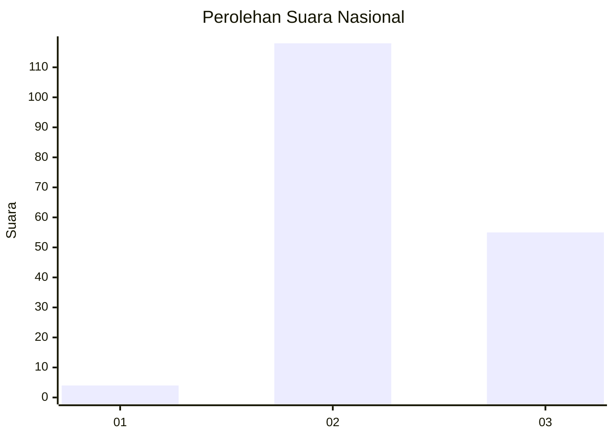
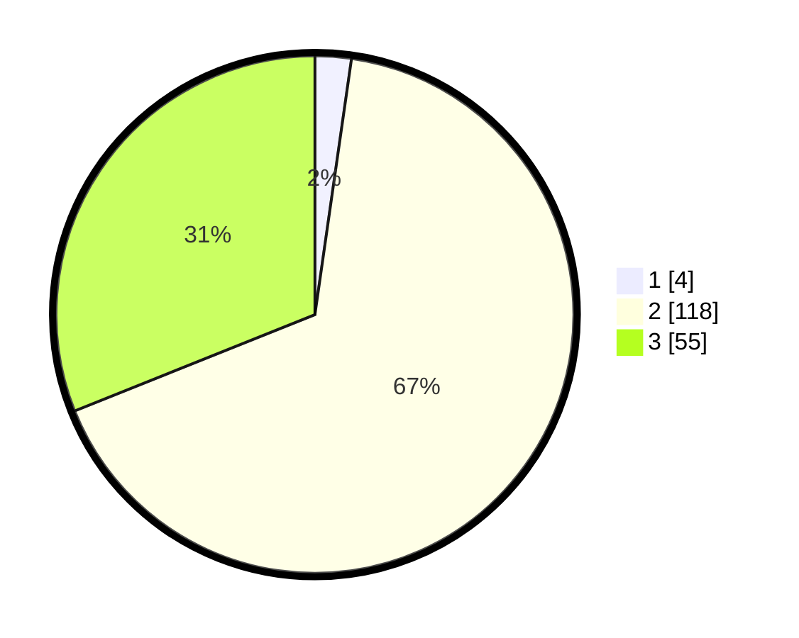

# Hasil

## Grafik

## Tabel

| No. | Nama Paslon    | Suara | Suara (raw) | Persentase |
|:--- |:-------------- | -----:| -----------:| ----------:|
| 1   | ANIES MUHAIMIN | 4     | [4][p-1]    | 2,26       |
| 2   | PRABOWO GIBRAN | 118   | [118][p-2]  | 66,67      |
| 3   | GANJAR MAHFUD  | 55    | [55][p-3]   | 31,07      |

[p-1]: https://github.com/gigit-pemilu/pemilu-2024/blob/main/pilpres/hitung-suara/sub/51-bali/sub/08-buleleng/sub/06-buleleng/sub/1019-banyuning/sub/030-tps/sub/paslon-1.txt
[p-2]: https://github.com/gigit-pemilu/pemilu-2024/blob/main/pilpres/hitung-suara/sub/51-bali/sub/08-buleleng/sub/06-buleleng/sub/1019-banyuning/sub/030-tps/sub/paslon-2.txt
[p-3]: https://github.com/gigit-pemilu/pemilu-2024/blob/main/pilpres/hitung-suara/sub/51-bali/sub/08-buleleng/sub/06-buleleng/sub/1019-banyuning/sub/030-tps/sub/paslon-3.txt

## Foto C Plano

https://sirekap-obj-formc.kpu.go.id/213a/pemilu/ppwp/51/08/06/10/19/5108061019030-20240215-001304--82d70487-06c1-41a5-8294-9a13a00d00c7.jpg

https://sirekap-obj-formc.kpu.go.id/213a/pemilu/ppwp/51/08/06/10/19/5108061019030-20240214-213710--27975f0d-f1a4-41c6-b20d-d29ec17597cb.jpg

https://sirekap-obj-formc.kpu.go.id/213a/pemilu/ppwp/51/08/06/10/19/5108061019030-20240214-213849--fac030ce-b65d-493b-86d6-008807ee2dee.jpg

## Metadata

| Key        | Value               |
| ---------- | ------------------- |
| Time Stamp | 2024-02-24 22:31:28 |

