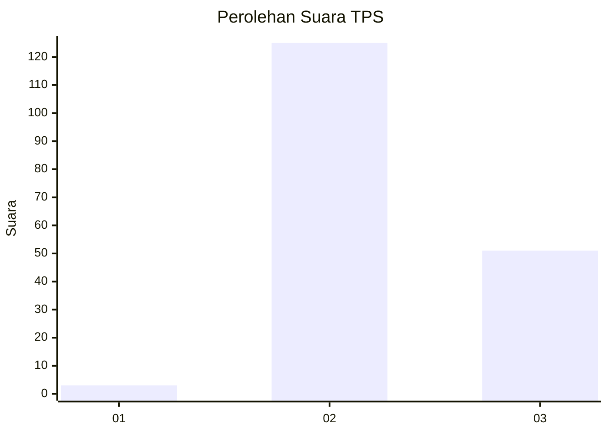
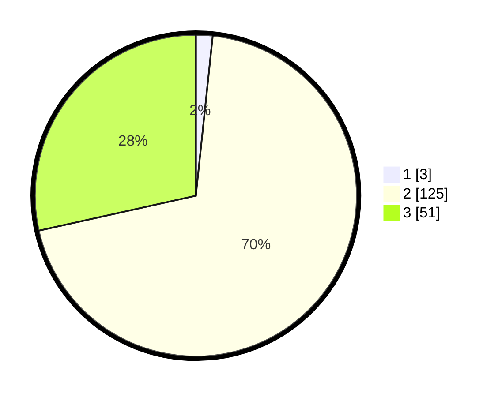

# Hasil

## Grafik

## Tabel

| No. | Nama Paslon    | Suara | Suara (raw) | Persentase |
|:--- |:-------------- | -----:| -----------:| ----------:|
| 1   | ANIES MUHAIMIN | 3     | [3][p-1]    | 1,68       |
| 2   | PRABOWO GIBRAN | 125   | [125][p-2]  | 69,83      |
| 3   | GANJAR MAHFUD  | 51    | [51][p-3]   | 28,49      |

[p-1]: https://github.com/gigit-pemilu/pemilu-2024-51-bali/blob/main/pilpres/hitung-suara/sub/51-bali/sub/08-buleleng/sub/06-buleleng/sub/1019-banyuning/sub/035-tps/sub/paslon-1.txt
[p-2]: https://github.com/gigit-pemilu/pemilu-2024-51-bali/blob/main/pilpres/hitung-suara/sub/51-bali/sub/08-buleleng/sub/06-buleleng/sub/1019-banyuning/sub/035-tps/sub/paslon-2.txt
[p-3]: https://github.com/gigit-pemilu/pemilu-2024-51-bali/blob/main/pilpres/hitung-suara/sub/51-bali/sub/08-buleleng/sub/06-buleleng/sub/1019-banyuning/sub/035-tps/sub/paslon-3.txt

## Foto C Plano

https://sirekap-obj-formc.kpu.go.id/bd82/pemilu/ppwp/51/08/06/10/19/5108061019035-20240214-232540--631a512f-e5ca-4063-b547-09d861c68318.jpg

https://sirekap-obj-formc.kpu.go.id/bd82/pemilu/ppwp/51/08/06/10/19/5108061019035-20240214-232056--d7845ca9-2ee2-4639-afeb-b46378e00730.jpg

https://sirekap-obj-formc.kpu.go.id/bd82/pemilu/ppwp/51/08/06/10/19/5108061019035-20240214-232148--38395062-11a3-4c42-ac45-deb6c1e2c352.jpg

## Metadata

| Key        | Value               |
| ---------- | ------------------- |
| Time Stamp | 2024-02-24 22:31:28 |

