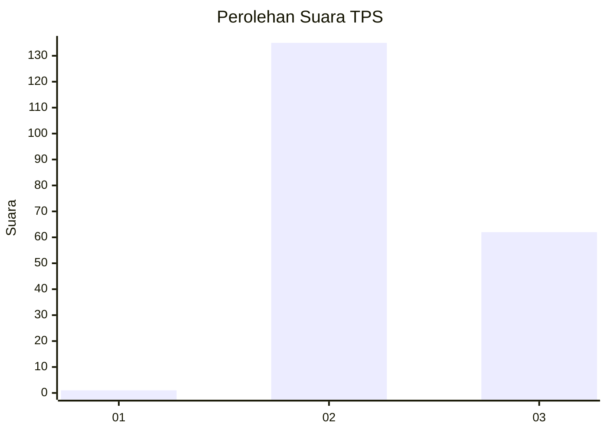
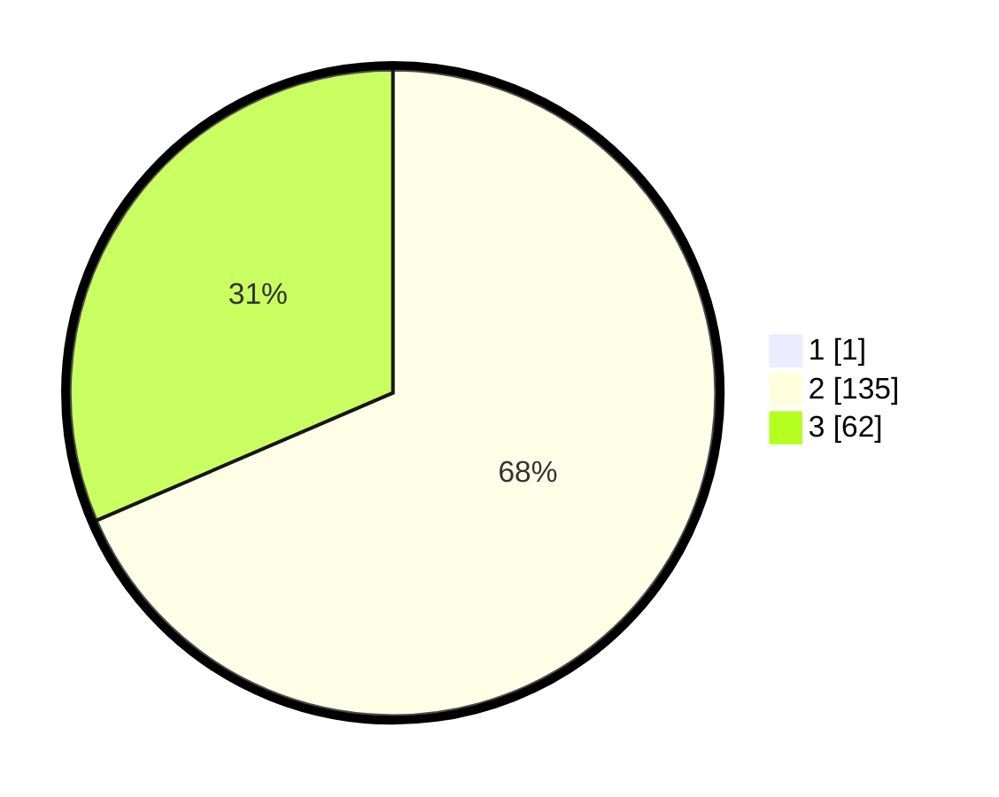

# Hasil

## Grafik

## Tabel

| No. | Nama Paslon    | Suara | Suara (raw) | Persentase |
|:--- |:-------------- | -----:| -----------:| ----------:|
| 1   | ANIES MUHAIMIN | 1     | [1][p-1]    | 0,51       |
| 2   | PRABOWO GIBRAN | 135   | [135][p-2]  | 68,18      |
| 3   | GANJAR MAHFUD  | 62    | [62][p-3]   | 31,31      |

[p-1]: https://github.com/gigit-pemilu/pemilu-2024-51-bali/blob/main/pilpres/hitung-suara/sub/51-bali/sub/08-buleleng/sub/06-buleleng/sub/1019-banyuning/sub/041-tps/sub/paslon-1.txt
[p-2]: https://github.com/gigit-pemilu/pemilu-2024-51-bali/blob/main/pilpres/hitung-suara/sub/51-bali/sub/08-buleleng/sub/06-buleleng/sub/1019-banyuning/sub/041-tps/sub/paslon-2.txt
[p-3]: https://github.com/gigit-pemilu/pemilu-2024-51-bali/blob/main/pilpres/hitung-suara/sub/51-bali/sub/08-buleleng/sub/06-buleleng/sub/1019-banyuning/sub/041-tps/sub/paslon-3.txt

## Foto C Plano

https://sirekap-obj-formc.kpu.go.id/7540/pemilu/ppwp/51/08/06/10/19/5108061019041-20240214-141643--096f31cc-9a16-4218-8296-829daedab20f.jpg

https://sirekap-obj-formc.kpu.go.id/7540/pemilu/ppwp/51/08/06/10/19/5108061019041-20240215-125448--1c793557-c5fa-44fc-8f56-a339de6963a0.jpg

https://sirekap-obj-formc.kpu.go.id/7540/pemilu/ppwp/51/08/06/10/19/5108061019041-20240215-125542--fefc391e-f379-45db-adcf-d834f6e62225.jpg

## Metadata

| Key        | Value               |
| ---------- | ------------------- |
| Time Stamp | 2024-02-24 22:31:28 |

