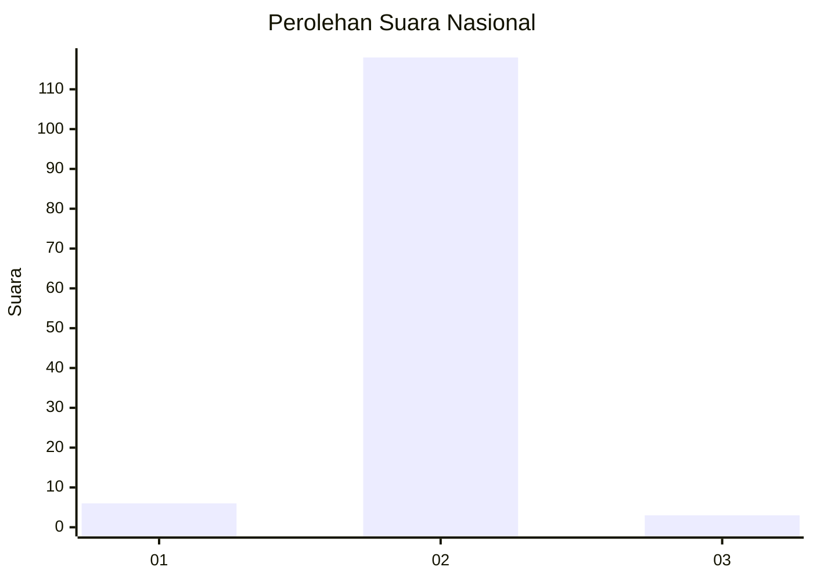
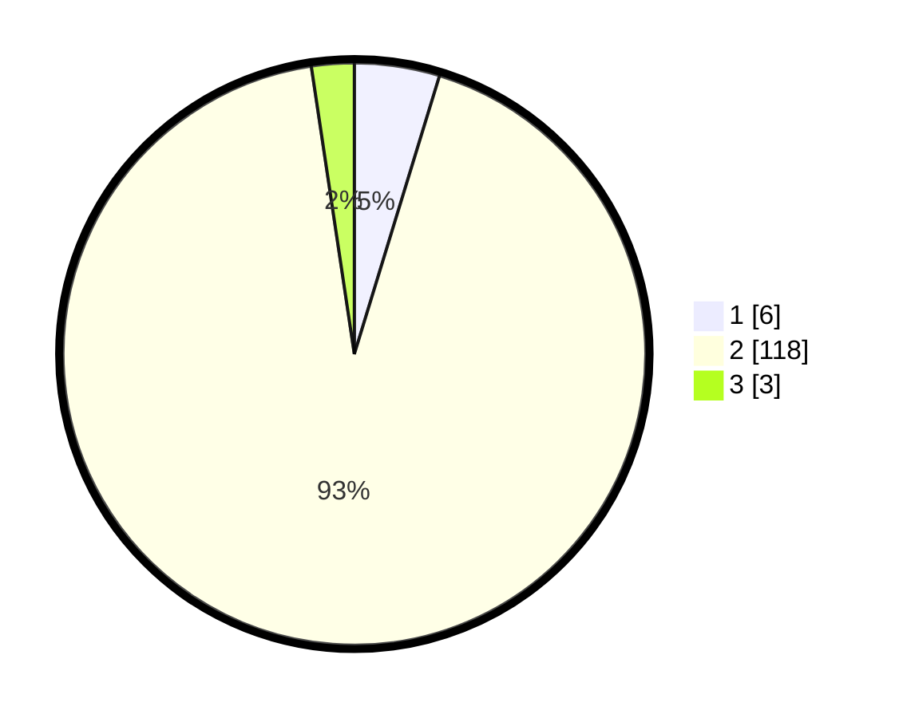

# Hasil

## Grafik

## Tabel

| No. | Nama Paslon    | Suara | Suara (raw) | Persentase |
|:--- |:-------------- | -----:| -----------:| ----------:|
| 1   | ANIES MUHAIMIN | 6     | [6][p-1]    | 4,72       |
| 2   | PRABOWO GIBRAN | 118   | [118][p-2]  | 92,91      |
| 3   | GANJAR MAHFUD  | 3     | [3][p-3]    | 2,36       |

[p-1]: https://github.com/gigit-pemilu/pemilu-2024/blob/main/pilpres/hitung-suara/sub/51-bali/sub/08-buleleng/sub/06-buleleng/sub/1019-banyuning/sub/051-tps/sub/paslon-1.txt
[p-2]: https://github.com/gigit-pemilu/pemilu-2024/blob/main/pilpres/hitung-suara/sub/51-bali/sub/08-buleleng/sub/06-buleleng/sub/1019-banyuning/sub/051-tps/sub/paslon-2.txt
[p-3]: https://github.com/gigit-pemilu/pemilu-2024/blob/main/pilpres/hitung-suara/sub/51-bali/sub/08-buleleng/sub/06-buleleng/sub/1019-banyuning/sub/051-tps/sub/paslon-3.txt

## Foto C Plano

https://sirekap-obj-formc.kpu.go.id/17e9/pemilu/ppwp/51/08/06/10/19/5108061019051-20240214-141708--dbe3ebea-7d6d-4d52-b88e-bed9eb9546c1.jpg

https://sirekap-obj-formc.kpu.go.id/17e9/pemilu/ppwp/51/08/06/10/19/5108061019051-20240214-141816--4a923215-1f50-47ae-8da6-1ec3125d7465.jpg

## Metadata

| Key        | Value               |
| ---------- | ------------------- |
| Time Stamp | 2024-02-24 22:31:28 |

