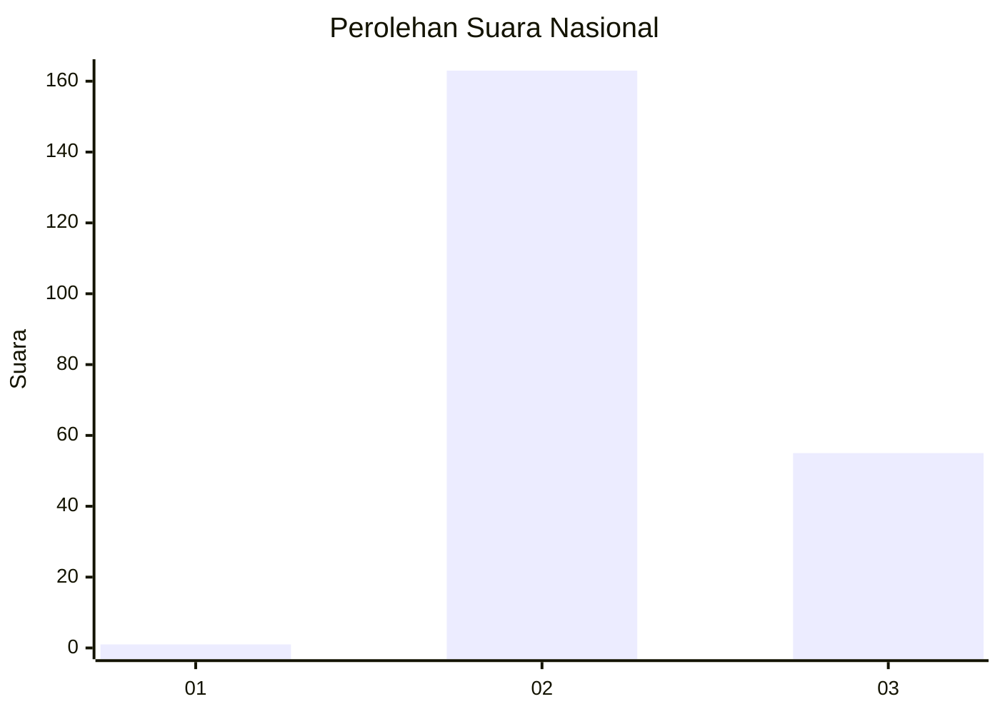
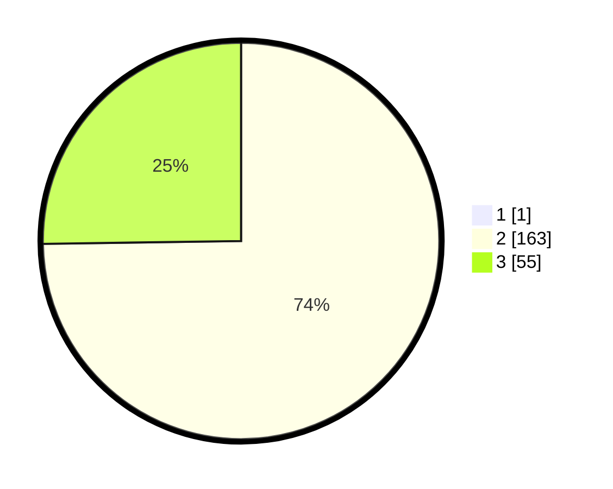

# Hasil

## Grafik

## Tabel

| No. | Nama Paslon    | Suara | Suara (raw) | Persentase |
|:--- |:-------------- | -----:| -----------:| ----------:|
| 1   | ANIES MUHAIMIN | 1     | [1][p-1]    | 0,46       |
| 2   | PRABOWO GIBRAN | 163   | [163][p-2]  | 74,43      |
| 3   | GANJAR MAHFUD  | 55    | [55][p-3]   | 25,11      |

[p-1]: https://github.com/gigit-pemilu/pemilu-2024/blob/main/pilpres/hitung-suara/sub/51-bali/sub/08-buleleng/sub/06-buleleng/sub/1020-penarukan/sub/002-tps/sub/paslon-1.txt
[p-2]: https://github.com/gigit-pemilu/pemilu-2024/blob/main/pilpres/hitung-suara/sub/51-bali/sub/08-buleleng/sub/06-buleleng/sub/1020-penarukan/sub/002-tps/sub/paslon-2.txt
[p-3]: https://github.com/gigit-pemilu/pemilu-2024/blob/main/pilpres/hitung-suara/sub/51-bali/sub/08-buleleng/sub/06-buleleng/sub/1020-penarukan/sub/002-tps/sub/paslon-3.txt

## Foto C Plano

https://sirekap-obj-formc.kpu.go.id/da52/pemilu/ppwp/51/08/06/10/20/5108061020002-20240214-224228--510b7732-ae61-45f2-8df6-59edbc42ca87.jpg

https://sirekap-obj-formc.kpu.go.id/da52/pemilu/ppwp/51/08/06/10/20/5108061020002-20240214-224459--769b5b1b-face-4536-ad75-c6ac8451a486.jpg

https://sirekap-obj-formc.kpu.go.id/da52/pemilu/ppwp/51/08/06/10/20/5108061020002-20240218-090623--c32c7b6e-f065-482d-abcd-685483403875.jpg

## Metadata

| Key        | Value               |
| ---------- | ------------------- |
| Time Stamp | 2024-02-19 06:16:00 |

