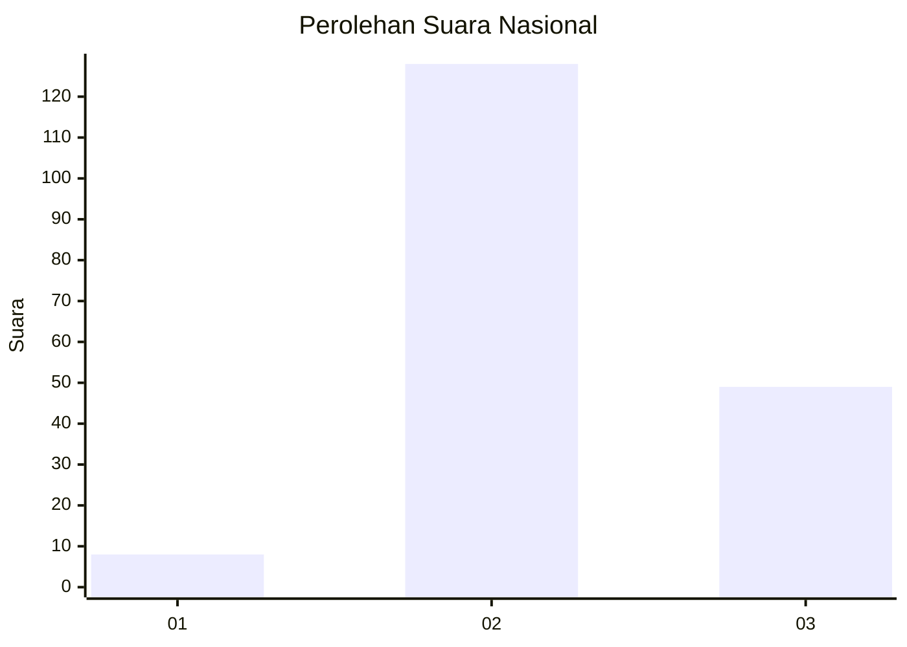

# Hasil

## Grafik

## Tabel

| No. | Nama Paslon    | Suara | Suara (raw) | Persentase |
|:--- |:-------------- | -----:| -----------:| ----------:|
| 1   | ANIES MUHAIMIN | 8     | [8][p-1]    | 4,32       |
| 2   | PRABOWO GIBRAN | 128   | [128][p-2]  | 69,19      |
| 3   | GANJAR MAHFUD  | 49    | [49][p-3]   | 26,49      |

[p-1]: https://github.com/gigit-pemilu/pemilu-2024/blob/main/pilpres/hitung-suara/sub/51-bali/sub/08-buleleng/sub/06-buleleng/sub/1020-penarukan/sub/004-tps/sub/paslon-1.txt
[p-2]: https://github.com/gigit-pemilu/pemilu-2024/blob/main/pilpres/hitung-suara/sub/51-bali/sub/08-buleleng/sub/06-buleleng/sub/1020-penarukan/sub/004-tps/sub/paslon-2.txt
[p-3]: https://github.com/gigit-pemilu/pemilu-2024/blob/main/pilpres/hitung-suara/sub/51-bali/sub/08-buleleng/sub/06-buleleng/sub/1020-penarukan/sub/004-tps/sub/paslon-3.txt

## Foto C Plano

https://sirekap-obj-formc.kpu.go.id/eae7/pemilu/ppwp/51/08/06/10/20/5108061020004-20240214-202630--5b440fc5-47d4-49e7-a53f-9ada9f27e544.jpg

https://sirekap-obj-formc.kpu.go.id/eae7/pemilu/ppwp/51/08/06/10/20/5108061020004-20240214-203106--9c683bc5-1067-49ca-ae12-74bb98b9d0f8.jpg

https://sirekap-obj-formc.kpu.go.id/eae7/pemilu/ppwp/51/08/06/10/20/5108061020004-20240214-203208--1675870d-537e-4e0f-ba80-3de95ca09498.jpg

## Metadata

| Key        | Value               |
| ---------- | ------------------- |
| Time Stamp | 2024-02-21 13:00:00 |

