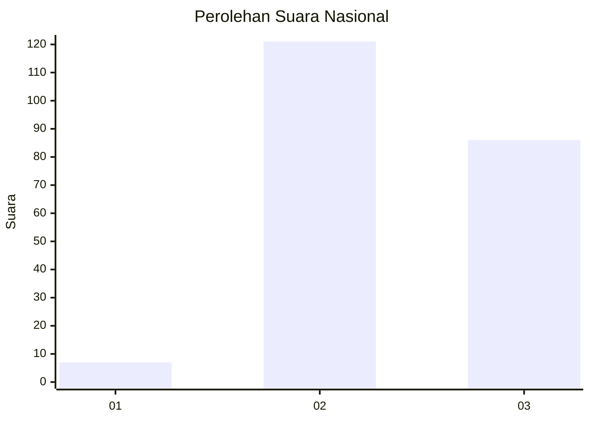
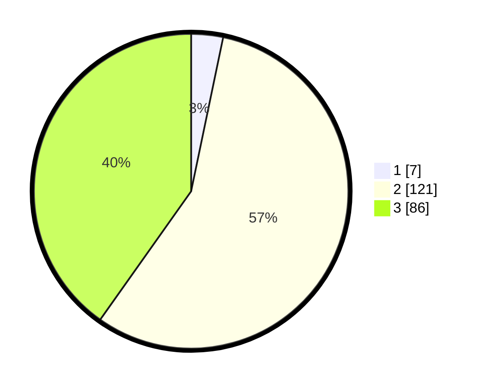

# Hasil

## Grafik

## Tabel

| No. | Nama Paslon    | Suara | Suara (raw) | Persentase |
|:--- |:-------------- | -----:| -----------:| ----------:|
| 1   | ANIES MUHAIMIN | 7     | [7][p-1]    | 3,27       |
| 2   | PRABOWO GIBRAN | 121   | [121][p-2]  | 56,54      |
| 3   | GANJAR MAHFUD  | 86    | [86][p-3]   | 40,19      |

[p-1]: https://github.com/gigit-pemilu/pemilu-2024/blob/main/pilpres/hitung-suara/sub/51-bali/sub/08-buleleng/sub/06-buleleng/sub/1020-penarukan/sub/005-tps/sub/paslon-1.txt
[p-2]: https://github.com/gigit-pemilu/pemilu-2024/blob/main/pilpres/hitung-suara/sub/51-bali/sub/08-buleleng/sub/06-buleleng/sub/1020-penarukan/sub/005-tps/sub/paslon-2.txt
[p-3]: https://github.com/gigit-pemilu/pemilu-2024/blob/main/pilpres/hitung-suara/sub/51-bali/sub/08-buleleng/sub/06-buleleng/sub/1020-penarukan/sub/005-tps/sub/paslon-3.txt

## Foto C Plano

https://sirekap-obj-formc.kpu.go.id/0e79/pemilu/ppwp/51/08/06/10/20/5108061020005-20240214-222546--0e05d92b-aaef-4635-aa5f-2d3757f534b0.jpg

https://sirekap-obj-formc.kpu.go.id/0e79/pemilu/ppwp/51/08/06/10/20/5108061020005-20240214-230547--87fa6b1e-aa54-47e6-8b0e-45d784d70e58.jpg

https://sirekap-obj-formc.kpu.go.id/0e79/pemilu/ppwp/51/08/06/10/20/5108061020005-20240214-230723--b664f442-6a34-4a26-a20c-bdc42080dff8.jpg

## Metadata

| Key        | Value               |
| ---------- | ------------------- |
| Time Stamp | 2024-02-15 12:00:28 |

