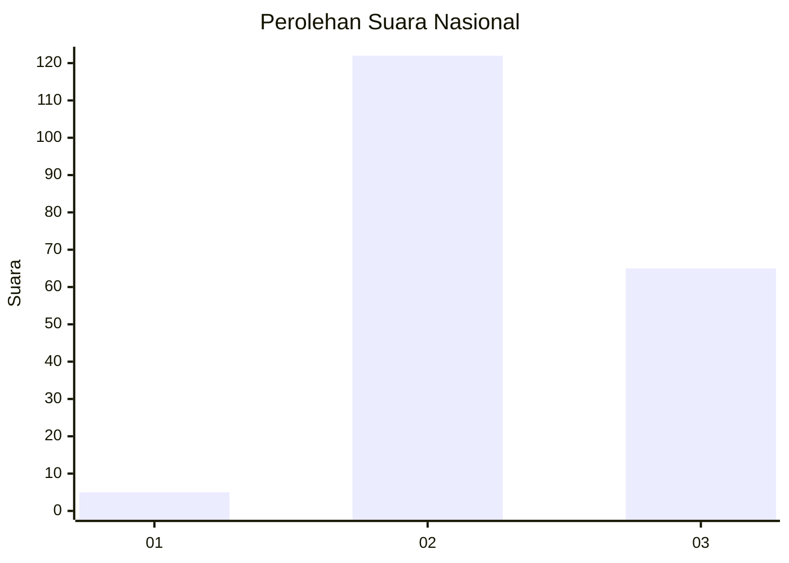
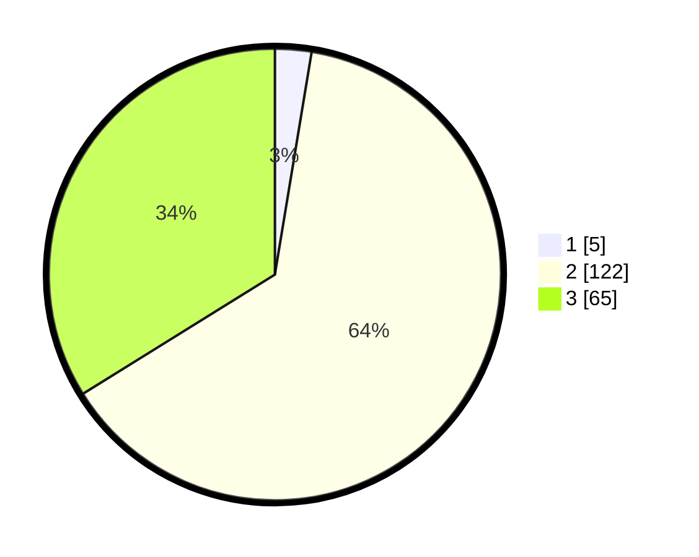

# Hasil

## Grafik

## Tabel

| No. | Nama Paslon    | Suara | Suara (raw) | Persentase |
|:--- |:-------------- | -----:| -----------:| ----------:|
| 1   | ANIES MUHAIMIN | 5     | [5][p-1]    | 2,60       |
| 2   | PRABOWO GIBRAN | 122   | [122][p-2]  | 63,54      |
| 3   | GANJAR MAHFUD  | 65    | [65][p-3]   | 33,85      |

[p-1]: https://github.com/gigit-pemilu/pemilu-2024/blob/main/pilpres/hitung-suara/sub/51-bali/sub/08-buleleng/sub/06-buleleng/sub/1020-penarukan/sub/007-tps/sub/paslon-1.txt
[p-2]: https://github.com/gigit-pemilu/pemilu-2024/blob/main/pilpres/hitung-suara/sub/51-bali/sub/08-buleleng/sub/06-buleleng/sub/1020-penarukan/sub/007-tps/sub/paslon-2.txt
[p-3]: https://github.com/gigit-pemilu/pemilu-2024/blob/main/pilpres/hitung-suara/sub/51-bali/sub/08-buleleng/sub/06-buleleng/sub/1020-penarukan/sub/007-tps/sub/paslon-3.txt

## Foto C Plano

https://sirekap-obj-formc.kpu.go.id/7a19/pemilu/ppwp/51/08/06/10/20/5108061020007-20240215-022605--a6d0d211-f32e-4a5e-8529-64507ad55767.jpg

https://sirekap-obj-formc.kpu.go.id/7a19/pemilu/ppwp/51/08/06/10/20/5108061020007-20240215-023743--f33bb2db-82e0-4e48-83aa-440a95f702b8.jpg

https://sirekap-obj-formc.kpu.go.id/7a19/pemilu/ppwp/51/08/06/10/20/5108061020007-20240215-024208--58151866-e4c9-4d65-acc9-bac51416f9d6.jpg

## Metadata

| Key        | Value               |
| ---------- | ------------------- |
| Time Stamp | 2024-02-15 04:00:24 |

## DATA PEMILIH TETAP

Jumlah pemilih dalam DPT: **273**.
 * L: **136**.
 * P: **137**.

## DATA PENGGUNA HAK PILIH

Jumlah pengguna hak pilih dalam DPT: **193**.
 * L: **94**.
 * P: **99**.

Jumlah pengguna hak pilih dalam DPTb: **1**.
 * L: **0**.
 * P: **1**.

Jumlah pengguna hak pilih dalam DPK: **0**.
 * L: **0**.
 * P: **0**.

Jumlah pengguna hak pilih: **194**.
 * L: **94**.
 * P: **100**.

## JUMLAH SUARA SAH DAN TIDAK SAH

JUMLAH SELURUH SUARA SAH: **192**.

JUMLAH SUARA TIDAK SAH: **2**.

JUMLAH SELURUH SUARA SAH DAN SUARA TIDAK SAH: **194**.

