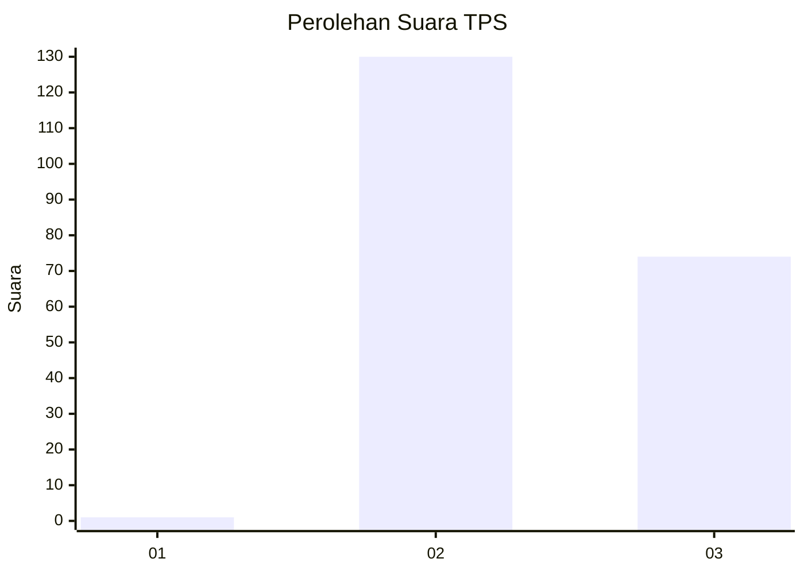
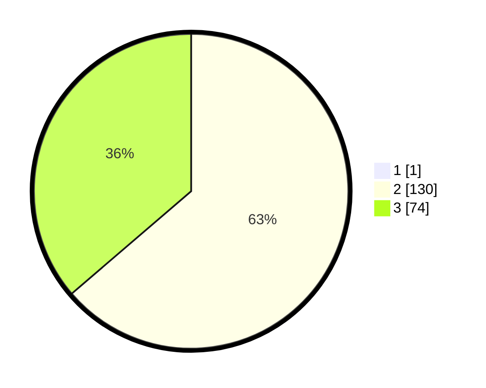

# Hasil

## Grafik

## Tabel

| No. | Nama Paslon    | Suara | Suara (raw) | Persentase |
|:--- |:-------------- | -----:| -----------:| ----------:|
| 1   | ANIES MUHAIMIN | 1     | [1][p-1]    | 0,49       |
| 2   | PRABOWO GIBRAN | 130   | [130][p-2]  | 63,41      |
| 3   | GANJAR MAHFUD  | 74    | [74][p-3]   | 36,10      |

[p-1]: https://github.com/gigit-pemilu/pemilu-2024-51-bali/blob/main/pilpres/hitung-suara/sub/51-bali/sub/08-buleleng/sub/06-buleleng/sub/1020-penarukan/sub/008-tps/sub/paslon-1.txt
[p-2]: https://github.com/gigit-pemilu/pemilu-2024-51-bali/blob/main/pilpres/hitung-suara/sub/51-bali/sub/08-buleleng/sub/06-buleleng/sub/1020-penarukan/sub/008-tps/sub/paslon-2.txt
[p-3]: https://github.com/gigit-pemilu/pemilu-2024-51-bali/blob/main/pilpres/hitung-suara/sub/51-bali/sub/08-buleleng/sub/06-buleleng/sub/1020-penarukan/sub/008-tps/sub/paslon-3.txt

## Foto C Plano

https://sirekap-obj-formc.kpu.go.id/5f3e/pemilu/ppwp/51/08/06/10/20/5108061020008-20240215-000313--69654271-00b0-4094-9ea3-856deb5b21a7.jpg

https://sirekap-obj-formc.kpu.go.id/5f3e/pemilu/ppwp/51/08/06/10/20/5108061020008-20240215-024952--a5131947-1b88-4793-b80a-a89c9c7cbb00.jpg

https://sirekap-obj-formc.kpu.go.id/5f3e/pemilu/ppwp/51/08/06/10/20/5108061020008-20240215-025001--fcaa293d-c8b8-43ec-9ecc-c760dd596336.jpg

## Metadata

| Key        | Value               |
| ---------- | ------------------- |
| Time Stamp | 2024-02-24 22:31:28 |

