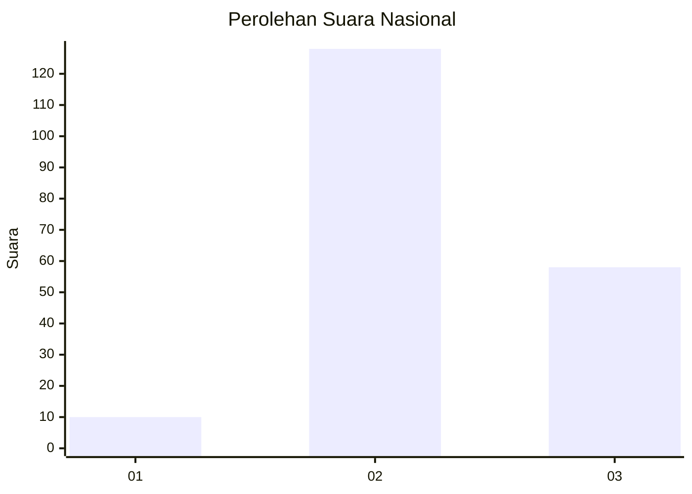

# Hasil

## Grafik

## Tabel

| No. | Nama Paslon    | Suara | Suara (raw) | Persentase |
|:--- |:-------------- | -----:| -----------:| ----------:|
| 1   | ANIES MUHAIMIN | 10    | [10][p-1]   | 5,10       |
| 2   | PRABOWO GIBRAN | 128   | [128][p-2]  | 65,31      |
| 3   | GANJAR MAHFUD  | 58    | [58][p-3]   | 29,59      |

[p-1]: https://github.com/gigit-pemilu/pemilu-2024/blob/main/pilpres/hitung-suara/sub/51-bali/sub/08-buleleng/sub/06-buleleng/sub/1020-penarukan/sub/013-tps/sub/paslon-1.txt
[p-2]: https://github.com/gigit-pemilu/pemilu-2024/blob/main/pilpres/hitung-suara/sub/51-bali/sub/08-buleleng/sub/06-buleleng/sub/1020-penarukan/sub/013-tps/sub/paslon-2.txt
[p-3]: https://github.com/gigit-pemilu/pemilu-2024/blob/main/pilpres/hitung-suara/sub/51-bali/sub/08-buleleng/sub/06-buleleng/sub/1020-penarukan/sub/013-tps/sub/paslon-3.txt

## Foto C Plano

https://sirekap-obj-formc.kpu.go.id/1804/pemilu/ppwp/51/08/06/10/20/5108061020013-20240218-131933--114cc154-142d-4eac-96e2-e0ff54ac6f89.jpg

https://sirekap-obj-formc.kpu.go.id/1804/pemilu/ppwp/51/08/06/10/20/5108061020013-20240218-131759--59a46630-b9e7-4d9b-b51b-e8f7d685ebf7.jpg

https://sirekap-obj-formc.kpu.go.id/1804/pemilu/ppwp/51/08/06/10/20/5108061020013-20240218-132148--4ecf8a88-c58b-43b2-91c5-fc8374d01957.jpg

## Metadata

| Key        | Value               |
| ---------- | ------------------- |
| Time Stamp | 2024-02-24 22:31:28 |

