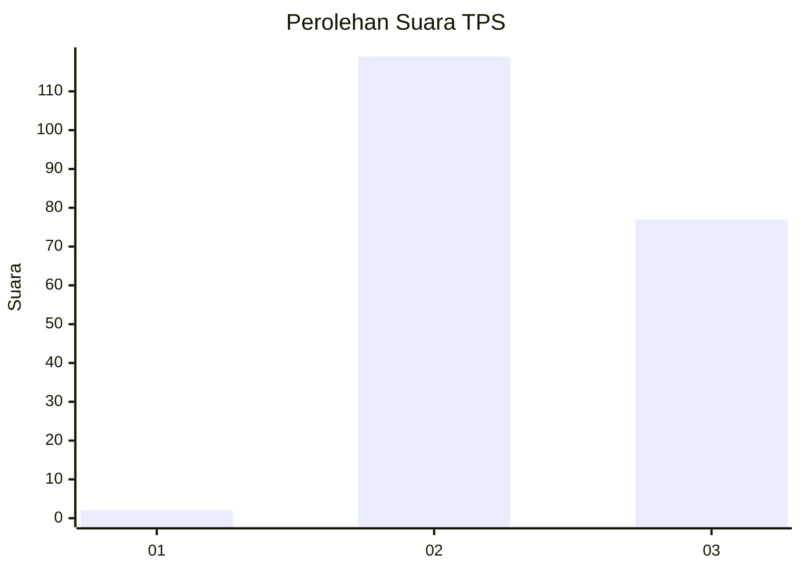
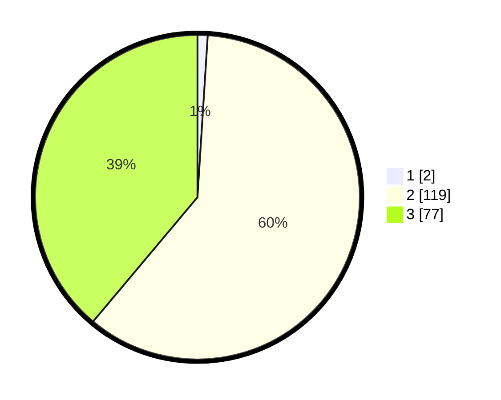

# Hasil

## Grafik

## Tabel

| No. | Nama Paslon    | Suara | Suara (raw) | Persentase |
|:--- |:-------------- | -----:| -----------:| ----------:|
| 1   | ANIES MUHAIMIN | 2     | [2][p-1]    | 1,01       |
| 2   | PRABOWO GIBRAN | 119   | [119][p-2]  | 60,10      |
| 3   | GANJAR MAHFUD  | 77    | [77][p-3]   | 38,89      |

[p-1]: https://github.com/gigit-pemilu/pemilu-2024-51-bali/blob/main/pilpres/hitung-suara/sub/51-bali/sub/08-buleleng/sub/06-buleleng/sub/1020-penarukan/sub/018-tps/sub/paslon-1.txt
[p-2]: https://github.com/gigit-pemilu/pemilu-2024-51-bali/blob/main/pilpres/hitung-suara/sub/51-bali/sub/08-buleleng/sub/06-buleleng/sub/1020-penarukan/sub/018-tps/sub/paslon-2.txt
[p-3]: https://github.com/gigit-pemilu/pemilu-2024-51-bali/blob/main/pilpres/hitung-suara/sub/51-bali/sub/08-buleleng/sub/06-buleleng/sub/1020-penarukan/sub/018-tps/sub/paslon-3.txt

## Foto C Plano

https://sirekap-obj-formc.kpu.go.id/b8fb/pemilu/ppwp/51/08/06/10/20/5108061020018-20240215-015511--29201464-2b0d-4ee1-866e-753f8280f6d4.jpg

https://sirekap-obj-formc.kpu.go.id/b8fb/pemilu/ppwp/51/08/06/10/20/5108061020018-20240215-015632--910fcb93-2845-44ae-8894-2140aeee9a86.jpg

https://sirekap-obj-formc.kpu.go.id/b8fb/pemilu/ppwp/51/08/06/10/20/5108061020018-20240215-015855--f5a5df74-b5dc-4c9e-a1bd-eeaabe94d70b.jpg

## Metadata

| Key        | Value               |
| ---------- | ------------------- |
| Time Stamp | 2024-02-25 12:00:00 |

