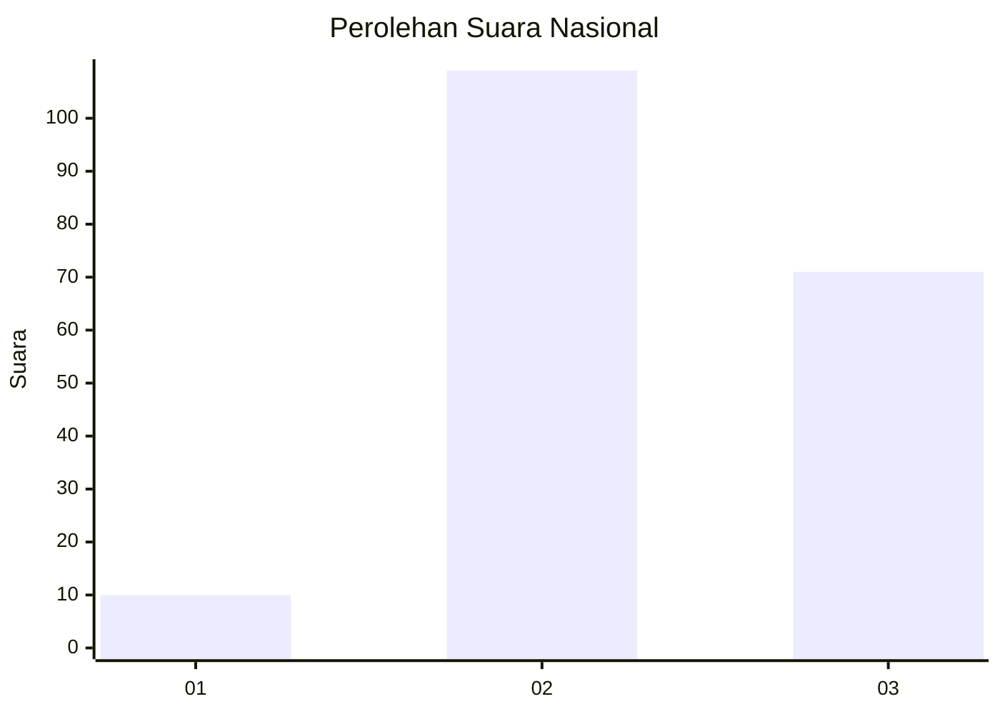
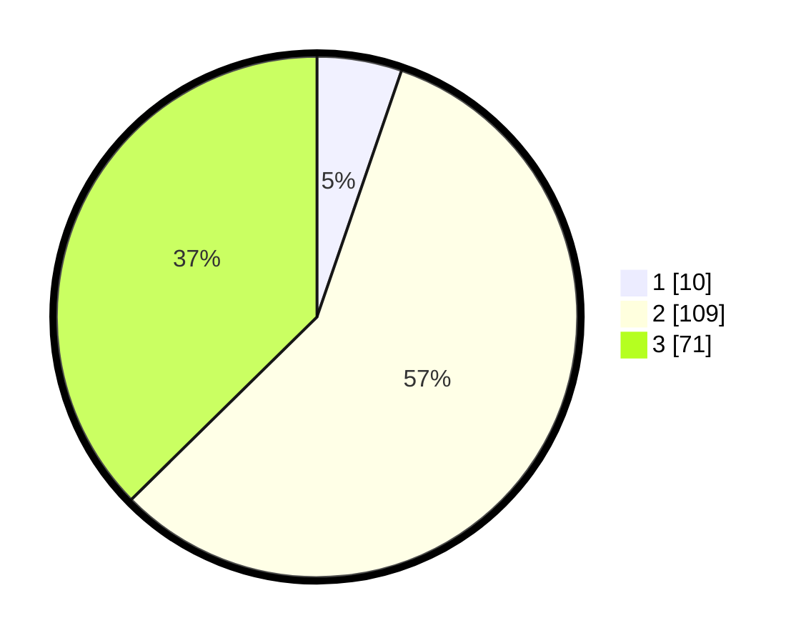

# Hasil

## Grafik

## Tabel

| No. | Nama Paslon    | Suara | Suara (raw) | Persentase |
|:--- |:-------------- | -----:| -----------:| ----------:|
| 1   | ANIES MUHAIMIN | 10    | [10][p-1]   | 5,26       |
| 2   | PRABOWO GIBRAN | 109   | [109][p-2]  | 57,37      |
| 3   | GANJAR MAHFUD  | 71    | [71][p-3]   | 37,37      |

[p-1]: https://github.com/gigit-pemilu/pemilu-2024/blob/main/pilpres/hitung-suara/sub/51-bali/sub/08-buleleng/sub/06-buleleng/sub/1020-penarukan/sub/019-tps/sub/paslon-1.txt
[p-2]: https://github.com/gigit-pemilu/pemilu-2024/blob/main/pilpres/hitung-suara/sub/51-bali/sub/08-buleleng/sub/06-buleleng/sub/1020-penarukan/sub/019-tps/sub/paslon-2.txt
[p-3]: https://github.com/gigit-pemilu/pemilu-2024/blob/main/pilpres/hitung-suara/sub/51-bali/sub/08-buleleng/sub/06-buleleng/sub/1020-penarukan/sub/019-tps/sub/paslon-3.txt

## Foto C Plano

https://sirekap-obj-formc.kpu.go.id/1841/pemilu/ppwp/51/08/06/10/20/5108061020019-20240217-194751--d1051697-6842-4dd9-aaaa-8589aad10d7f.jpg

https://sirekap-obj-formc.kpu.go.id/1841/pemilu/ppwp/51/08/06/10/20/5108061020019-20240217-194810--a0d73982-7729-4c42-841b-20bd9b1e831b.jpg

https://sirekap-obj-formc.kpu.go.id/1841/pemilu/ppwp/51/08/06/10/20/5108061020019-20240217-194826--ab11ac46-6a24-4db4-81d4-637820be9b2e.jpg

## Metadata

| Key        | Value               |
| ---------- | ------------------- |
| Time Stamp | 2024-02-24 22:31:28 |

