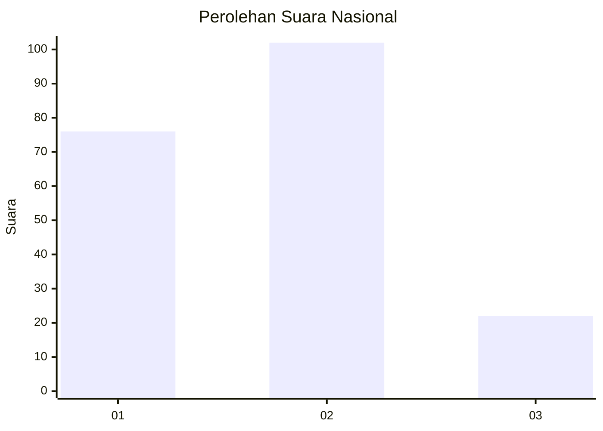
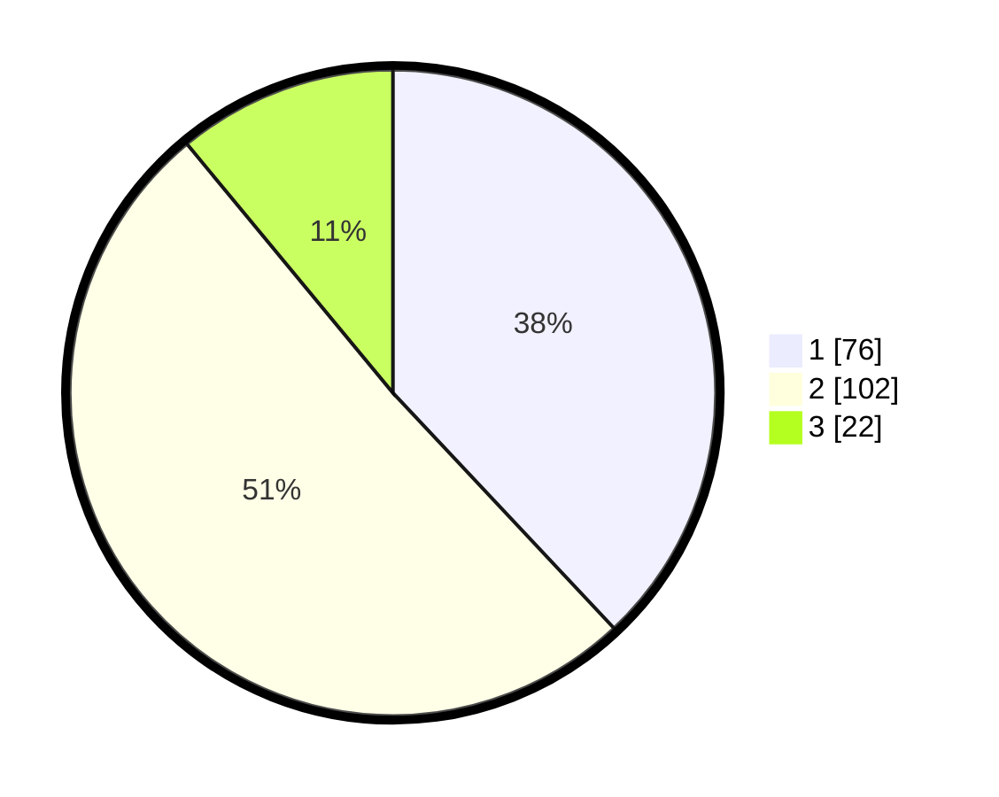

# Hasil

## Grafik

## Tabel

| No. | Nama Paslon    | Suara | Suara (raw) | Persentase |
|:--- |:-------------- | -----:| -----------:| ----------:|
| 1   | ANIES MUHAIMIN | 76    | [76][p-1]   | 38,00      |
| 2   | PRABOWO GIBRAN | 102   | [102][p-2]  | 51,00      |
| 3   | GANJAR MAHFUD  | 22    | [22][p-3]   | 11,00      |

[p-1]: https://github.com/gigit-pemilu/pemilu-2024/blob/main/pilpres/hitung-suara/sub/51-bali/sub/08-buleleng/sub/06-buleleng/sub/1020-penarukan/sub/028-tps/sub/paslon-1.txt
[p-2]: https://github.com/gigit-pemilu/pemilu-2024/blob/main/pilpres/hitung-suara/sub/51-bali/sub/08-buleleng/sub/06-buleleng/sub/1020-penarukan/sub/028-tps/sub/paslon-2.txt
[p-3]: https://github.com/gigit-pemilu/pemilu-2024/blob/main/pilpres/hitung-suara/sub/51-bali/sub/08-buleleng/sub/06-buleleng/sub/1020-penarukan/sub/028-tps/sub/paslon-3.txt

## Foto C Plano

https://sirekap-obj-formc.kpu.go.id/d530/pemilu/ppwp/51/08/06/10/20/5108061020028-20240219-215447--b41af758-9f9a-4bb6-a05e-b04a5b2b275c.jpg

https://sirekap-obj-formc.kpu.go.id/d530/pemilu/ppwp/51/08/06/10/20/5108061020028-20240215-004033--92a26fc4-e796-4625-811b-688f4cc5475a.jpg

https://sirekap-obj-formc.kpu.go.id/d530/pemilu/ppwp/51/08/06/10/20/5108061020028-20240215-004115--b1f124a5-b8c5-443b-8672-f6c151a1b475.jpg

## Metadata

| Key        | Value               |
| ---------- | ------------------- |
| Time Stamp | 2024-02-24 22:31:28 |

