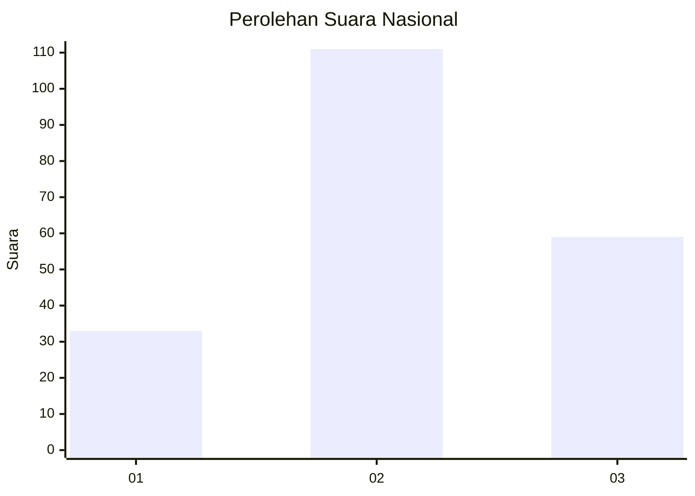
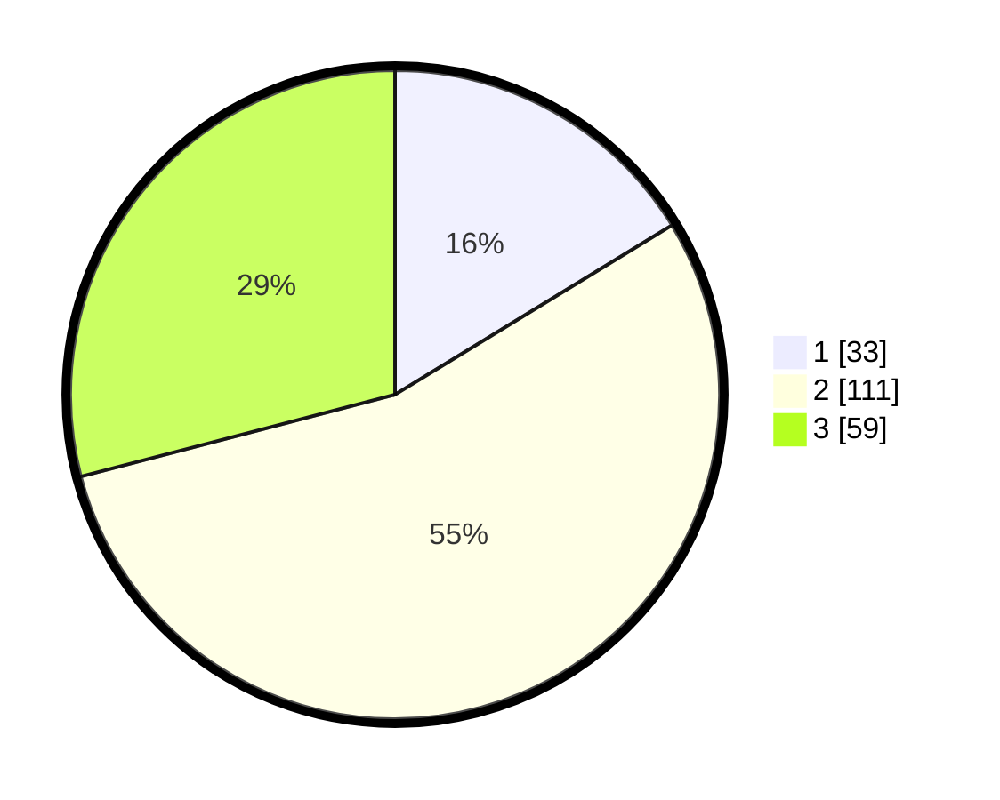

# Hasil

## Grafik

## Tabel

| No. | Nama Paslon    | Suara | Suara (raw) | Persentase |
|:--- |:-------------- | -----:| -----------:| ----------:|
| 1   | ANIES MUHAIMIN | 33    | [33][p-1]   | 16,26      |
| 2   | PRABOWO GIBRAN | 111   | [111][p-2]  | 54,68      |
| 3   | GANJAR MAHFUD  | 59    | [59][p-3]   | 29,06      |

[p-1]: https://github.com/gigit-pemilu/pemilu-2024/blob/main/pilpres/hitung-suara/sub/51-bali/sub/08-buleleng/sub/06-buleleng/sub/1020-penarukan/sub/031-tps/sub/paslon-1.txt
[p-2]: https://github.com/gigit-pemilu/pemilu-2024/blob/main/pilpres/hitung-suara/sub/51-bali/sub/08-buleleng/sub/06-buleleng/sub/1020-penarukan/sub/031-tps/sub/paslon-2.txt
[p-3]: https://github.com/gigit-pemilu/pemilu-2024/blob/main/pilpres/hitung-suara/sub/51-bali/sub/08-buleleng/sub/06-buleleng/sub/1020-penarukan/sub/031-tps/sub/paslon-3.txt

## Foto C Plano

https://sirekap-obj-formc.kpu.go.id/b8a2/pemilu/ppwp/51/08/06/10/20/5108061020031-20240214-220444--a4fdeb2c-2910-47be-a0ed-9a568aae249e.jpg

https://sirekap-obj-formc.kpu.go.id/b8a2/pemilu/ppwp/51/08/06/10/20/5108061020031-20240214-220558--8c9bc0d1-ad48-41ae-9857-fdaf5ff1dd23.jpg

https://sirekap-obj-formc.kpu.go.id/b8a2/pemilu/ppwp/51/08/06/10/20/5108061020031-20240214-220646--472001cb-643a-4c83-9569-080935d82805.jpg

## Metadata

| Key        | Value               |
| ---------- | ------------------- |
| Time Stamp | 2024-02-24 22:31:28 |

