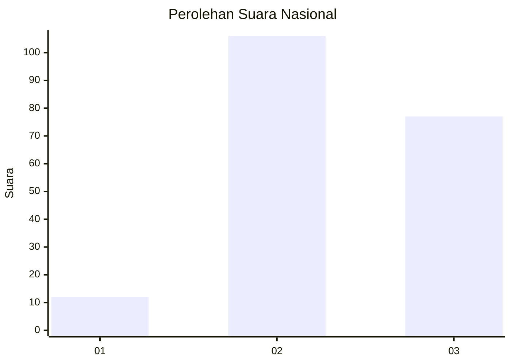
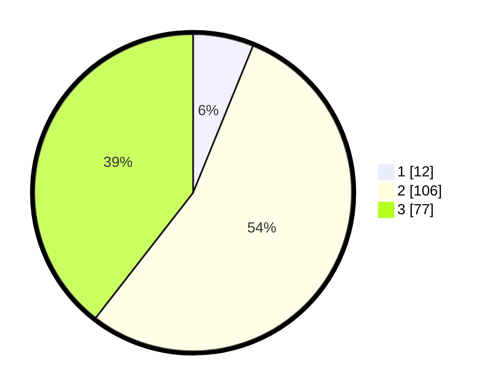

# Hasil

## Grafik

## Tabel

| No. | Nama Paslon    | Suara | Suara (raw) | Persentase |
|:--- |:-------------- | -----:| -----------:| ----------:|
| 1   | ANIES MUHAIMIN | 12    | [12][p-1]   | 6,15       |
| 2   | PRABOWO GIBRAN | 106   | [106][p-2]  | 54,36      |
| 3   | GANJAR MAHFUD  | 77    | [77][p-3]   | 39,49      |

[p-1]: https://github.com/gigit-pemilu/pemilu-2024/blob/main/pilpres/hitung-suara/sub/51-bali/sub/08-buleleng/sub/06-buleleng/sub/1020-penarukan/sub/032-tps/sub/paslon-1.txt
[p-2]: https://github.com/gigit-pemilu/pemilu-2024/blob/main/pilpres/hitung-suara/sub/51-bali/sub/08-buleleng/sub/06-buleleng/sub/1020-penarukan/sub/032-tps/sub/paslon-2.txt
[p-3]: https://github.com/gigit-pemilu/pemilu-2024/blob/main/pilpres/hitung-suara/sub/51-bali/sub/08-buleleng/sub/06-buleleng/sub/1020-penarukan/sub/032-tps/sub/paslon-3.txt

## Foto C Plano

https://sirekap-obj-formc.kpu.go.id/b832/pemilu/ppwp/51/08/06/10/20/5108061020032-20240214-233023--c5fa2a4c-8edb-4499-894a-c7be7cb895b3.jpg

https://sirekap-obj-formc.kpu.go.id/b832/pemilu/ppwp/51/08/06/10/20/5108061020032-20240214-233049--04fc914e-4808-4097-a3e2-6213e7c9bf9d.jpg

https://sirekap-obj-formc.kpu.go.id/b832/pemilu/ppwp/51/08/06/10/20/5108061020032-20240214-233053--ea16dcf8-1776-4620-88c0-3467c64bbe34.jpg

## Metadata

| Key        | Value               |
| ---------- | ------------------- |
| Time Stamp | 2024-02-24 22:31:28 |

