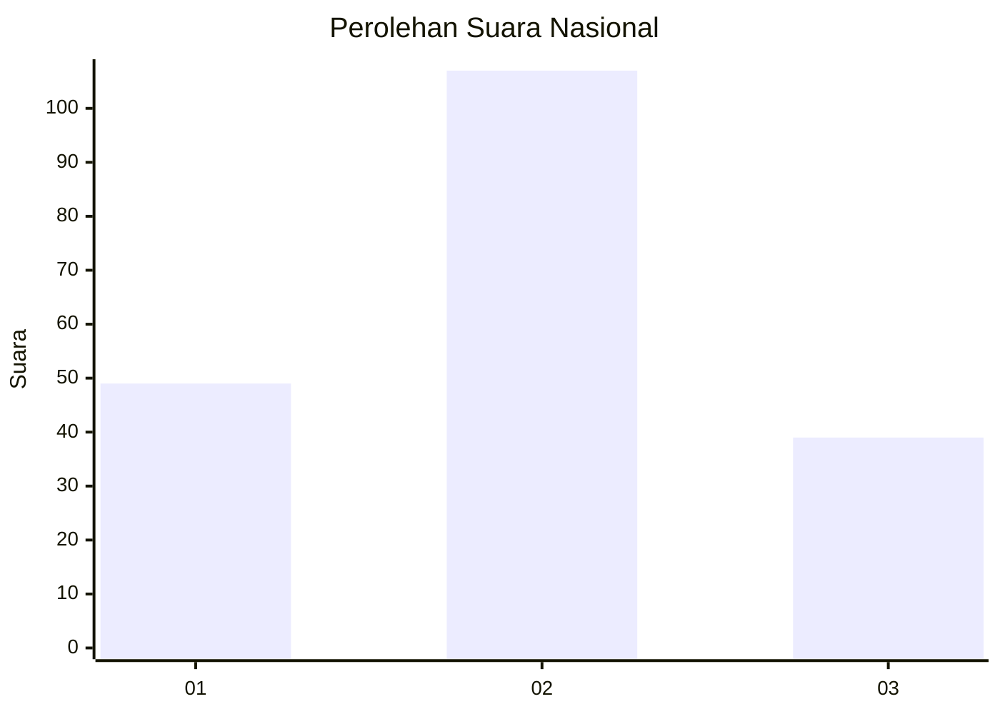
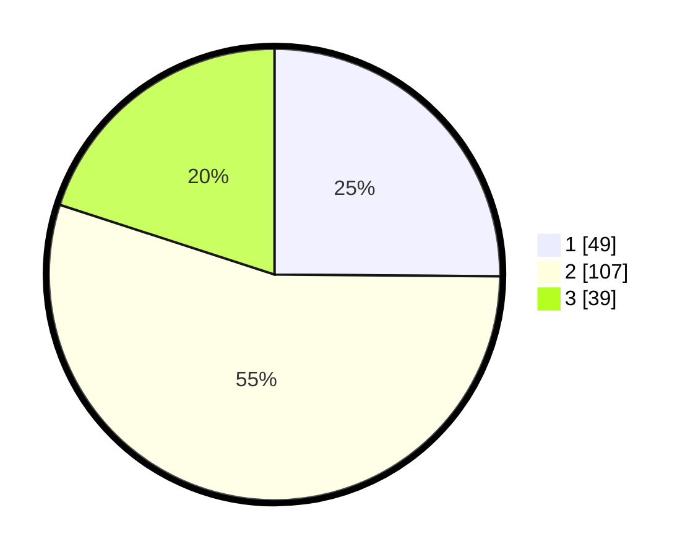

# Hasil

## Grafik

## Tabel

| No. | Nama Paslon    | Suara | Suara (raw) | Persentase |
|:--- |:-------------- | -----:| -----------:| ----------:|
| 1   | ANIES MUHAIMIN | 49    | [49][p-1]   | 25,13      |
| 2   | PRABOWO GIBRAN | 107   | [107][p-2]  | 54,87      |
| 3   | GANJAR MAHFUD  | 39    | [39][p-3]   | 20,00      |

[p-1]: https://github.com/gigit-pemilu/pemilu-2024/blob/main/pilpres/hitung-suara/sub/51-bali/sub/08-buleleng/sub/06-buleleng/sub/1021-kampung-kajanan/sub/002-tps/sub/paslon-1.txt
[p-2]: https://github.com/gigit-pemilu/pemilu-2024/blob/main/pilpres/hitung-suara/sub/51-bali/sub/08-buleleng/sub/06-buleleng/sub/1021-kampung-kajanan/sub/002-tps/sub/paslon-2.txt
[p-3]: https://github.com/gigit-pemilu/pemilu-2024/blob/main/pilpres/hitung-suara/sub/51-bali/sub/08-buleleng/sub/06-buleleng/sub/1021-kampung-kajanan/sub/002-tps/sub/paslon-3.txt

## Foto C Plano

https://sirekap-obj-formc.kpu.go.id/6c2d/pemilu/ppwp/51/08/06/10/21/5108061021002-20240216-024340--7045a2e9-f7a0-4c4e-bcc3-80dd1f1328a6.jpg

https://sirekap-obj-formc.kpu.go.id/6c2d/pemilu/ppwp/51/08/06/10/21/5108061021002-20240216-024349--0fb0ff05-ed6e-433d-a288-d8970f20460d.jpg

https://sirekap-obj-formc.kpu.go.id/6c2d/pemilu/ppwp/51/08/06/10/21/5108061021002-20240216-024345--3f92e814-6f9a-4dc0-8a68-2a8c3b8d350e.jpg

## Metadata

| Key        | Value               |
| ---------- | ------------------- |
| Time Stamp | 2024-02-16 17:00:00 |

## DATA PEMILIH TETAP

Jumlah pemilih dalam DPT: **294**.
 * L: **147**.
 * P: **147**.

## DATA PENGGUNA HAK PILIH

Jumlah pengguna hak pilih dalam DPT: **201**.
 * L: **98**.
 * P: **103**.

Jumlah pengguna hak pilih dalam DPTb: **0**.
 * L: **0**.
 * P: **0**.

Jumlah pengguna hak pilih dalam DPK: **2**.
 * L: **0**.
 * P: **2**.

Jumlah pengguna hak pilih: **203**.
 * L: **98**.
 * P: **105**.

## JUMLAH SUARA SAH DAN TIDAK SAH

JUMLAH SELURUH SUARA SAH: **195**.

JUMLAH SUARA TIDAK SAH: **8**.

JUMLAH SELURUH SUARA SAH DAN SUARA TIDAK SAH: **203**.

