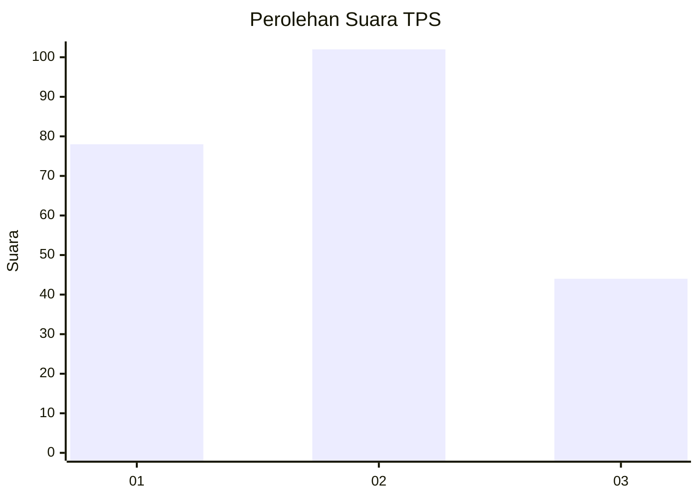
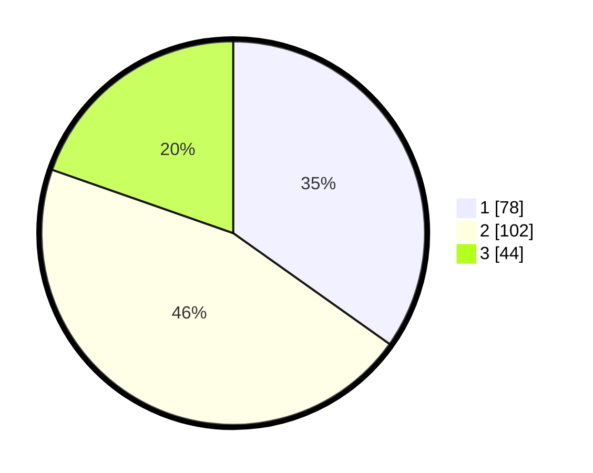

# Hasil

## Grafik

## Tabel

| No. | Nama Paslon    | Suara | Suara (raw) | Persentase |
|:--- |:-------------- | -----:| -----------:| ----------:|
| 1   | ANIES MUHAIMIN | 78    | [78][p-1]   | 34,82      |
| 2   | PRABOWO GIBRAN | 102   | [102][p-2]  | 45,54      |
| 3   | GANJAR MAHFUD  | 44    | [44][p-3]   | 19,64      |

[p-1]: https://github.com/gigit-pemilu/pemilu-2024-51-bali/blob/main/pilpres/hitung-suara/sub/51-bali/sub/08-buleleng/sub/06-buleleng/sub/1021-kampung-kajanan/sub/005-tps/sub/paslon-1.txt
[p-2]: https://github.com/gigit-pemilu/pemilu-2024-51-bali/blob/main/pilpres/hitung-suara/sub/51-bali/sub/08-buleleng/sub/06-buleleng/sub/1021-kampung-kajanan/sub/005-tps/sub/paslon-2.txt
[p-3]: https://github.com/gigit-pemilu/pemilu-2024-51-bali/blob/main/pilpres/hitung-suara/sub/51-bali/sub/08-buleleng/sub/06-buleleng/sub/1021-kampung-kajanan/sub/005-tps/sub/paslon-3.txt

## Foto C Plano

https://sirekap-obj-formc.kpu.go.id/b526/pemilu/ppwp/51/08/06/10/21/5108061021005-20240216-010940--4d90c075-1569-435a-bb2e-7f35e01ebd30.jpg

https://sirekap-obj-formc.kpu.go.id/b526/pemilu/ppwp/51/08/06/10/21/5108061021005-20240216-010943--8ccb1a25-7774-4aed-8cb8-eb40d720c6b4.jpg

https://sirekap-obj-formc.kpu.go.id/b526/pemilu/ppwp/51/08/06/10/21/5108061021005-20240216-010942--2e54aaa5-81f7-4d67-96cc-c008e7471164.jpg

## Metadata

| Key        | Value               |
| ---------- | ------------------- |
| Time Stamp | 2024-02-17 18:00:00 |

## DATA PEMILIH TETAP

Jumlah pemilih dalam DPT: **290**.
 * L: **148**.
 * P: **142**.

## DATA PENGGUNA HAK PILIH

Jumlah pengguna hak pilih dalam DPT: **224**.
 * L: **110**.
 * P: **114**.

Jumlah pengguna hak pilih dalam DPTb: **2**.
 * L: **1**.
 * P: **1**.

Jumlah pengguna hak pilih dalam DPK: **1**.
 * L: **0**.
 * P: **1**.

Jumlah pengguna hak pilih: **227**.
 * L: **111**.
 * P: **116**.

## JUMLAH SUARA SAH DAN TIDAK SAH

JUMLAH SELURUH SUARA SAH: **224**.

JUMLAH SUARA TIDAK SAH: **3**.

JUMLAH SELURUH SUARA SAH DAN SUARA TIDAK SAH: **227**.

