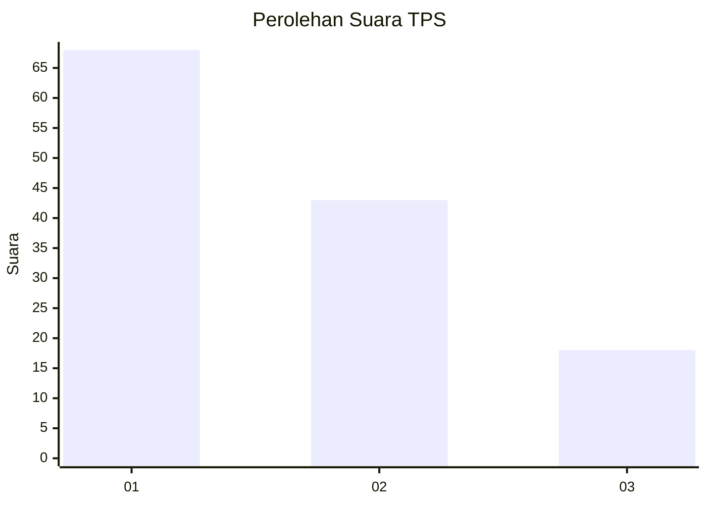
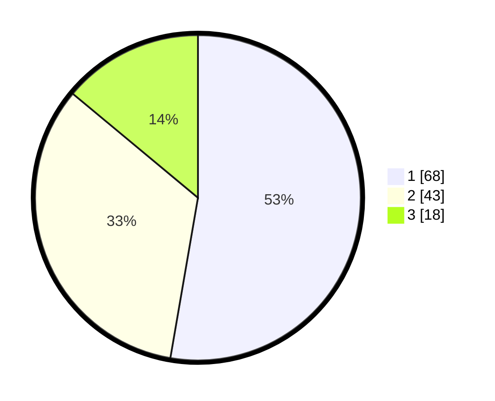

# Hasil

## Grafik

## Tabel

| No. | Nama Paslon    | Suara | Suara (raw) | Persentase |
|:--- |:-------------- | -----:| -----------:| ----------:|
| 1   | ANIES MUHAIMIN | 68    | [68][p-1]   | 52,71      |
| 2   | PRABOWO GIBRAN | 43    | [43][p-2]   | 33,33      |
| 3   | GANJAR MAHFUD  | 18    | [18][p-3]   | 13,95      |

[p-1]: https://github.com/gigit-pemilu/pemilu-2024-51-bali/blob/main/pilpres/hitung-suara/sub/51-bali/sub/08-buleleng/sub/06-buleleng/sub/1021-kampung-kajanan/sub/009-tps/sub/paslon-1.txt
[p-2]: https://github.com/gigit-pemilu/pemilu-2024-51-bali/blob/main/pilpres/hitung-suara/sub/51-bali/sub/08-buleleng/sub/06-buleleng/sub/1021-kampung-kajanan/sub/009-tps/sub/paslon-2.txt
[p-3]: https://github.com/gigit-pemilu/pemilu-2024-51-bali/blob/main/pilpres/hitung-suara/sub/51-bali/sub/08-buleleng/sub/06-buleleng/sub/1021-kampung-kajanan/sub/009-tps/sub/paslon-3.txt

## Foto C Plano

https://sirekap-obj-formc.kpu.go.id/e25c/pemilu/ppwp/51/08/06/10/21/5108061021009-20240215-002115--ba060e0f-4cb2-478c-8cbd-a95d37b5b79a.jpg

https://sirekap-obj-formc.kpu.go.id/e25c/pemilu/ppwp/51/08/06/10/21/5108061021009-20240215-002001--5399a751-f01b-4e6f-85f7-4d5114c6de5b.jpg

https://sirekap-obj-formc.kpu.go.id/e25c/pemilu/ppwp/51/08/06/10/21/5108061021009-20240215-002309--e438a350-936c-48dd-9852-f92a27e66c16.jpg

## Metadata

| Key        | Value               |
| ---------- | ------------------- |
| Time Stamp | 2024-02-24 22:31:28 |

