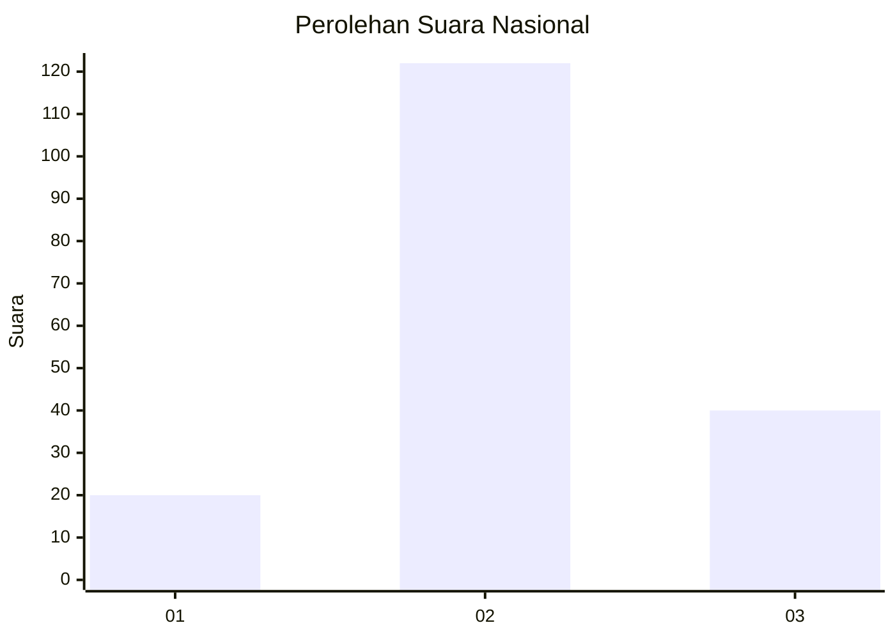
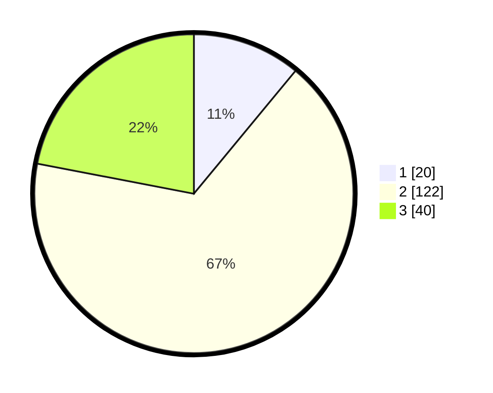

# Hasil

## Grafik

## Tabel

| No. | Nama Paslon    | Suara | Suara (raw) | Persentase |
|:--- |:-------------- | -----:| -----------:| ----------:|
| 1   | ANIES MUHAIMIN | 20    | [20][p-1]   | 10,99      |
| 2   | PRABOWO GIBRAN | 122   | [122][p-2]  | 67,03      |
| 3   | GANJAR MAHFUD  | 40    | [40][p-3]   | 21,98      |

[p-1]: https://github.com/gigit-pemilu/pemilu-2024/blob/main/pilpres/hitung-suara/sub/51-bali/sub/08-buleleng/sub/06-buleleng/sub/1021-kampung-kajanan/sub/014-tps/sub/paslon-1.txt
[p-2]: https://github.com/gigit-pemilu/pemilu-2024/blob/main/pilpres/hitung-suara/sub/51-bali/sub/08-buleleng/sub/06-buleleng/sub/1021-kampung-kajanan/sub/014-tps/sub/paslon-2.txt
[p-3]: https://github.com/gigit-pemilu/pemilu-2024/blob/main/pilpres/hitung-suara/sub/51-bali/sub/08-buleleng/sub/06-buleleng/sub/1021-kampung-kajanan/sub/014-tps/sub/paslon-3.txt

## Foto C Plano

https://sirekap-obj-formc.kpu.go.id/bc69/pemilu/ppwp/51/08/06/10/21/5108061021014-20240216-063116--27637c17-19e7-4d8f-b0f5-4f3d7e8f07dc.jpg

https://sirekap-obj-formc.kpu.go.id/bc69/pemilu/ppwp/51/08/06/10/21/5108061021014-20240216-063117--5a69babb-f6c4-4d6b-a34d-b88300b64891.jpg

https://sirekap-obj-formc.kpu.go.id/bc69/pemilu/ppwp/51/08/06/10/21/5108061021014-20240216-063116--3a475404-3bac-4780-aa57-349ca9c6a3cf.jpg

## Metadata

| Key        | Value               |
| ---------- | ------------------- |
| Time Stamp | 2024-02-17 18:00:00 |

## DATA PEMILIH TETAP

Jumlah pemilih dalam DPT: **257**.
 * L: **130**.
 * P: **127**.

## DATA PENGGUNA HAK PILIH

Jumlah pengguna hak pilih dalam DPT: **181**.
 * L: **97**.
 * P: **84**.

Jumlah pengguna hak pilih dalam DPTb: **6**.
 * L: **6**.
 * P: **0**.

Jumlah pengguna hak pilih dalam DPK: **0**.
 * L: **0**.
 * P: **0**.

Jumlah pengguna hak pilih: **187**.
 * L: **103**.
 * P: **84**.

## JUMLAH SUARA SAH DAN TIDAK SAH

JUMLAH SELURUH SUARA SAH: **182**.

JUMLAH SUARA TIDAK SAH: **5**.

JUMLAH SELURUH SUARA SAH DAN SUARA TIDAK SAH: **187**.

