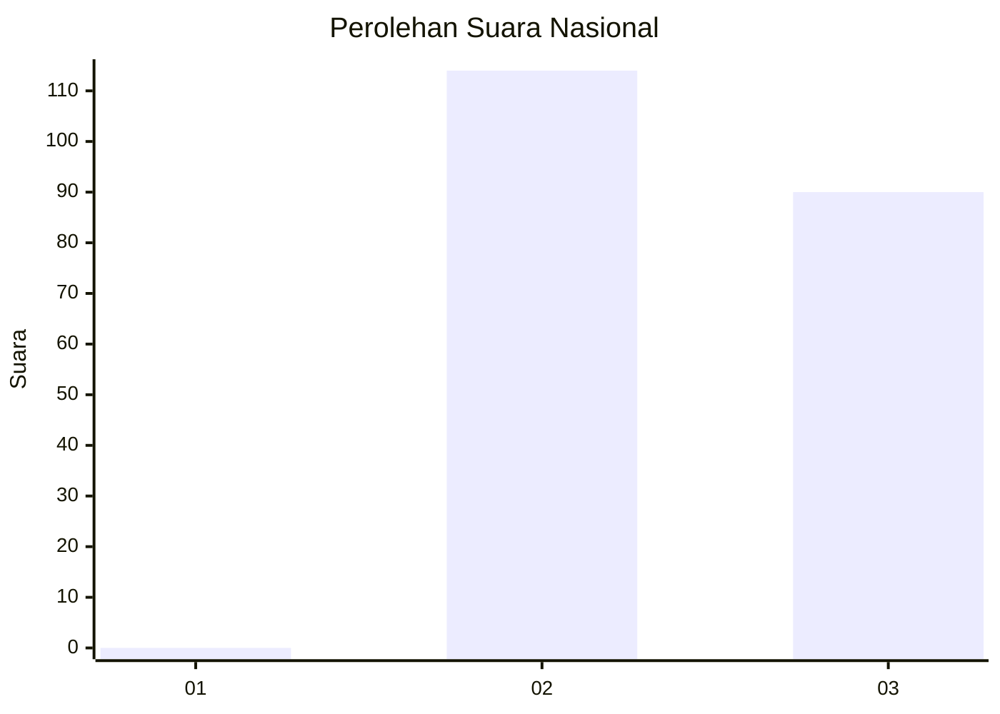
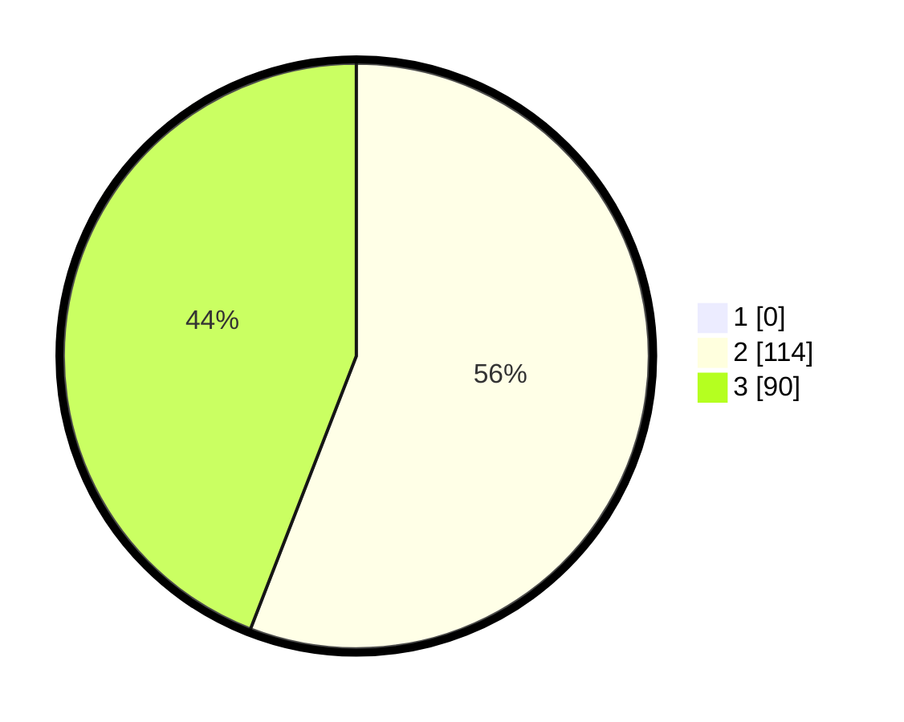

# Hasil

## Grafik

## Tabel

| No. | Nama Paslon    | Suara | Suara (raw) | Persentase |
|:--- |:-------------- | -----:| -----------:| ----------:|
| 1   | ANIES MUHAIMIN | 0     | [0][p-1]    | 0,00       |
| 2   | PRABOWO GIBRAN | 114   | [114][p-2]  | 55,88      |
| 3   | GANJAR MAHFUD  | 90    | [90][p-3]   | 44,12      |

[p-1]: https://github.com/gigit-pemilu/pemilu-2024/blob/main/pilpres/hitung-suara/sub/51-bali/sub/08-buleleng/sub/06-buleleng/sub/1022-astina/sub/005-tps/sub/paslon-1.txt
[p-2]: https://github.com/gigit-pemilu/pemilu-2024/blob/main/pilpres/hitung-suara/sub/51-bali/sub/08-buleleng/sub/06-buleleng/sub/1022-astina/sub/005-tps/sub/paslon-2.txt
[p-3]: https://github.com/gigit-pemilu/pemilu-2024/blob/main/pilpres/hitung-suara/sub/51-bali/sub/08-buleleng/sub/06-buleleng/sub/1022-astina/sub/005-tps/sub/paslon-3.txt

## Foto C Plano

https://sirekap-obj-formc.kpu.go.id/f0ac/pemilu/ppwp/51/08/06/10/22/5108061022005-20240215-013507--6b906024-e06f-478f-adc7-d5de4b43d7c6.jpg

https://sirekap-obj-formc.kpu.go.id/f0ac/pemilu/ppwp/51/08/06/10/22/5108061022005-20240215-013513--8d209bca-4ead-4c45-992a-d1608ae0c8b6.jpg

https://sirekap-obj-formc.kpu.go.id/f0ac/pemilu/ppwp/51/08/06/10/22/5108061022005-20240215-013528--dec444ae-0f04-410e-bd5a-d8fd5476f218.jpg

## Metadata

| Key        | Value               |
| ---------- | ------------------- |
| Time Stamp | 2024-02-26 16:00:00 |

