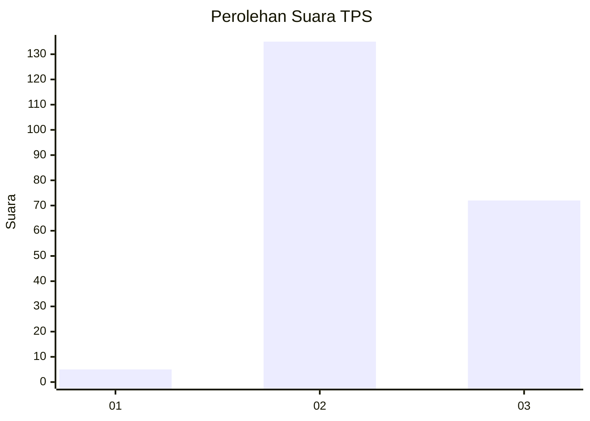
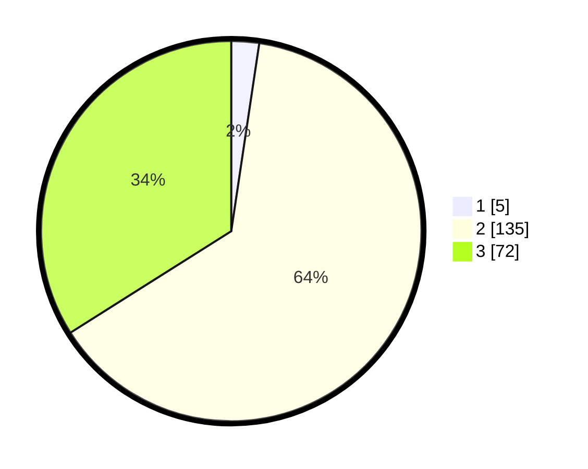

# Hasil

## Grafik

## Tabel

| No. | Nama Paslon    | Suara | Suara (raw) | Persentase |
|:--- |:-------------- | -----:| -----------:| ----------:|
| 1   | ANIES MUHAIMIN | 5     | [5][p-1]    | 2,36       |
| 2   | PRABOWO GIBRAN | 135   | [135][p-2]  | 63,68      |
| 3   | GANJAR MAHFUD  | 72    | [72][p-3]   | 33,96      |

[p-1]: https://github.com/gigit-pemilu/pemilu-2024-51-bali/blob/main/pilpres/hitung-suara/sub/51-bali/sub/08-buleleng/sub/06-buleleng/sub/1023-banjar-jawa/sub/002-tps/sub/paslon-1.txt
[p-2]: https://github.com/gigit-pemilu/pemilu-2024-51-bali/blob/main/pilpres/hitung-suara/sub/51-bali/sub/08-buleleng/sub/06-buleleng/sub/1023-banjar-jawa/sub/002-tps/sub/paslon-2.txt
[p-3]: https://github.com/gigit-pemilu/pemilu-2024-51-bali/blob/main/pilpres/hitung-suara/sub/51-bali/sub/08-buleleng/sub/06-buleleng/sub/1023-banjar-jawa/sub/002-tps/sub/paslon-3.txt

## Foto C Plano

https://sirekap-obj-formc.kpu.go.id/67a3/pemilu/ppwp/51/08/06/10/23/5108061023002-20240215-024127--82f6e74e-0a2d-4235-a3a2-26401fda9165.jpg

https://sirekap-obj-formc.kpu.go.id/67a3/pemilu/ppwp/51/08/06/10/23/5108061023002-20240215-024133--90fd983e-428b-4f2d-aa25-2d70eb798b33.jpg

https://sirekap-obj-formc.kpu.go.id/67a3/pemilu/ppwp/51/08/06/10/23/5108061023002-20240215-024139--1b43fc13-ac67-4521-a35f-215d8a9bd5fa.jpg

## Metadata

| Key        | Value               |
| ---------- | ------------------- |
| Time Stamp | 2024-02-24 22:31:28 |

