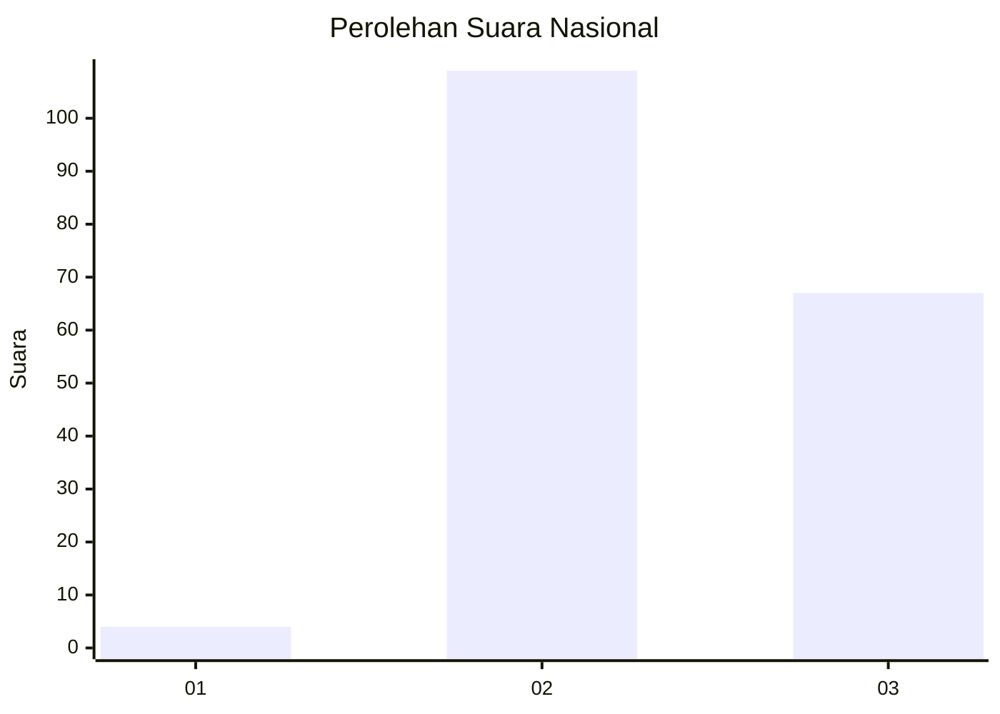
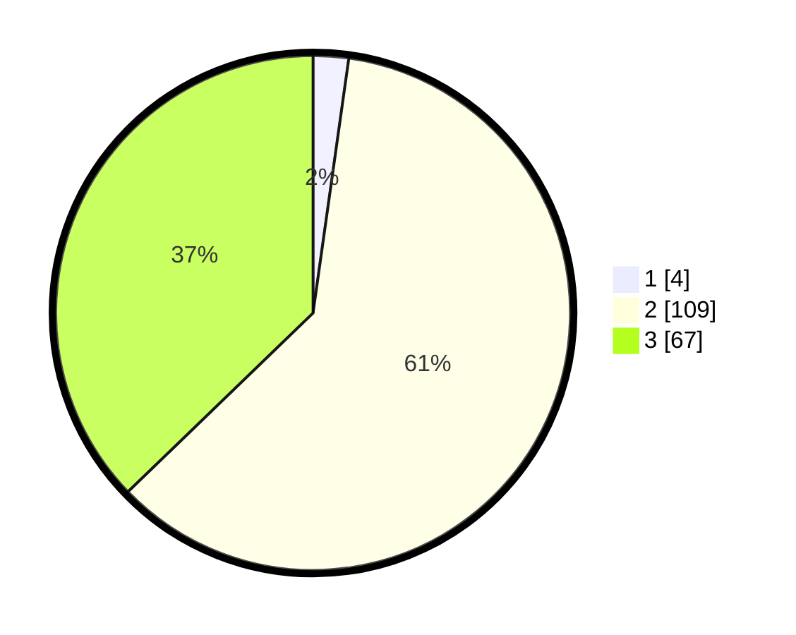

# Hasil

## Grafik

## Tabel

| No. | Nama Paslon    | Suara | Suara (raw) | Persentase |
|:--- |:-------------- | -----:| -----------:| ----------:|
| 1   | ANIES MUHAIMIN | 4     | [4][p-1]    | 2,22       |
| 2   | PRABOWO GIBRAN | 109   | [109][p-2]  | 60,56      |
| 3   | GANJAR MAHFUD  | 67    | [67][p-3]   | 37,22      |

[p-1]: https://github.com/gigit-pemilu/pemilu-2024/blob/main/pilpres/hitung-suara/sub/51-bali/sub/08-buleleng/sub/06-buleleng/sub/1023-banjar-jawa/sub/010-tps/sub/paslon-1.txt
[p-2]: https://github.com/gigit-pemilu/pemilu-2024/blob/main/pilpres/hitung-suara/sub/51-bali/sub/08-buleleng/sub/06-buleleng/sub/1023-banjar-jawa/sub/010-tps/sub/paslon-2.txt
[p-3]: https://github.com/gigit-pemilu/pemilu-2024/blob/main/pilpres/hitung-suara/sub/51-bali/sub/08-buleleng/sub/06-buleleng/sub/1023-banjar-jawa/sub/010-tps/sub/paslon-3.txt

## Foto C Plano

https://sirekap-obj-formc.kpu.go.id/2710/pemilu/ppwp/51/08/06/10/23/5108061023010-20240215-044855--3367a9a4-c14d-4d21-82d0-5f1a91fada59.jpg

https://sirekap-obj-formc.kpu.go.id/2710/pemilu/ppwp/51/08/06/10/23/5108061023010-20240215-045048--3be47fba-753d-4bcc-a526-2806793aa650.jpg

https://sirekap-obj-formc.kpu.go.id/2710/pemilu/ppwp/51/08/06/10/23/5108061023010-20240215-045232--02ab9f26-a216-4a5c-88c9-005cd6837a46.jpg

## Metadata

| Key        | Value               |
| ---------- | ------------------- |
| Time Stamp | 2024-02-24 22:31:28 |

