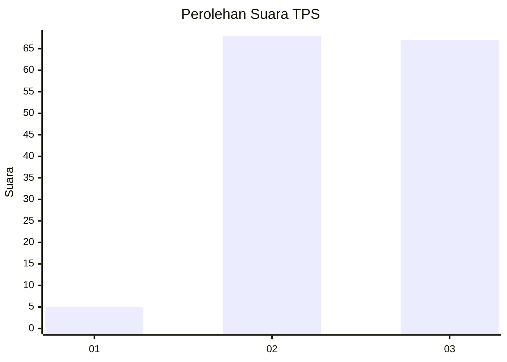
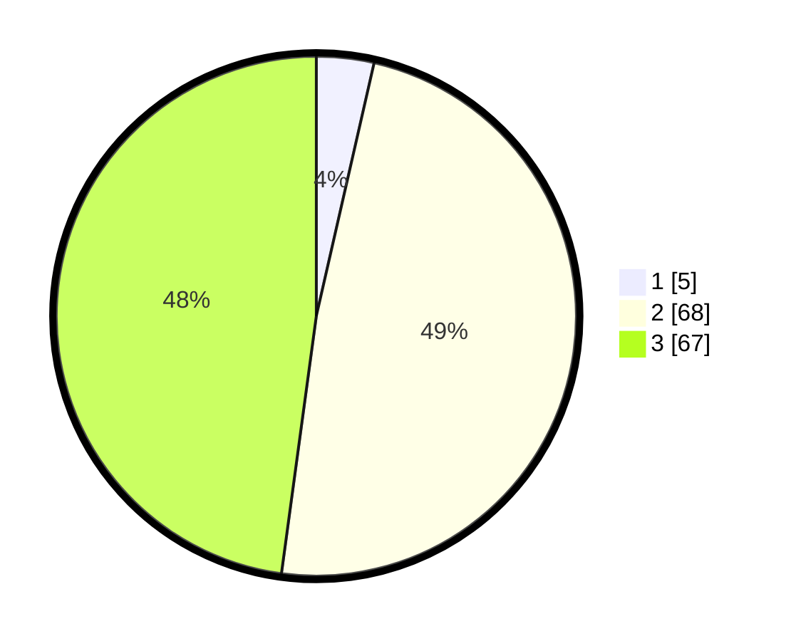

# Hasil

## Grafik

## Tabel

| No. | Nama Paslon    | Suara | Suara (raw) | Persentase |
|:--- |:-------------- | -----:| -----------:| ----------:|
| 1   | ANIES MUHAIMIN | 5     | [5][p-1]    | 3,57       |
| 2   | PRABOWO GIBRAN | 68    | [68][p-2]   | 48,57      |
| 3   | GANJAR MAHFUD  | 67    | [67][p-3]   | 47,86      |

[p-1]: https://github.com/gigit-pemilu/pemilu-2024-51-bali/blob/main/pilpres/hitung-suara/sub/51-bali/sub/08-buleleng/sub/06-buleleng/sub/1023-banjar-jawa/sub/013-tps/sub/paslon-1.txt
[p-2]: https://github.com/gigit-pemilu/pemilu-2024-51-bali/blob/main/pilpres/hitung-suara/sub/51-bali/sub/08-buleleng/sub/06-buleleng/sub/1023-banjar-jawa/sub/013-tps/sub/paslon-2.txt
[p-3]: https://github.com/gigit-pemilu/pemilu-2024-51-bali/blob/main/pilpres/hitung-suara/sub/51-bali/sub/08-buleleng/sub/06-buleleng/sub/1023-banjar-jawa/sub/013-tps/sub/paslon-3.txt

## Foto C Plano

https://sirekap-obj-formc.kpu.go.id/dfa8/pemilu/ppwp/51/08/06/10/23/5108061023013-20240215-031536--69081e43-4252-46c7-8851-90e6ee00cc70.jpg

https://sirekap-obj-formc.kpu.go.id/dfa8/pemilu/ppwp/51/08/06/10/23/5108061023013-20240215-031715--bb41745b-2643-4c11-af92-305d5094ce04.jpg

https://sirekap-obj-formc.kpu.go.id/dfa8/pemilu/ppwp/51/08/06/10/23/5108061023013-20240215-031841--b1ff083b-5bcb-4a54-87f2-cdb0c22e164c.jpg

## Metadata

| Key        | Value               |
| ---------- | ------------------- |
| Time Stamp | 2024-02-24 22:31:28 |

