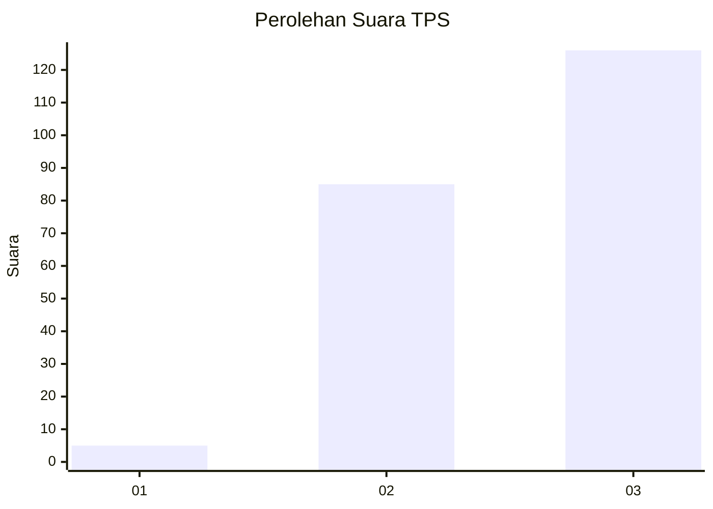
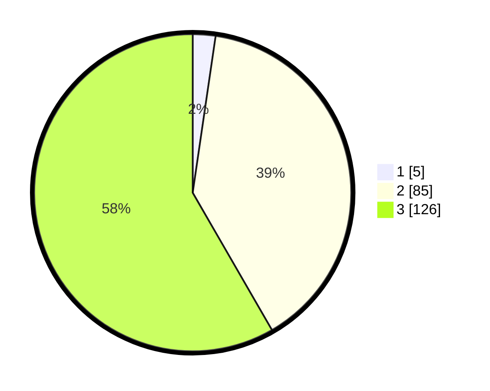

# Hasil

## Grafik

## Tabel

| No. | Nama Paslon    | Suara | Suara (raw) | Persentase |
|:--- |:-------------- | -----:| -----------:| ----------:|
| 1   | ANIES MUHAIMIN | 5     | [5][p-1]    | 2,31       |
| 2   | PRABOWO GIBRAN | 85    | [85][p-2]   | 39,35      |
| 3   | GANJAR MAHFUD  | 126   | [126][p-3]  | 58,33      |

[p-1]: https://github.com/gigit-pemilu/pemilu-2024-51-bali/blob/main/pilpres/hitung-suara/sub/51-bali/sub/08-buleleng/sub/06-buleleng/sub/1024-kaliuntu/sub/004-tps/sub/paslon-1.txt
[p-2]: https://github.com/gigit-pemilu/pemilu-2024-51-bali/blob/main/pilpres/hitung-suara/sub/51-bali/sub/08-buleleng/sub/06-buleleng/sub/1024-kaliuntu/sub/004-tps/sub/paslon-2.txt
[p-3]: https://github.com/gigit-pemilu/pemilu-2024-51-bali/blob/main/pilpres/hitung-suara/sub/51-bali/sub/08-buleleng/sub/06-buleleng/sub/1024-kaliuntu/sub/004-tps/sub/paslon-3.txt

## Foto C Plano

https://sirekap-obj-formc.kpu.go.id/4df8/pemilu/ppwp/51/08/06/10/24/5108061024004-20240217-175514--b4748c98-56f8-4bea-a336-9f7649c27513.jpg

https://sirekap-obj-formc.kpu.go.id/4df8/pemilu/ppwp/51/08/06/10/24/5108061024004-20240217-175518--cc703030-1076-4b58-bbc7-ca3ee607394d.jpg

https://sirekap-obj-formc.kpu.go.id/4df8/pemilu/ppwp/51/08/06/10/24/5108061024004-20240217-175521--646913c8-f9f5-44da-9e75-ddf2a09d6928.jpg

## Metadata

| Key        | Value               |
| ---------- | ------------------- |
| Time Stamp | 2024-02-24 22:31:28 |

