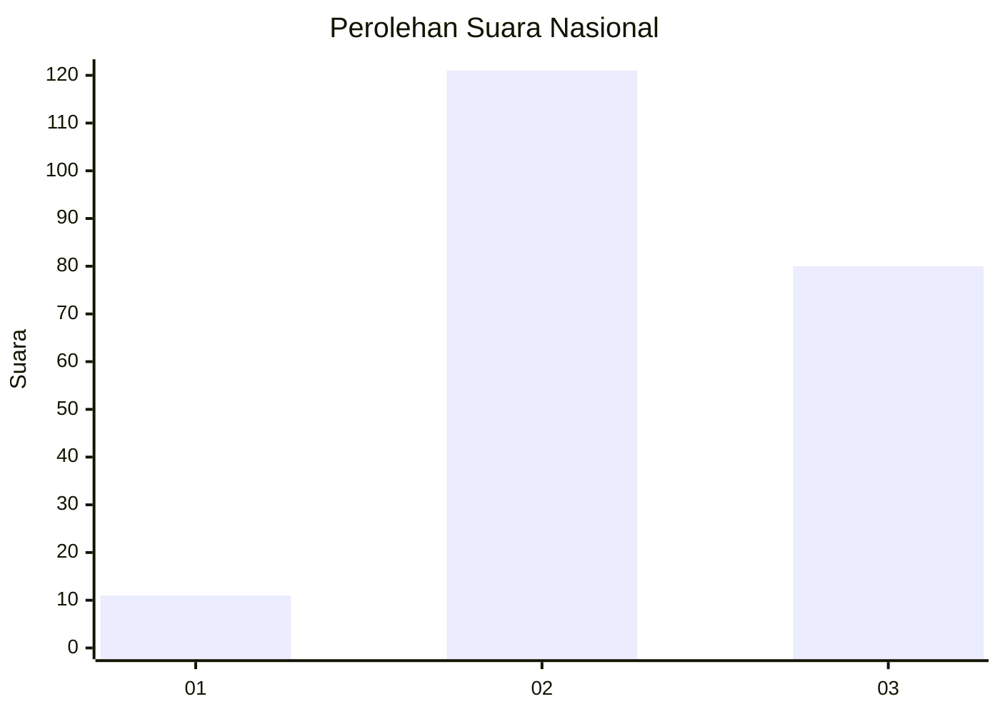
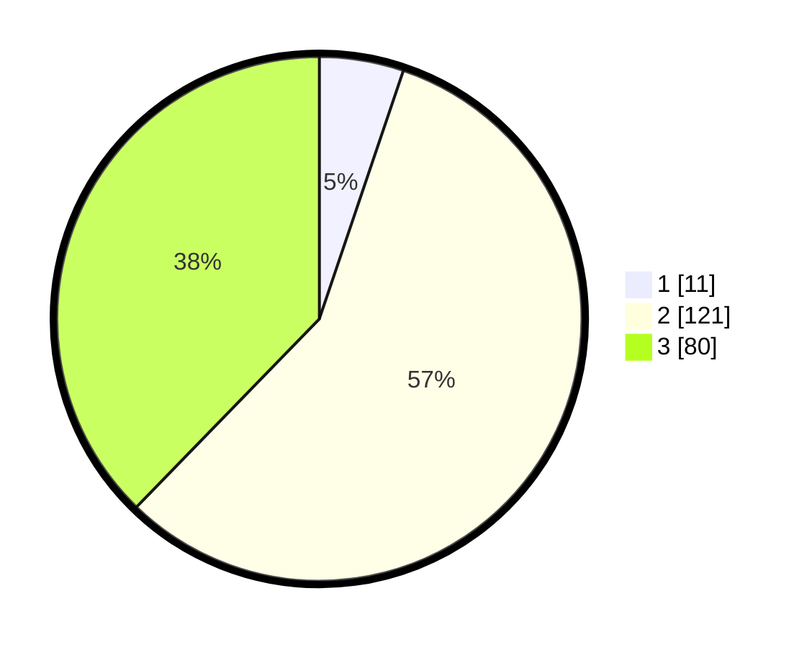

# Hasil

## Grafik

## Tabel

| No. | Nama Paslon    | Suara | Suara (raw) | Persentase |
|:--- |:-------------- | -----:| -----------:| ----------:|
| 1   | ANIES MUHAIMIN | 11    | [11][p-1]   | 5,19       |
| 2   | PRABOWO GIBRAN | 121   | [121][p-2]  | 57,08      |
| 3   | GANJAR MAHFUD  | 80    | [80][p-3]   | 37,74      |

[p-1]: https://github.com/gigit-pemilu/pemilu-2024/blob/main/pilpres/hitung-suara/sub/51-bali/sub/08-buleleng/sub/06-buleleng/sub/1024-kaliuntu/sub/005-tps/sub/paslon-1.txt
[p-2]: https://github.com/gigit-pemilu/pemilu-2024/blob/main/pilpres/hitung-suara/sub/51-bali/sub/08-buleleng/sub/06-buleleng/sub/1024-kaliuntu/sub/005-tps/sub/paslon-2.txt
[p-3]: https://github.com/gigit-pemilu/pemilu-2024/blob/main/pilpres/hitung-suara/sub/51-bali/sub/08-buleleng/sub/06-buleleng/sub/1024-kaliuntu/sub/005-tps/sub/paslon-3.txt

## Foto C Plano

https://sirekap-obj-formc.kpu.go.id/4851/pemilu/ppwp/51/08/06/10/24/5108061024005-20240214-160115--1e7f70ae-a654-4313-9c1f-b26a67cba816.jpg

https://sirekap-obj-formc.kpu.go.id/4851/pemilu/ppwp/51/08/06/10/24/5108061024005-20240214-155903--15f38cec-a9b3-48a0-9e64-83aecb231e63.jpg

https://sirekap-obj-formc.kpu.go.id/4851/pemilu/ppwp/51/08/06/10/24/5108061024005-20240214-160111--d55cf77d-2d8a-43e3-aacd-cfcf76bb03a7.jpg

## Metadata

| Key        | Value               |
| ---------- | ------------------- |
| Time Stamp | 2024-02-24 22:31:28 |

