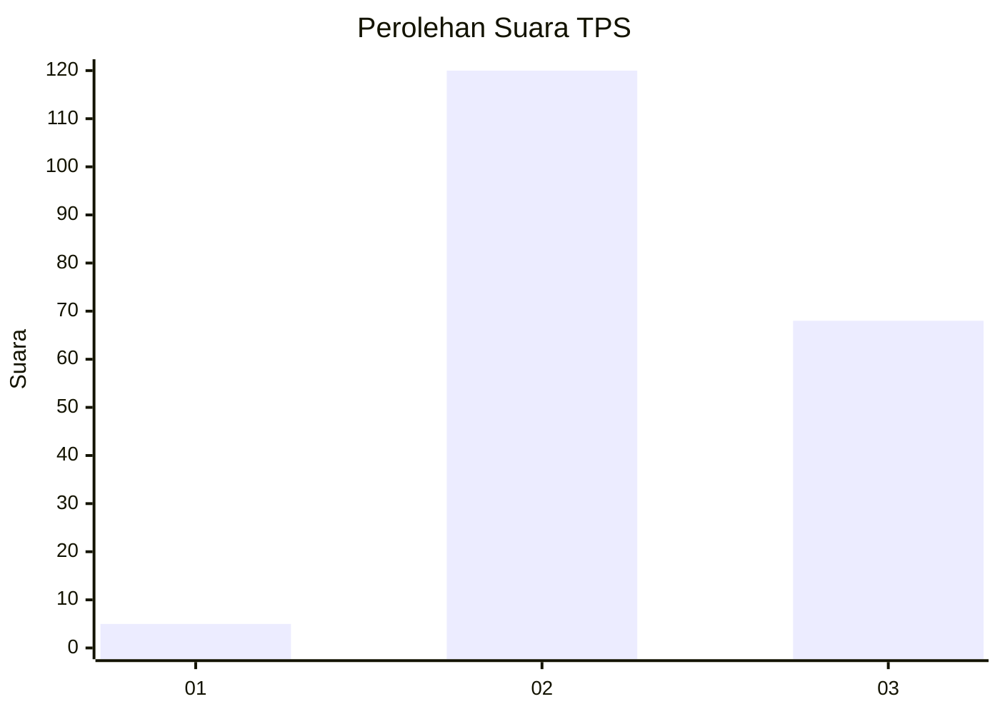
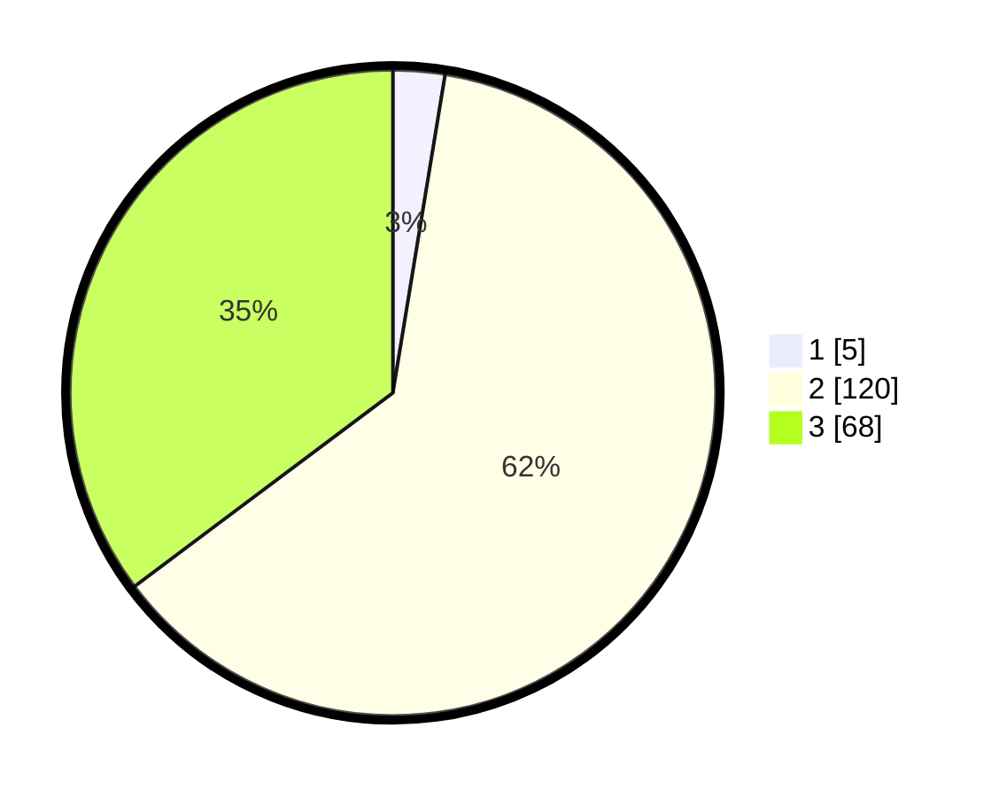

# Hasil

## Grafik

## Tabel

| No. | Nama Paslon    | Suara | Suara (raw) | Persentase |
|:--- |:-------------- | -----:| -----------:| ----------:|
| 1   | ANIES MUHAIMIN | 5     | [5][p-1]    | 2,59       |
| 2   | PRABOWO GIBRAN | 120   | [120][p-2]  | 62,18      |
| 3   | GANJAR MAHFUD  | 68    | [68][p-3]   | 35,23      |

[p-1]: https://github.com/gigit-pemilu/pemilu-2024-51-bali/blob/main/pilpres/hitung-suara/sub/51-bali/sub/08-buleleng/sub/06-buleleng/sub/1024-kaliuntu/sub/006-tps/sub/paslon-1.txt
[p-2]: https://github.com/gigit-pemilu/pemilu-2024-51-bali/blob/main/pilpres/hitung-suara/sub/51-bali/sub/08-buleleng/sub/06-buleleng/sub/1024-kaliuntu/sub/006-tps/sub/paslon-2.txt
[p-3]: https://github.com/gigit-pemilu/pemilu-2024-51-bali/blob/main/pilpres/hitung-suara/sub/51-bali/sub/08-buleleng/sub/06-buleleng/sub/1024-kaliuntu/sub/006-tps/sub/paslon-3.txt

## Foto C Plano

https://sirekap-obj-formc.kpu.go.id/778c/pemilu/ppwp/51/08/06/10/24/5108061024006-20240214-204549--9da1f40a-37ac-4c38-9d00-443af607df44.jpg

https://sirekap-obj-formc.kpu.go.id/778c/pemilu/ppwp/51/08/06/10/24/5108061024006-20240215-112415--57aa1b92-a217-4a1f-b496-d9fb8f2dbc04.jpg

https://sirekap-obj-formc.kpu.go.id/778c/pemilu/ppwp/51/08/06/10/24/5108061024006-20240215-112520--5f3180d9-1549-49ca-b01d-93f561e32b67.jpg

## Metadata

| Key        | Value               |
| ---------- | ------------------- |
| Time Stamp | 2024-02-15 19:00:26 |

## DATA PEMILIH TETAP

Jumlah pemilih dalam DPT: **284**.
 * L: **122**.
 * P: **162**.

## DATA PENGGUNA HAK PILIH

Jumlah pengguna hak pilih dalam DPT: **183**.
 * L: **84**.
 * P: **99**.

Jumlah pengguna hak pilih dalam DPTb: **8**.
 * L: **4**.
 * P: **4**.

Jumlah pengguna hak pilih dalam DPK: **4**.
 * L: **0**.
 * P: **4**.

Jumlah pengguna hak pilih: **195**.
 * L: **88**.
 * P: **107**.

## JUMLAH SUARA SAH DAN TIDAK SAH

JUMLAH SELURUH SUARA SAH: **193**.

JUMLAH SUARA TIDAK SAH: **2**.

JUMLAH SELURUH SUARA SAH DAN SUARA TIDAK SAH: **195**.

