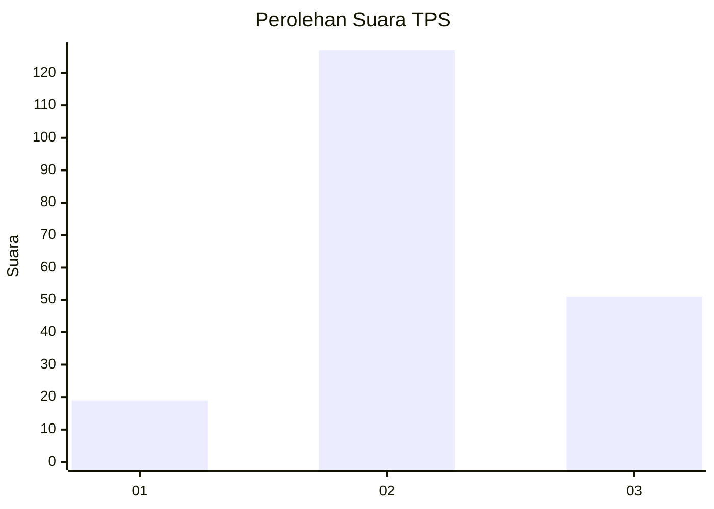
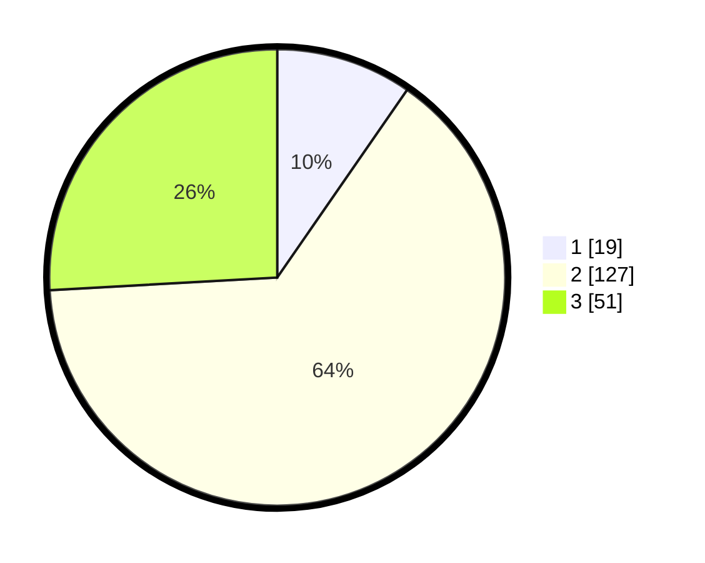

# Hasil

## Grafik

## Tabel

| No. | Nama Paslon    | Suara | Suara (raw) | Persentase |
|:--- |:-------------- | -----:| -----------:| ----------:|
| 1   | ANIES MUHAIMIN | 19    | [19][p-1]   | 9,64       |
| 2   | PRABOWO GIBRAN | 127   | [127][p-2]  | 64,47      |
| 3   | GANJAR MAHFUD  | 51    | [51][p-3]   | 25,89      |

[p-1]: https://github.com/gigit-pemilu/pemilu-2024-51-bali/blob/main/pilpres/hitung-suara/sub/51-bali/sub/08-buleleng/sub/06-buleleng/sub/1025-kampung-anyar/sub/010-tps/sub/paslon-1.txt
[p-2]: https://github.com/gigit-pemilu/pemilu-2024-51-bali/blob/main/pilpres/hitung-suara/sub/51-bali/sub/08-buleleng/sub/06-buleleng/sub/1025-kampung-anyar/sub/010-tps/sub/paslon-2.txt
[p-3]: https://github.com/gigit-pemilu/pemilu-2024-51-bali/blob/main/pilpres/hitung-suara/sub/51-bali/sub/08-buleleng/sub/06-buleleng/sub/1025-kampung-anyar/sub/010-tps/sub/paslon-3.txt

## Foto C Plano

https://sirekap-obj-formc.kpu.go.id/cbc0/pemilu/ppwp/51/08/06/10/25/5108061025010-20240214-235329--f50f6c55-2e0a-4d05-8dfc-e49ce43be552.jpg

https://sirekap-obj-formc.kpu.go.id/cbc0/pemilu/ppwp/51/08/06/10/25/5108061025010-20240215-000015--299d4f59-9932-4873-a440-a17e5b61604b.jpg

https://sirekap-obj-formc.kpu.go.id/cbc0/pemilu/ppwp/51/08/06/10/25/5108061025010-20240215-000203--02be1e6c-f649-4d60-8259-10c706edcc2f.jpg

## Metadata

| Key        | Value               |
| ---------- | ------------------- |
| Time Stamp | 2024-02-24 22:31:28 |

