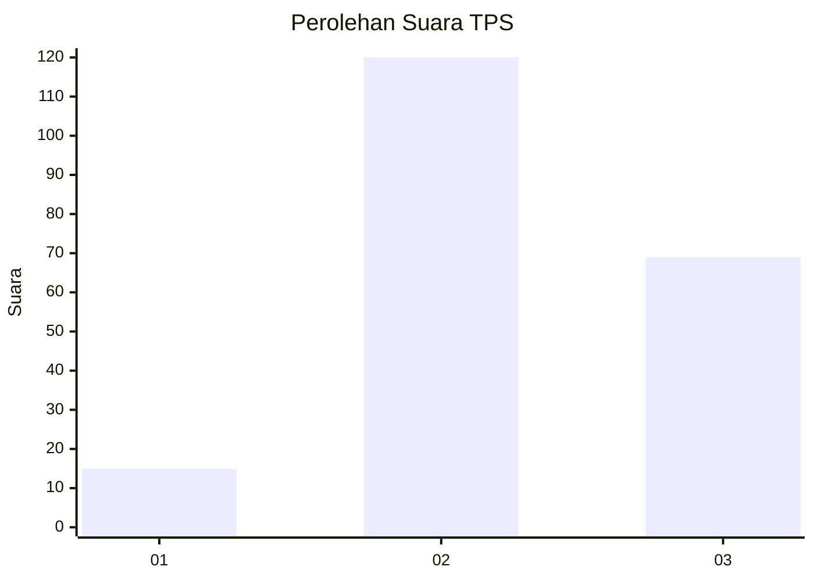
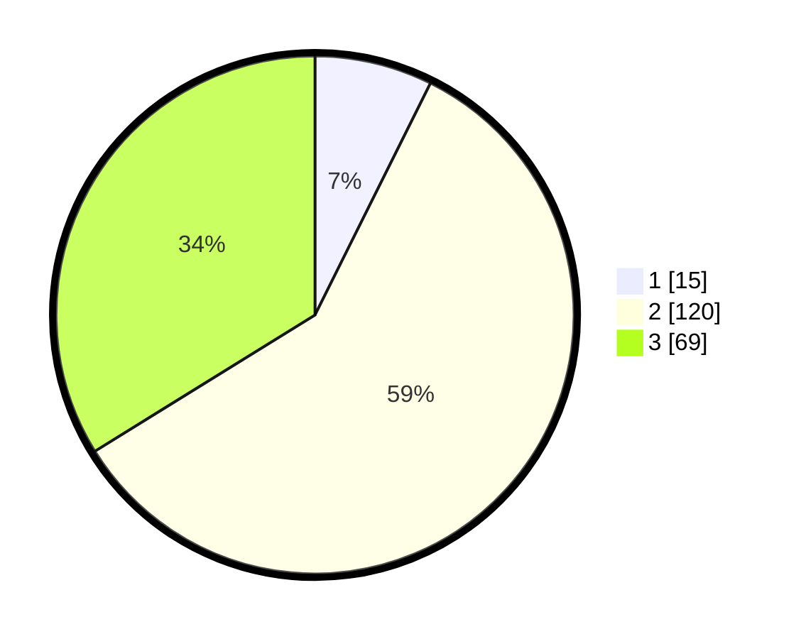

# Hasil

## Grafik

## Tabel

| No. | Nama Paslon    | Suara | Suara (raw) | Persentase |
|:--- |:-------------- | -----:| -----------:| ----------:|
| 1   | ANIES MUHAIMIN | 15    | [15][p-1]   | 7,35       |
| 2   | PRABOWO GIBRAN | 120   | [120][p-2]  | 58,82      |
| 3   | GANJAR MAHFUD  | 69    | [69][p-3]   | 33,82      |

[p-1]: https://github.com/gigit-pemilu/pemilu-2024-51-bali/blob/main/pilpres/hitung-suara/sub/51-bali/sub/08-buleleng/sub/06-buleleng/sub/1025-kampung-anyar/sub/013-tps/sub/paslon-1.txt
[p-2]: https://github.com/gigit-pemilu/pemilu-2024-51-bali/blob/main/pilpres/hitung-suara/sub/51-bali/sub/08-buleleng/sub/06-buleleng/sub/1025-kampung-anyar/sub/013-tps/sub/paslon-2.txt
[p-3]: https://github.com/gigit-pemilu/pemilu-2024-51-bali/blob/main/pilpres/hitung-suara/sub/51-bali/sub/08-buleleng/sub/06-buleleng/sub/1025-kampung-anyar/sub/013-tps/sub/paslon-3.txt

## Foto C Plano

https://sirekap-obj-formc.kpu.go.id/6a46/pemilu/ppwp/51/08/06/10/25/5108061025013-20240219-130138--84ea3ba4-c14d-44a1-a39e-97d6504ebcd5.jpg

https://sirekap-obj-formc.kpu.go.id/6a46/pemilu/ppwp/51/08/06/10/25/5108061025013-20240219-130232--a7e3f166-a8f1-4e5d-99da-ef7d1debc5ac.jpg

https://sirekap-obj-formc.kpu.go.id/6a46/pemilu/ppwp/51/08/06/10/25/5108061025013-20240219-131532--9edccd66-b8bf-4923-87e8-e7f7216ef83b.jpg

## Metadata

| Key        | Value               |
| ---------- | ------------------- |
| Time Stamp | 2024-02-25 17:00:00 |

