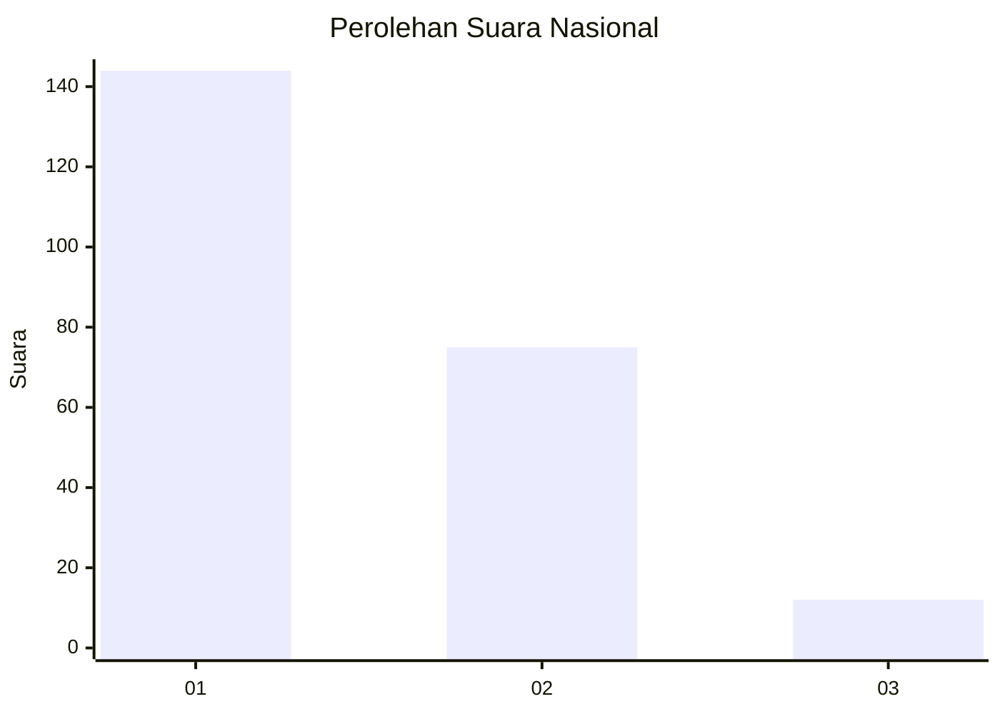
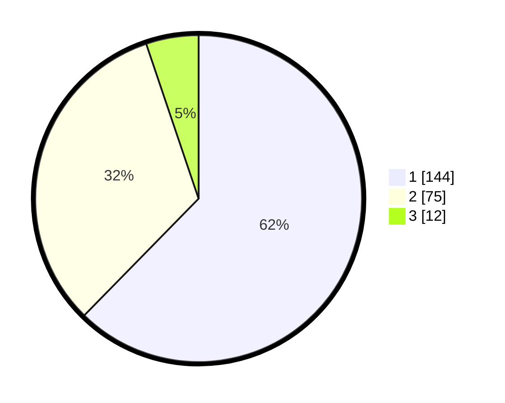

# Hasil

## Grafik

## Tabel

| No. | Nama Paslon    | Suara | Suara (raw) | Persentase |
|:--- |:-------------- | -----:| -----------:| ----------:|
| 1   | ANIES MUHAIMIN | 144   | [144][p-1]  | 62,34      |
| 2   | PRABOWO GIBRAN | 75    | [75][p-2]   | 32,47      |
| 3   | GANJAR MAHFUD  | 12    | [12][p-3]   | 5,19       |

[p-1]: https://github.com/gigit-pemilu/pemilu-2024/blob/main/pilpres/hitung-suara/sub/51-bali/sub/08-buleleng/sub/06-buleleng/sub/1026-kampung-bugis/sub/003-tps/sub/paslon-1.txt
[p-2]: https://github.com/gigit-pemilu/pemilu-2024/blob/main/pilpres/hitung-suara/sub/51-bali/sub/08-buleleng/sub/06-buleleng/sub/1026-kampung-bugis/sub/003-tps/sub/paslon-2.txt
[p-3]: https://github.com/gigit-pemilu/pemilu-2024/blob/main/pilpres/hitung-suara/sub/51-bali/sub/08-buleleng/sub/06-buleleng/sub/1026-kampung-bugis/sub/003-tps/sub/paslon-3.txt

## Foto C Plano

https://sirekap-obj-formc.kpu.go.id/c31e/pemilu/ppwp/51/08/06/10/26/5108061026003-20240218-132036--452bb82f-7a1e-4311-8547-8747a417bf6a.jpg

https://sirekap-obj-formc.kpu.go.id/c31e/pemilu/ppwp/51/08/06/10/26/5108061026003-20240218-132038--25b2c331-9489-49ea-a9af-9636d0b73ac6.jpg

https://sirekap-obj-formc.kpu.go.id/c31e/pemilu/ppwp/51/08/06/10/26/5108061026003-20240218-132037--90911b9c-9d15-4bda-9a79-f201ae08ff8e.jpg

## Metadata

| Key        | Value               |
| ---------- | ------------------- |
| Time Stamp | 2024-02-21 10:00:00 |

## DATA PEMILIH TETAP

Jumlah pemilih dalam DPT: **290**.
 * L: **140**.
 * P: **150**.

## DATA PENGGUNA HAK PILIH

Jumlah pengguna hak pilih dalam DPT: **230**.
 * L: **113**.
 * P: **117**.

Jumlah pengguna hak pilih dalam DPTb: **1**.
 * L: **0**.
 * P: **1**.

Jumlah pengguna hak pilih dalam DPK: **3**.
 * L: **2**.
 * P: **1**.

Jumlah pengguna hak pilih: **234**.
 * L: **115**.
 * P: **119**.

## JUMLAH SUARA SAH DAN TIDAK SAH

JUMLAH SELURUH SUARA SAH: **231**.

JUMLAH SUARA TIDAK SAH: **3**.

JUMLAH SELURUH SUARA SAH DAN SUARA TIDAK SAH: **234**.

