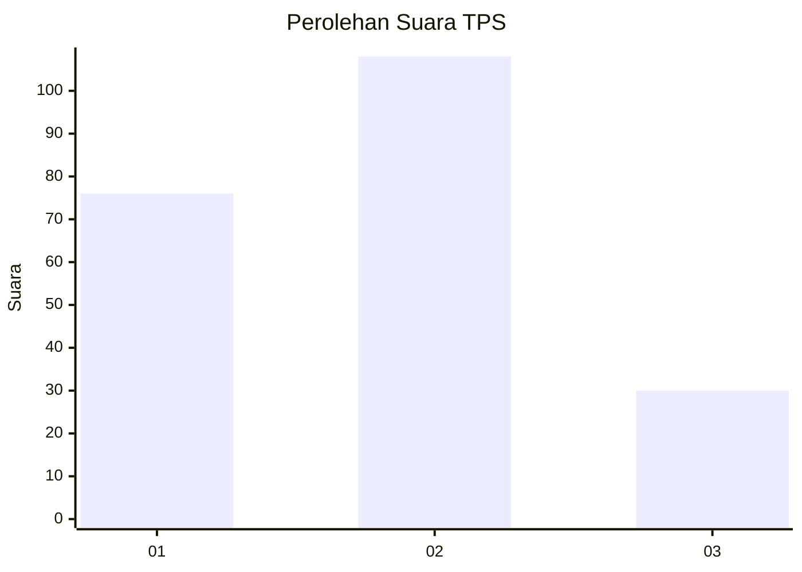
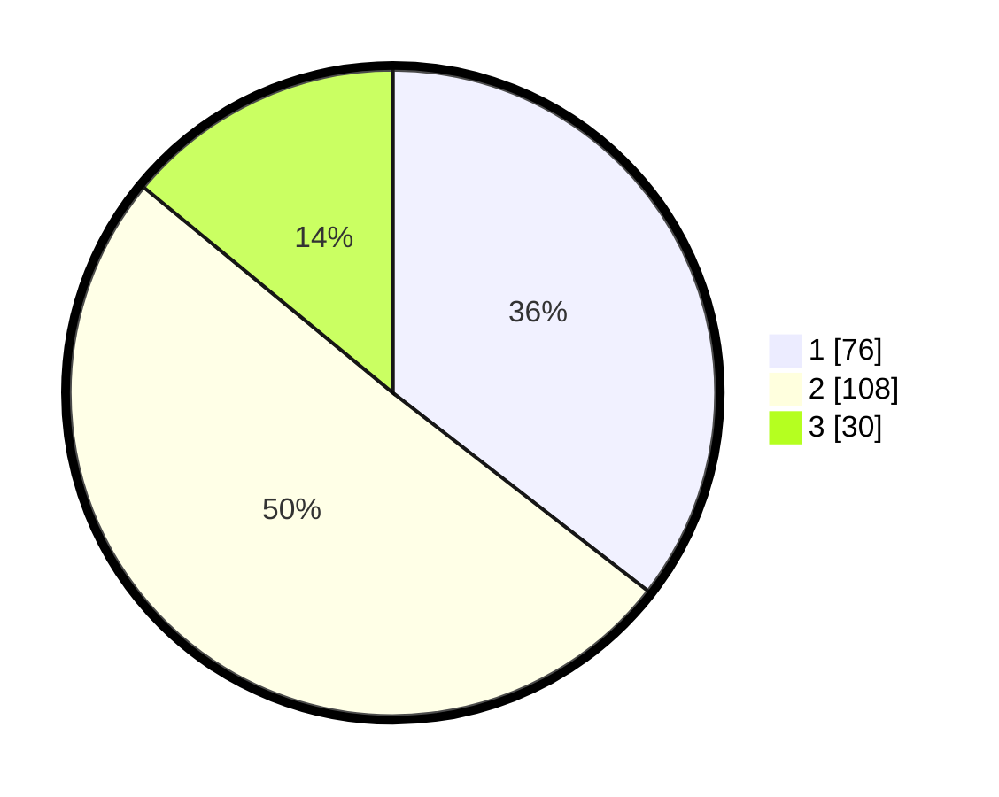

# Hasil

## Grafik

## Tabel

| No. | Nama Paslon    | Suara | Suara (raw) | Persentase |
|:--- |:-------------- | -----:| -----------:| ----------:|
| 1   | ANIES MUHAIMIN | 76    | [76][p-1]   | 35,51      |
| 2   | PRABOWO GIBRAN | 108   | [108][p-2]  | 50,47      |
| 3   | GANJAR MAHFUD  | 30    | [30][p-3]   | 14,02      |

[p-1]: https://github.com/gigit-pemilu/pemilu-2024-51-bali/blob/main/pilpres/hitung-suara/sub/51-bali/sub/08-buleleng/sub/06-buleleng/sub/1026-kampung-bugis/sub/006-tps/sub/paslon-1.txt
[p-2]: https://github.com/gigit-pemilu/pemilu-2024-51-bali/blob/main/pilpres/hitung-suara/sub/51-bali/sub/08-buleleng/sub/06-buleleng/sub/1026-kampung-bugis/sub/006-tps/sub/paslon-2.txt
[p-3]: https://github.com/gigit-pemilu/pemilu-2024-51-bali/blob/main/pilpres/hitung-suara/sub/51-bali/sub/08-buleleng/sub/06-buleleng/sub/1026-kampung-bugis/sub/006-tps/sub/paslon-3.txt

## Foto C Plano

https://sirekap-obj-formc.kpu.go.id/fa20/pemilu/ppwp/51/08/06/10/26/5108061026006-20240217-133337--4fb09ba7-6a47-44a2-8983-e16af99a5d19.jpg

https://sirekap-obj-formc.kpu.go.id/fa20/pemilu/ppwp/51/08/06/10/26/5108061026006-20240217-133354--03004d9a-2aa4-4350-9e0f-323af764e7fb.jpg

https://sirekap-obj-formc.kpu.go.id/fa20/pemilu/ppwp/51/08/06/10/26/5108061026006-20240217-133406--7a157420-9fa1-400f-ac36-f5b1d3ac4f75.jpg

## Metadata

| Key        | Value               |
| ---------- | ------------------- |
| Time Stamp | 2024-02-24 22:31:28 |

