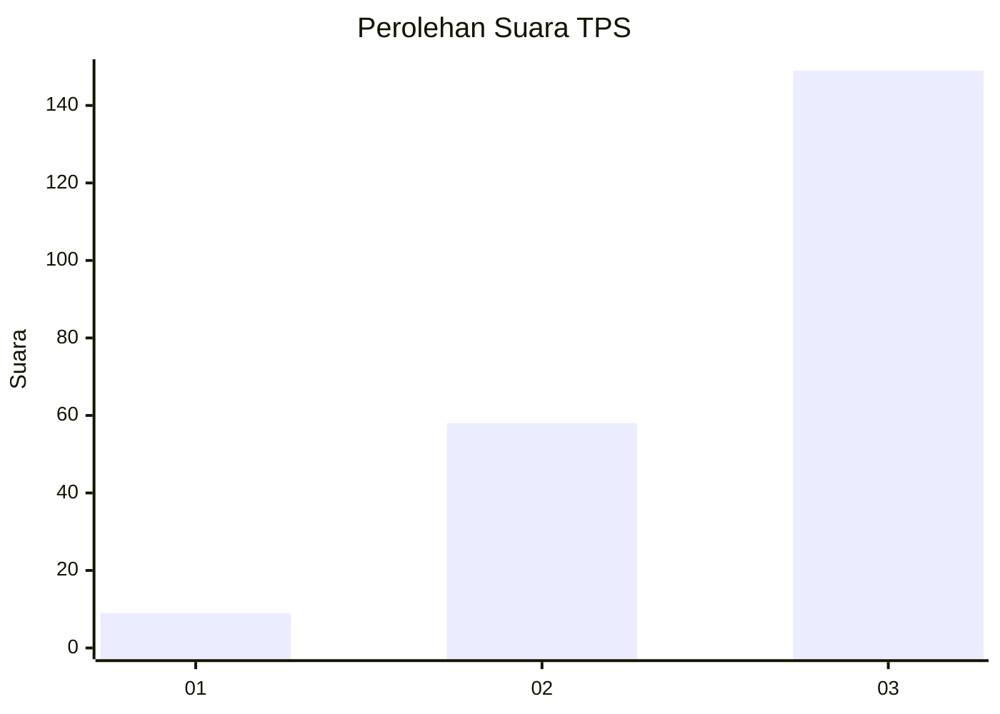
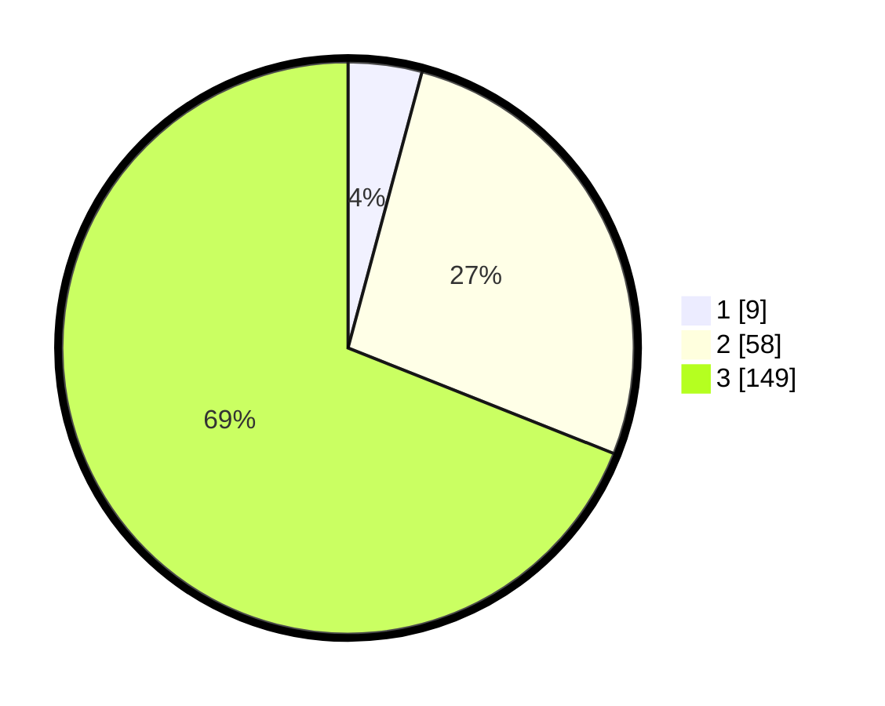

# Hasil

## Grafik

## Tabel

| No. | Nama Paslon    | Suara | Suara (raw) | Persentase |
|:--- |:-------------- | -----:| -----------:| ----------:|
| 1   | ANIES MUHAIMIN | 9     | [9][p-1]    | 4,17       |
| 2   | PRABOWO GIBRAN | 58    | [58][p-2]   | 26,85      |
| 3   | GANJAR MAHFUD  | 149   | [149][p-3]  | 68,98      |

[p-1]: https://github.com/gigit-pemilu/pemilu-2024-51-bali/blob/main/pilpres/hitung-suara/sub/51-bali/sub/08-buleleng/sub/06-buleleng/sub/1027-banjar-bali/sub/005-tps/sub/paslon-1.txt
[p-2]: https://github.com/gigit-pemilu/pemilu-2024-51-bali/blob/main/pilpres/hitung-suara/sub/51-bali/sub/08-buleleng/sub/06-buleleng/sub/1027-banjar-bali/sub/005-tps/sub/paslon-2.txt
[p-3]: https://github.com/gigit-pemilu/pemilu-2024-51-bali/blob/main/pilpres/hitung-suara/sub/51-bali/sub/08-buleleng/sub/06-buleleng/sub/1027-banjar-bali/sub/005-tps/sub/paslon-3.txt

## Foto C Plano

https://sirekap-obj-formc.kpu.go.id/a086/pemilu/ppwp/51/08/06/10/27/5108061027005-20240216-142816--4fe0963f-453e-4c0f-9eba-9c26ed6562fa.jpg

https://sirekap-obj-formc.kpu.go.id/a086/pemilu/ppwp/51/08/06/10/27/5108061027005-20240216-142817--8f4e7519-c485-4a40-a996-d5632bb5abaf.jpg

https://sirekap-obj-formc.kpu.go.id/a086/pemilu/ppwp/51/08/06/10/27/5108061027005-20240216-142816--80ac268d-5bce-4c20-9b94-dafaf26356b9.jpg

## Metadata

| Key        | Value               |
| ---------- | ------------------- |
| Time Stamp | 2024-02-17 18:30:00 |

## DATA PEMILIH TETAP

Jumlah pemilih dalam DPT: **257**.
 * L: **126**.
 * P: **131**.

## DATA PENGGUNA HAK PILIH

Jumlah pengguna hak pilih dalam DPT: **251**.
 * L: **123**.
 * P: **128**.

Jumlah pengguna hak pilih dalam DPTb: **0**.
 * L: **0**.
 * P: **0**.

Jumlah pengguna hak pilih dalam DPK: **0**.
 * L: **0**.
 * P: **0**.

Jumlah pengguna hak pilih: **251**.
 * L: **123**.
 * P: **128**.

## JUMLAH SUARA SAH DAN TIDAK SAH

JUMLAH SELURUH SUARA SAH: **216**.

JUMLAH SUARA TIDAK SAH: **35**.

JUMLAH SELURUH SUARA SAH DAN SUARA TIDAK SAH: **251**.

