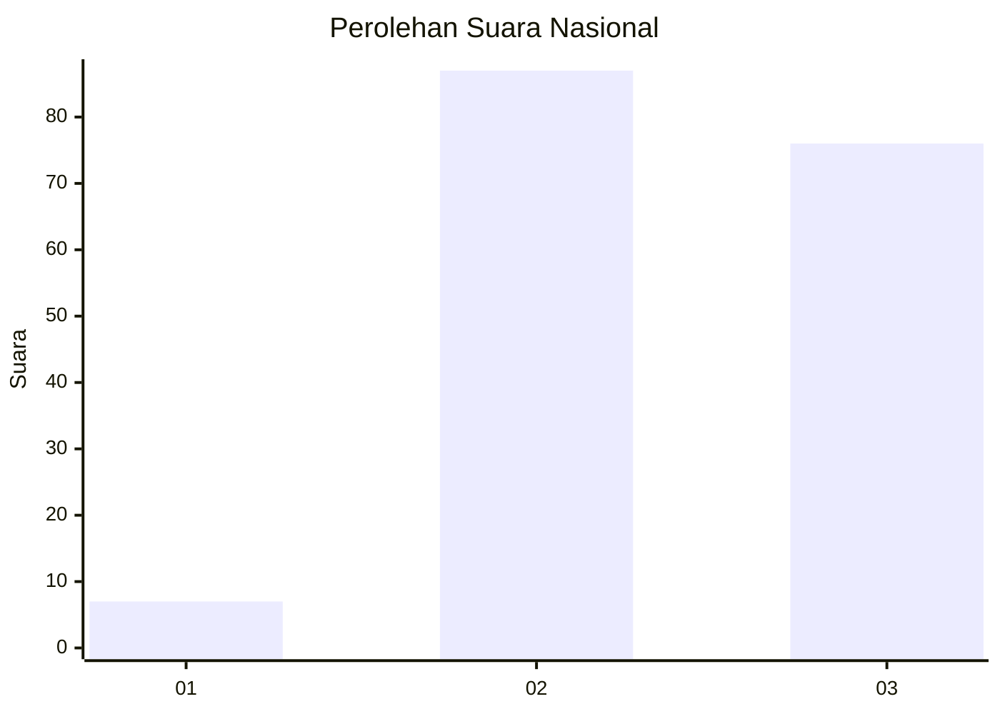
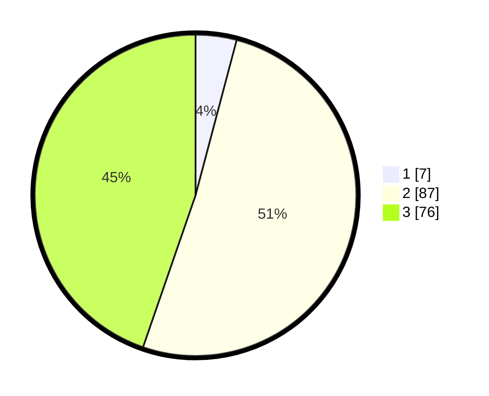

# Hasil

## Grafik

## Tabel

| No. | Nama Paslon    | Suara | Suara (raw) | Persentase |
|:--- |:-------------- | -----:| -----------:| ----------:|
| 1   | ANIES MUHAIMIN | 7     | [7][p-1]    | 4,12       |
| 2   | PRABOWO GIBRAN | 87    | [87][p-2]   | 51,18      |
| 3   | GANJAR MAHFUD  | 76    | [76][p-3]   | 44,71      |

[p-1]: https://github.com/gigit-pemilu/pemilu-2024/blob/main/pilpres/hitung-suara/sub/51-bali/sub/08-buleleng/sub/06-buleleng/sub/1027-banjar-bali/sub/006-tps/sub/paslon-1.txt
[p-2]: https://github.com/gigit-pemilu/pemilu-2024/blob/main/pilpres/hitung-suara/sub/51-bali/sub/08-buleleng/sub/06-buleleng/sub/1027-banjar-bali/sub/006-tps/sub/paslon-2.txt
[p-3]: https://github.com/gigit-pemilu/pemilu-2024/blob/main/pilpres/hitung-suara/sub/51-bali/sub/08-buleleng/sub/06-buleleng/sub/1027-banjar-bali/sub/006-tps/sub/paslon-3.txt

## Foto C Plano

https://sirekap-obj-formc.kpu.go.id/4b49/pemilu/ppwp/51/08/06/10/27/5108061027006-20240214-210550--47a0149e-35b0-4998-936e-bac1f2dc5f55.jpg

https://sirekap-obj-formc.kpu.go.id/4b49/pemilu/ppwp/51/08/06/10/27/5108061027006-20240214-210640--f4ecb061-d96d-40df-9f1e-c6bb3ad95471.jpg

https://sirekap-obj-formc.kpu.go.id/4b49/pemilu/ppwp/51/08/06/10/27/5108061027006-20240214-232404--f3ee7453-e73c-4f1e-86d1-eb7d6f388447.jpg

## Metadata

| Key        | Value               |
| ---------- | ------------------- |
| Time Stamp | 2024-02-24 22:31:28 |

