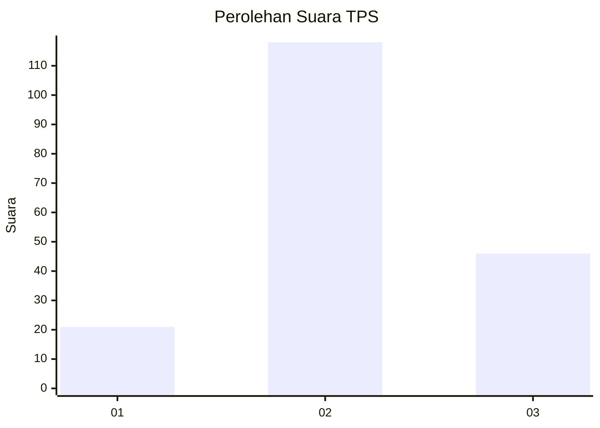
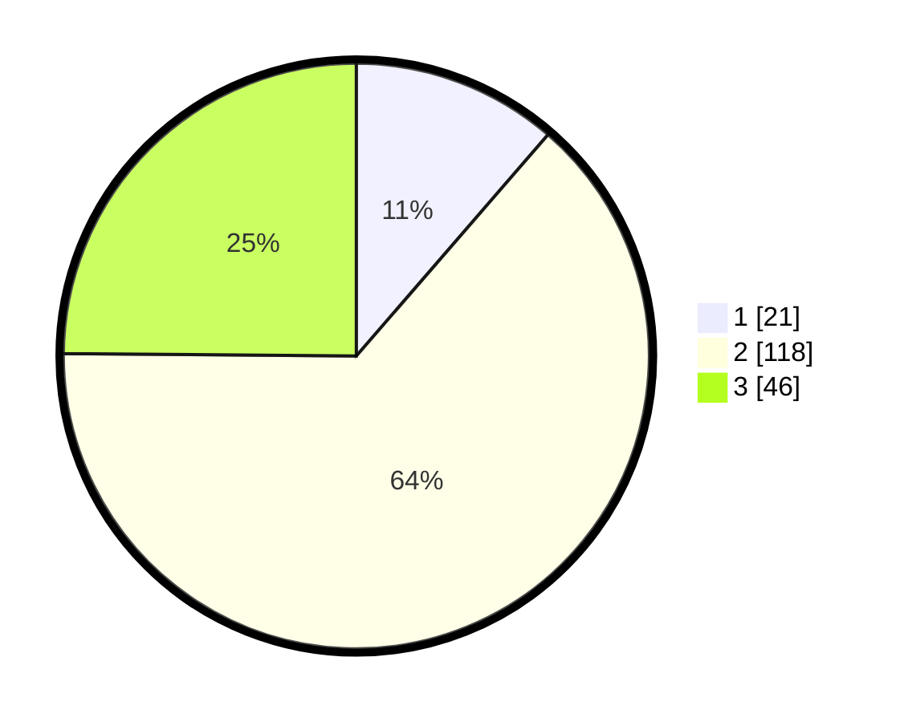

# Hasil

## Grafik

## Tabel

| No. | Nama Paslon    | Suara | Suara (raw) | Persentase |
|:--- |:-------------- | -----:| -----------:| ----------:|
| 1   | ANIES MUHAIMIN | 21    | [21][p-1]   | 11,35      |
| 2   | PRABOWO GIBRAN | 118   | [118][p-2]  | 63,78      |
| 3   | GANJAR MAHFUD  | 46    | [46][p-3]   | 24,86      |

[p-1]: https://github.com/gigit-pemilu/pemilu-2024-51-bali/blob/main/pilpres/hitung-suara/sub/51-bali/sub/08-buleleng/sub/06-buleleng/sub/1029-kampung-baru/sub/001-tps/sub/paslon-1.txt
[p-2]: https://github.com/gigit-pemilu/pemilu-2024-51-bali/blob/main/pilpres/hitung-suara/sub/51-bali/sub/08-buleleng/sub/06-buleleng/sub/1029-kampung-baru/sub/001-tps/sub/paslon-2.txt
[p-3]: https://github.com/gigit-pemilu/pemilu-2024-51-bali/blob/main/pilpres/hitung-suara/sub/51-bali/sub/08-buleleng/sub/06-buleleng/sub/1029-kampung-baru/sub/001-tps/sub/paslon-3.txt

## Foto C Plano

https://sirekap-obj-formc.kpu.go.id/9b73/pemilu/ppwp/51/08/06/10/29/5108061029001-20240214-222644--51f29034-e28b-4d8c-a9fa-e3e0d1b0e665.jpg

https://sirekap-obj-formc.kpu.go.id/9b73/pemilu/ppwp/51/08/06/10/29/5108061029001-20240214-222444--47e5b37b-541c-4d07-8ca5-4cce8237680d.jpg

https://sirekap-obj-formc.kpu.go.id/9b73/pemilu/ppwp/51/08/06/10/29/5108061029001-20240214-215555--e91eda59-d10c-4eed-b540-a77a35062612.jpg

## Metadata

| Key        | Value               |
| ---------- | ------------------- |
| Time Stamp | 2024-02-24 22:31:28 |

