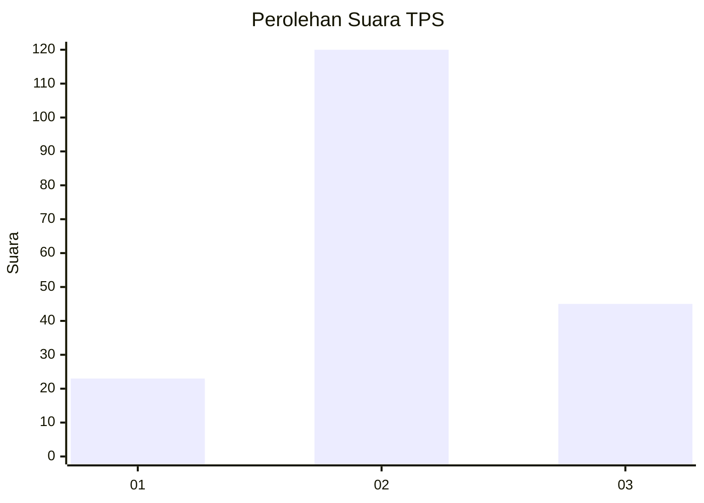
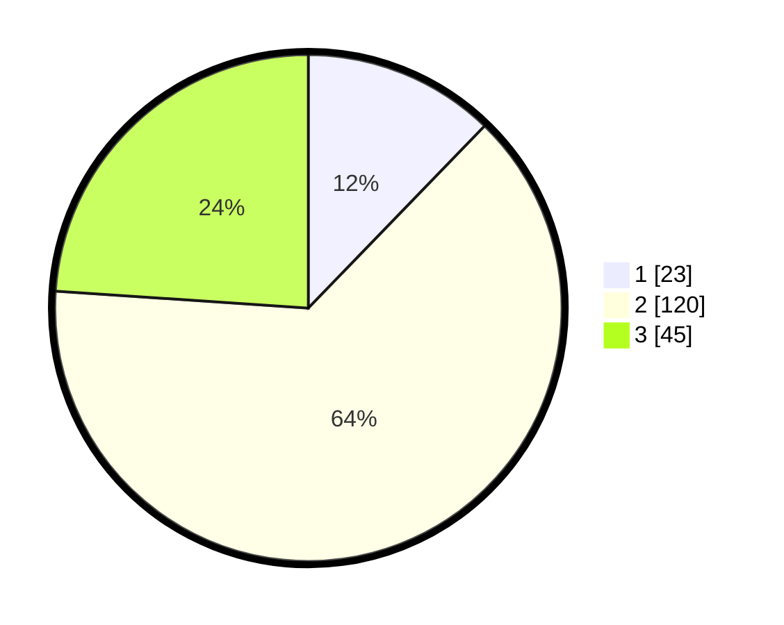

# Hasil

## Grafik

## Tabel

| No. | Nama Paslon    | Suara | Suara (raw) | Persentase |
|:--- |:-------------- | -----:| -----------:| ----------:|
| 1   | ANIES MUHAIMIN | 23    | [23][p-1]   | 12,23      |
| 2   | PRABOWO GIBRAN | 120   | [120][p-2]  | 63,83      |
| 3   | GANJAR MAHFUD  | 45    | [45][p-3]   | 23,94      |

[p-1]: https://github.com/gigit-pemilu/pemilu-2024-51-bali/blob/main/pilpres/hitung-suara/sub/51-bali/sub/08-buleleng/sub/06-buleleng/sub/1029-kampung-baru/sub/003-tps/sub/paslon-1.txt
[p-2]: https://github.com/gigit-pemilu/pemilu-2024-51-bali/blob/main/pilpres/hitung-suara/sub/51-bali/sub/08-buleleng/sub/06-buleleng/sub/1029-kampung-baru/sub/003-tps/sub/paslon-2.txt
[p-3]: https://github.com/gigit-pemilu/pemilu-2024-51-bali/blob/main/pilpres/hitung-suara/sub/51-bali/sub/08-buleleng/sub/06-buleleng/sub/1029-kampung-baru/sub/003-tps/sub/paslon-3.txt

## Foto C Plano

https://sirekap-obj-formc.kpu.go.id/bfd3/pemilu/ppwp/51/08/06/10/29/5108061029003-20240217-144147--624adc49-41f6-4f03-8570-ea0cc2257fbb.jpg

https://sirekap-obj-formc.kpu.go.id/bfd3/pemilu/ppwp/51/08/06/10/29/5108061029003-20240217-144153--733d966d-0fef-4210-abf0-c1c9de117081.jpg

https://sirekap-obj-formc.kpu.go.id/bfd3/pemilu/ppwp/51/08/06/10/29/5108061029003-20240217-144159--c0d5ec87-b27e-46c6-bbcb-9697062f6a92.jpg

## Metadata

| Key        | Value               |
| ---------- | ------------------- |
| Time Stamp | 2024-02-24 22:31:28 |

