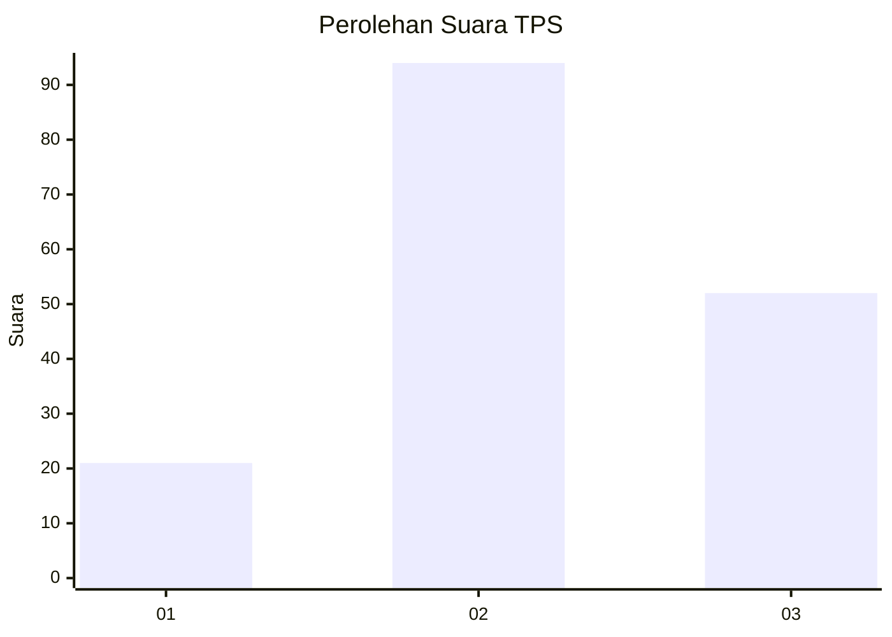
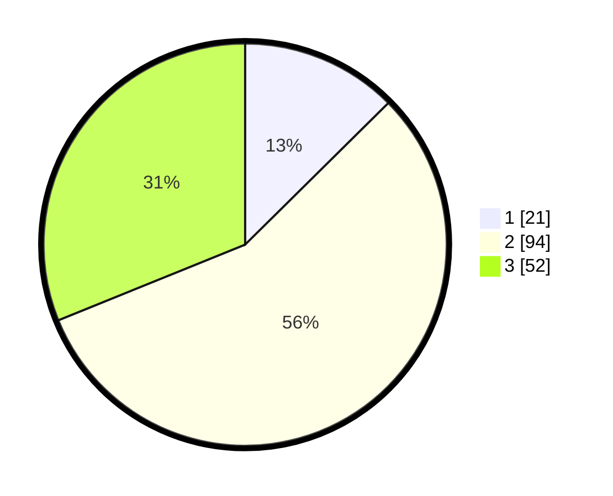

# Hasil

## Grafik

## Tabel

| No. | Nama Paslon    | Suara | Suara (raw) | Persentase |
|:--- |:-------------- | -----:| -----------:| ----------:|
| 1   | ANIES MUHAIMIN | 21    | [21][p-1]   | 12,57      |
| 2   | PRABOWO GIBRAN | 94    | [94][p-2]   | 56,29      |
| 3   | GANJAR MAHFUD  | 52    | [52][p-3]   | 31,14      |

[p-1]: https://github.com/gigit-pemilu/pemilu-2024-51-bali/blob/main/pilpres/hitung-suara/sub/51-bali/sub/08-buleleng/sub/06-buleleng/sub/1029-kampung-baru/sub/005-tps/sub/paslon-1.txt
[p-2]: https://github.com/gigit-pemilu/pemilu-2024-51-bali/blob/main/pilpres/hitung-suara/sub/51-bali/sub/08-buleleng/sub/06-buleleng/sub/1029-kampung-baru/sub/005-tps/sub/paslon-2.txt
[p-3]: https://github.com/gigit-pemilu/pemilu-2024-51-bali/blob/main/pilpres/hitung-suara/sub/51-bali/sub/08-buleleng/sub/06-buleleng/sub/1029-kampung-baru/sub/005-tps/sub/paslon-3.txt

## Foto C Plano

https://sirekap-obj-formc.kpu.go.id/2331/pemilu/ppwp/51/08/06/10/29/5108061029005-20240217-194244--85360c26-8898-42ae-91ce-0e6eff70e494.jpg

https://sirekap-obj-formc.kpu.go.id/2331/pemilu/ppwp/51/08/06/10/29/5108061029005-20240217-202200--f22f7658-90ff-4b97-9aef-364e46966805.jpg

https://sirekap-obj-formc.kpu.go.id/2331/pemilu/ppwp/51/08/06/10/29/5108061029005-20240217-202532--c3560705-51b6-49fe-b86b-091bc049ba92.jpg

## Metadata

| Key        | Value               |
| ---------- | ------------------- |
| Time Stamp | 2024-02-19 06:16:00 |

