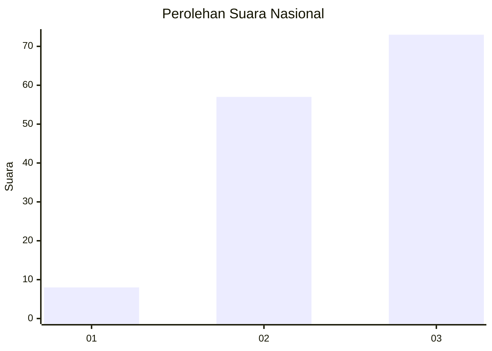
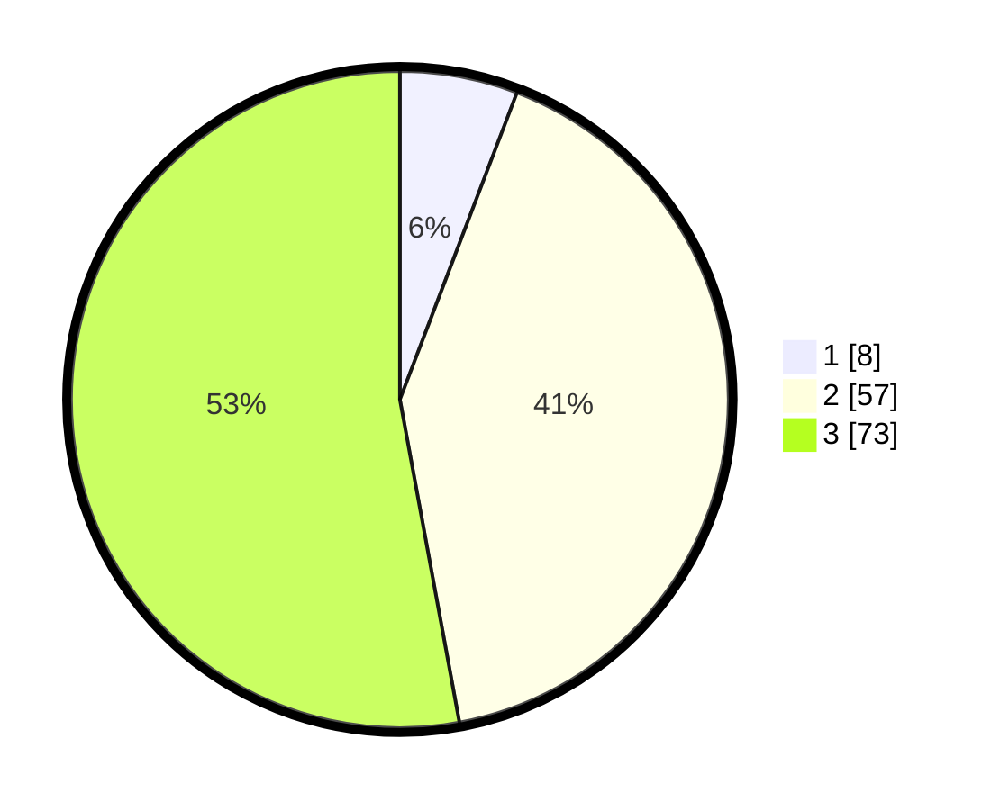

# Hasil

## Grafik

## Tabel

| No. | Nama Paslon    | Suara | Suara (raw) | Persentase |
|:--- |:-------------- | -----:| -----------:| ----------:|
| 1   | ANIES MUHAIMIN | 8     | [8][p-1]    | 5,80       |
| 2   | PRABOWO GIBRAN | 57    | [57][p-2]   | 41,30      |
| 3   | GANJAR MAHFUD  | 73    | [73][p-3]   | 52,90      |

[p-1]: https://github.com/gigit-pemilu/pemilu-2024/blob/main/pilpres/hitung-suara/sub/51-bali/sub/08-buleleng/sub/06-buleleng/sub/1029-kampung-baru/sub/010-tps/sub/paslon-1.txt
[p-2]: https://github.com/gigit-pemilu/pemilu-2024/blob/main/pilpres/hitung-suara/sub/51-bali/sub/08-buleleng/sub/06-buleleng/sub/1029-kampung-baru/sub/010-tps/sub/paslon-2.txt
[p-3]: https://github.com/gigit-pemilu/pemilu-2024/blob/main/pilpres/hitung-suara/sub/51-bali/sub/08-buleleng/sub/06-buleleng/sub/1029-kampung-baru/sub/010-tps/sub/paslon-3.txt

## Foto C Plano

https://sirekap-obj-formc.kpu.go.id/66c6/pemilu/ppwp/51/08/06/10/29/5108061029010-20240215-022238--5965f485-abe5-4ad3-8661-d5ab91d2d225.jpg

https://sirekap-obj-formc.kpu.go.id/66c6/pemilu/ppwp/51/08/06/10/29/5108061029010-20240214-224131--6a119e60-b3af-43d0-9ecf-ba04331e8c9a.jpg

https://sirekap-obj-formc.kpu.go.id/66c6/pemilu/ppwp/51/08/06/10/29/5108061029010-20240215-022347--15655af6-8608-4148-96e1-35588f247e0a.jpg

## Metadata

| Key        | Value               |
| ---------- | ------------------- |
| Time Stamp | 2024-02-24 22:31:28 |

