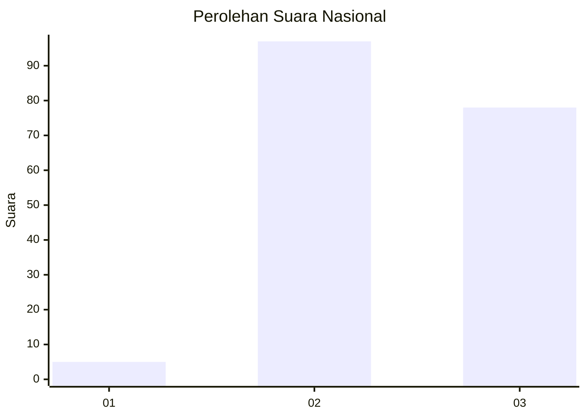
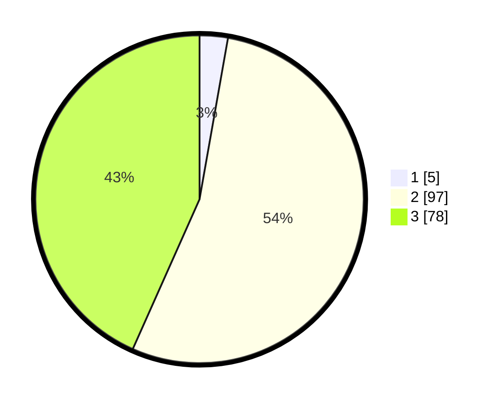

# Hasil

## Grafik

## Tabel

| No. | Nama Paslon    | Suara | Suara (raw) | Persentase |
|:--- |:-------------- | -----:| -----------:| ----------:|
| 1   | ANIES MUHAIMIN | 5     | [5][p-1]    | 2,78       |
| 2   | PRABOWO GIBRAN | 97    | [97][p-2]   | 53,89      |
| 3   | GANJAR MAHFUD  | 78    | [78][p-3]   | 43,33      |

[p-1]: https://github.com/gigit-pemilu/pemilu-2024/blob/main/pilpres/hitung-suara/sub/51-bali/sub/08-buleleng/sub/06-buleleng/sub/1029-kampung-baru/sub/021-tps/sub/paslon-1.txt
[p-2]: https://github.com/gigit-pemilu/pemilu-2024/blob/main/pilpres/hitung-suara/sub/51-bali/sub/08-buleleng/sub/06-buleleng/sub/1029-kampung-baru/sub/021-tps/sub/paslon-2.txt
[p-3]: https://github.com/gigit-pemilu/pemilu-2024/blob/main/pilpres/hitung-suara/sub/51-bali/sub/08-buleleng/sub/06-buleleng/sub/1029-kampung-baru/sub/021-tps/sub/paslon-3.txt

## Foto C Plano

https://sirekap-obj-formc.kpu.go.id/1c32/pemilu/ppwp/51/08/06/10/29/5108061029021-20240214-221715--b4c5e95e-c540-44f4-b7b9-a2e6f5ee15e0.jpg

https://sirekap-obj-formc.kpu.go.id/1c32/pemilu/ppwp/51/08/06/10/29/5108061029021-20240214-221821--2824e39f-d5e2-438c-8a46-e8b7bd40c127.jpg

https://sirekap-obj-formc.kpu.go.id/1c32/pemilu/ppwp/51/08/06/10/29/5108061029021-20240214-221916--abacc301-1dc4-42bb-a012-5beb08f2ebac.jpg

## Metadata

| Key        | Value               |
| ---------- | ------------------- |
| Time Stamp | 2024-02-17 14:45:18 |

## DATA PEMILIH TETAP

Jumlah pemilih dalam DPT: **265**.
 * L: **117**.
 * P: **148**.

## DATA PENGGUNA HAK PILIH

Jumlah pengguna hak pilih dalam DPT: **173**.
 * L: **78**.
 * P: **95**.

Jumlah pengguna hak pilih dalam DPTb: **0**.
 * L: **0**.
 * P: **0**.

Jumlah pengguna hak pilih dalam DPK: **8**.
 * L: **5**.
 * P: **3**.

Jumlah pengguna hak pilih: **181**.
 * L: **83**.
 * P: **98**.

## JUMLAH SUARA SAH DAN TIDAK SAH

JUMLAH SELURUH SUARA SAH: **180**.

JUMLAH SUARA TIDAK SAH: **1**.

JUMLAH SELURUH SUARA SAH DAN SUARA TIDAK SAH: **181**.

