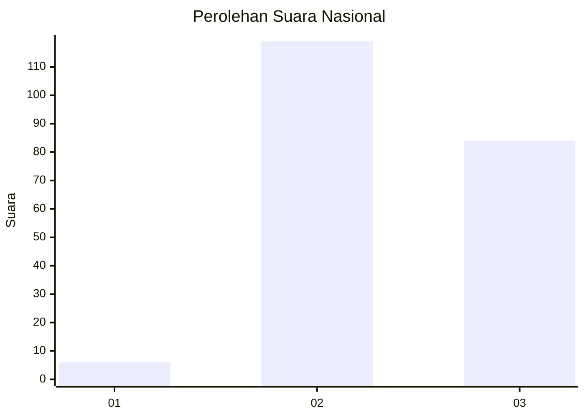
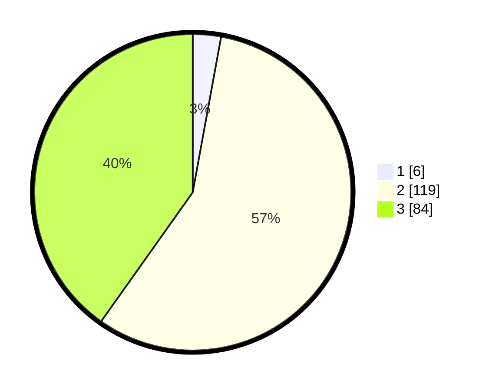

# Hasil

## Grafik

## Tabel

| No. | Nama Paslon    | Suara | Suara (raw) | Persentase |
|:--- |:-------------- | -----:| -----------:| ----------:|
| 1   | ANIES MUHAIMIN | 6     | [6][p-1]    | 2,87       |
| 2   | PRABOWO GIBRAN | 119   | [119][p-2]  | 56,94      |
| 3   | GANJAR MAHFUD  | 84    | [84][p-3]   | 40,19      |

[p-1]: https://github.com/gigit-pemilu/pemilu-2024/blob/main/pilpres/hitung-suara/sub/51-bali/sub/08-buleleng/sub/06-buleleng/sub/2001-kalibukbuk/sub/003-tps/sub/paslon-1.txt
[p-2]: https://github.com/gigit-pemilu/pemilu-2024/blob/main/pilpres/hitung-suara/sub/51-bali/sub/08-buleleng/sub/06-buleleng/sub/2001-kalibukbuk/sub/003-tps/sub/paslon-2.txt
[p-3]: https://github.com/gigit-pemilu/pemilu-2024/blob/main/pilpres/hitung-suara/sub/51-bali/sub/08-buleleng/sub/06-buleleng/sub/2001-kalibukbuk/sub/003-tps/sub/paslon-3.txt

## Foto C Plano

https://sirekap-obj-formc.kpu.go.id/4a55/pemilu/ppwp/51/08/06/20/01/5108062001003-20240214-213653--741427a0-3d45-4760-8ce8-f63d04277e76.jpg

https://sirekap-obj-formc.kpu.go.id/4a55/pemilu/ppwp/51/08/06/20/01/5108062001003-20240214-213853--057501df-6cbe-4a30-a679-0c6f2623cea1.jpg

https://sirekap-obj-formc.kpu.go.id/4a55/pemilu/ppwp/51/08/06/20/01/5108062001003-20240214-214044--a2a0b6d2-e85b-4eb4-b0b2-3bf7e3ef97e0.jpg

## Metadata

| Key        | Value               |
| ---------- | ------------------- |
| Time Stamp | 2024-02-24 22:31:28 |

