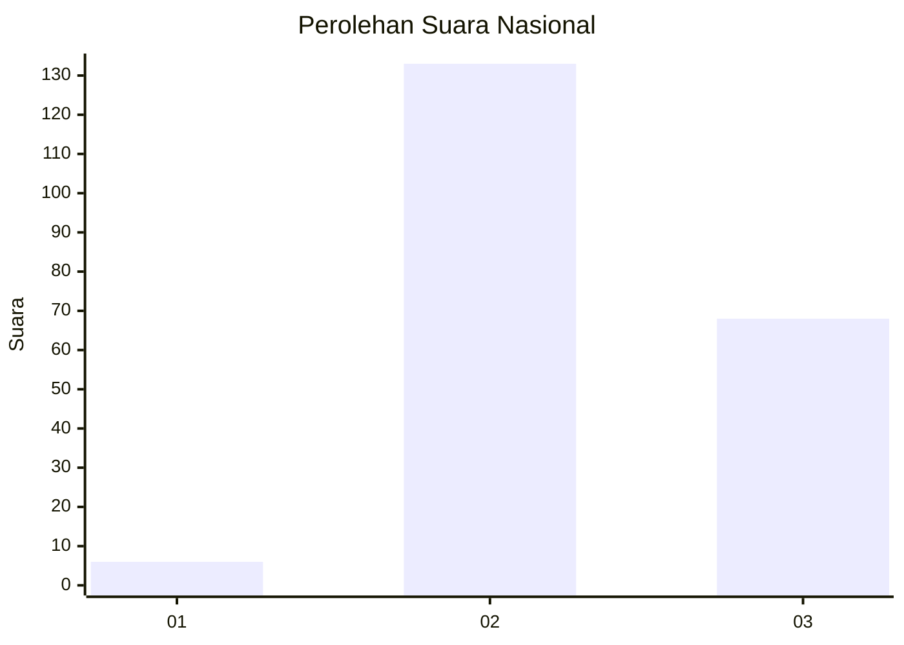
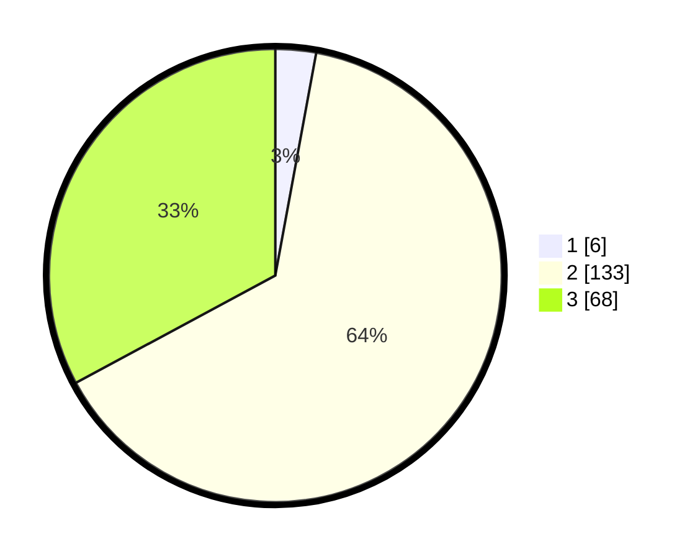

# Hasil

## Grafik

## Tabel

| No. | Nama Paslon    | Suara | Suara (raw) | Persentase |
|:--- |:-------------- | -----:| -----------:| ----------:|
| 1   | ANIES MUHAIMIN | 6     | [6][p-1]    | 2,90       |
| 2   | PRABOWO GIBRAN | 133   | [133][p-2]  | 64,25      |
| 3   | GANJAR MAHFUD  | 68    | [68][p-3]   | 32,85      |

[p-1]: https://github.com/gigit-pemilu/pemilu-2024/blob/main/pilpres/hitung-suara/sub/51-bali/sub/08-buleleng/sub/06-buleleng/sub/2001-kalibukbuk/sub/006-tps/sub/paslon-1.txt
[p-2]: https://github.com/gigit-pemilu/pemilu-2024/blob/main/pilpres/hitung-suara/sub/51-bali/sub/08-buleleng/sub/06-buleleng/sub/2001-kalibukbuk/sub/006-tps/sub/paslon-2.txt
[p-3]: https://github.com/gigit-pemilu/pemilu-2024/blob/main/pilpres/hitung-suara/sub/51-bali/sub/08-buleleng/sub/06-buleleng/sub/2001-kalibukbuk/sub/006-tps/sub/paslon-3.txt

## Foto C Plano

https://sirekap-obj-formc.kpu.go.id/12be/pemilu/ppwp/51/08/06/20/01/5108062001006-20240214-201238--d6cc1cb0-9944-41dc-9fcb-d0f5944dd8dd.jpg

https://sirekap-obj-formc.kpu.go.id/12be/pemilu/ppwp/51/08/06/20/01/5108062001006-20240214-224224--a5b17dee-faaf-48fe-95dd-a6a21420b779.jpg

https://sirekap-obj-formc.kpu.go.id/12be/pemilu/ppwp/51/08/06/20/01/5108062001006-20240214-201531--c6f65841-1238-4f4a-ac37-9c058a96a1f5.jpg

## Metadata

| Key        | Value               |
| ---------- | ------------------- |
| Time Stamp | 2024-02-24 22:31:28 |

