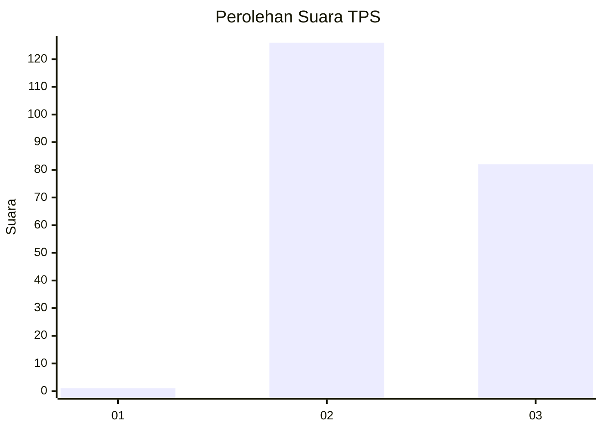
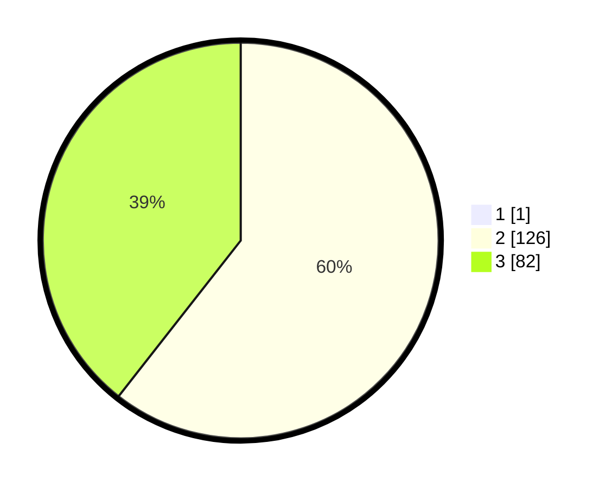

# Hasil

## Grafik

## Tabel

| No. | Nama Paslon    | Suara | Suara (raw) | Persentase |
|:--- |:-------------- | -----:| -----------:| ----------:|
| 1   | ANIES MUHAIMIN | 1     | [1][p-1]    | 0,48       |
| 2   | PRABOWO GIBRAN | 126   | [126][p-2]  | 60,29      |
| 3   | GANJAR MAHFUD  | 82    | [82][p-3]   | 39,23      |

[p-1]: https://github.com/gigit-pemilu/pemilu-2024-51-bali/blob/main/pilpres/hitung-suara/sub/51-bali/sub/08-buleleng/sub/06-buleleng/sub/2001-kalibukbuk/sub/011-tps/sub/paslon-1.txt
[p-2]: https://github.com/gigit-pemilu/pemilu-2024-51-bali/blob/main/pilpres/hitung-suara/sub/51-bali/sub/08-buleleng/sub/06-buleleng/sub/2001-kalibukbuk/sub/011-tps/sub/paslon-2.txt
[p-3]: https://github.com/gigit-pemilu/pemilu-2024-51-bali/blob/main/pilpres/hitung-suara/sub/51-bali/sub/08-buleleng/sub/06-buleleng/sub/2001-kalibukbuk/sub/011-tps/sub/paslon-3.txt

## Foto C Plano

https://sirekap-obj-formc.kpu.go.id/e669/pemilu/ppwp/51/08/06/20/01/5108062001011-20240214-234100--858f268d-aee1-4387-88eb-51ba36b09a33.jpg

https://sirekap-obj-formc.kpu.go.id/e669/pemilu/ppwp/51/08/06/20/01/5108062001011-20240214-234141--688b7cb9-3107-4996-be62-1199802dfbe3.jpg

https://sirekap-obj-formc.kpu.go.id/e669/pemilu/ppwp/51/08/06/20/01/5108062001011-20240214-234422--44a7c847-7918-48a4-a520-5049945f39c8.jpg

## Metadata

| Key        | Value               |
| ---------- | ------------------- |
| Time Stamp | 2024-02-24 22:31:28 |

