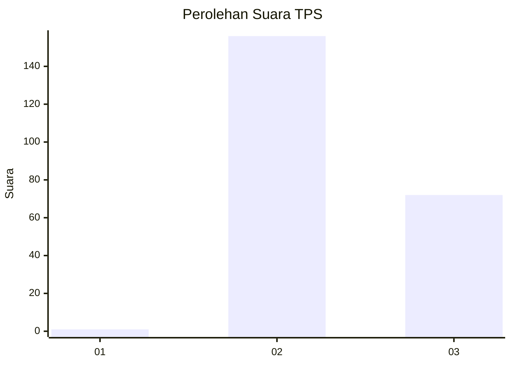
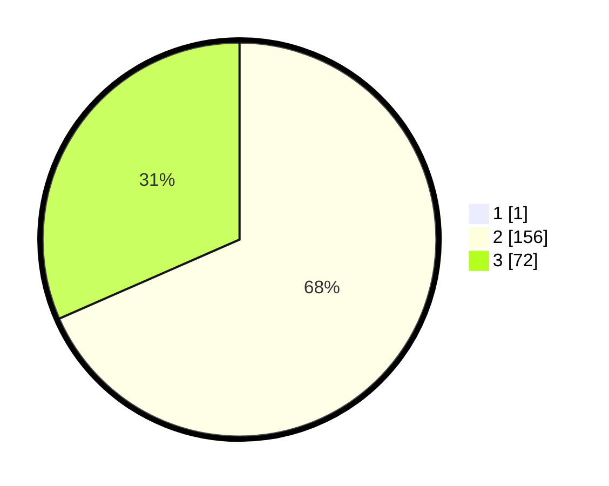

# Hasil

## Grafik

## Tabel

| No. | Nama Paslon    | Suara | Suara (raw) | Persentase |
|:--- |:-------------- | -----:| -----------:| ----------:|
| 1   | ANIES MUHAIMIN | 1     | [1][p-1]    | 0,44       |
| 2   | PRABOWO GIBRAN | 156   | [156][p-2]  | 68,12      |
| 3   | GANJAR MAHFUD  | 72    | [72][p-3]   | 31,44      |

[p-1]: https://github.com/gigit-pemilu/pemilu-2024-51-bali/blob/main/pilpres/hitung-suara/sub/51-bali/sub/08-buleleng/sub/06-buleleng/sub/2001-kalibukbuk/sub/018-tps/sub/paslon-1.txt
[p-2]: https://github.com/gigit-pemilu/pemilu-2024-51-bali/blob/main/pilpres/hitung-suara/sub/51-bali/sub/08-buleleng/sub/06-buleleng/sub/2001-kalibukbuk/sub/018-tps/sub/paslon-2.txt
[p-3]: https://github.com/gigit-pemilu/pemilu-2024-51-bali/blob/main/pilpres/hitung-suara/sub/51-bali/sub/08-buleleng/sub/06-buleleng/sub/2001-kalibukbuk/sub/018-tps/sub/paslon-3.txt

## Foto C Plano

https://sirekap-obj-formc.kpu.go.id/9ae2/pemilu/ppwp/51/08/06/20/01/5108062001018-20240214-203434--ed8ffe37-942c-44df-9c42-3bbad62fcf36.jpg

https://sirekap-obj-formc.kpu.go.id/9ae2/pemilu/ppwp/51/08/06/20/01/5108062001018-20240214-205455--faa16a3f-de51-4537-99a6-b964ea9fd7ad.jpg

https://sirekap-obj-formc.kpu.go.id/9ae2/pemilu/ppwp/51/08/06/20/01/5108062001018-20240214-205612--06266d37-f859-4a7d-add1-ed83d3a25e41.jpg

## Metadata

| Key        | Value               |
| ---------- | ------------------- |
| Time Stamp | 2024-02-24 22:31:28 |

