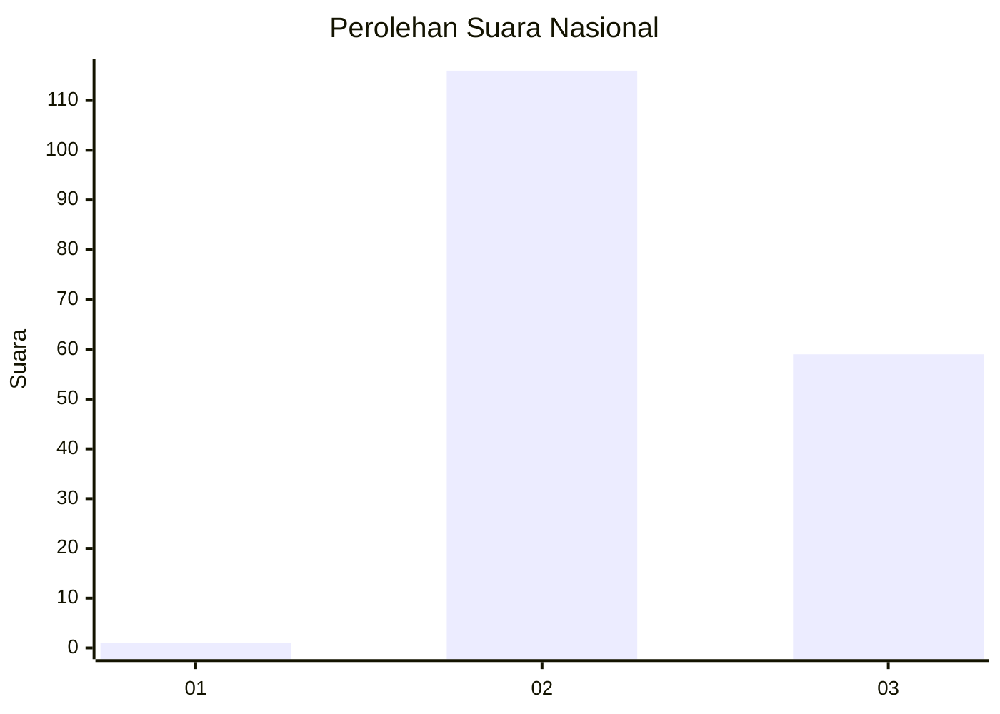
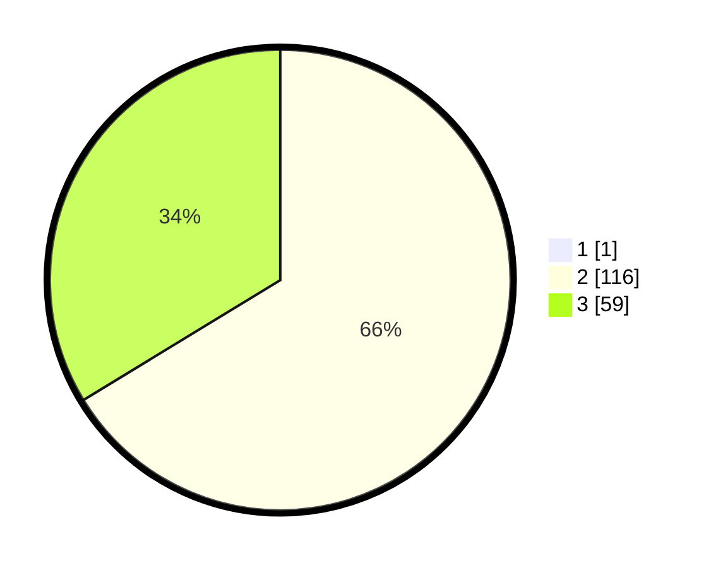

# Hasil

## Grafik

## Tabel

| No. | Nama Paslon    | Suara | Suara (raw) | Persentase |
|:--- |:-------------- | -----:| -----------:| ----------:|
| 1   | ANIES MUHAIMIN | 1     | [1][p-1]    | 0,57       |
| 2   | PRABOWO GIBRAN | 116   | [116][p-2]  | 65,91      |
| 3   | GANJAR MAHFUD  | 59    | [59][p-3]   | 33,52      |

[p-1]: https://github.com/gigit-pemilu/pemilu-2024/blob/main/pilpres/hitung-suara/sub/51-bali/sub/08-buleleng/sub/06-buleleng/sub/2002-anturan/sub/018-tps/sub/paslon-1.txt
[p-2]: https://github.com/gigit-pemilu/pemilu-2024/blob/main/pilpres/hitung-suara/sub/51-bali/sub/08-buleleng/sub/06-buleleng/sub/2002-anturan/sub/018-tps/sub/paslon-2.txt
[p-3]: https://github.com/gigit-pemilu/pemilu-2024/blob/main/pilpres/hitung-suara/sub/51-bali/sub/08-buleleng/sub/06-buleleng/sub/2002-anturan/sub/018-tps/sub/paslon-3.txt

## Foto C Plano

https://sirekap-obj-formc.kpu.go.id/0097/pemilu/ppwp/51/08/06/20/02/5108062002018-20240214-234138--81301ddc-2bbc-455d-8a93-a64549c4d711.jpg

https://sirekap-obj-formc.kpu.go.id/0097/pemilu/ppwp/51/08/06/20/02/5108062002018-20240214-235137--1c332257-c49d-4fa1-af05-aeec7565b9c8.jpg

https://sirekap-obj-formc.kpu.go.id/0097/pemilu/ppwp/51/08/06/20/02/5108062002018-20240214-235635--e6eb61bd-40cf-4127-b0f2-536ad4d53b2e.jpg

## Metadata

| Key        | Value               |
| ---------- | ------------------- |
| Time Stamp | 2024-02-24 22:31:28 |

