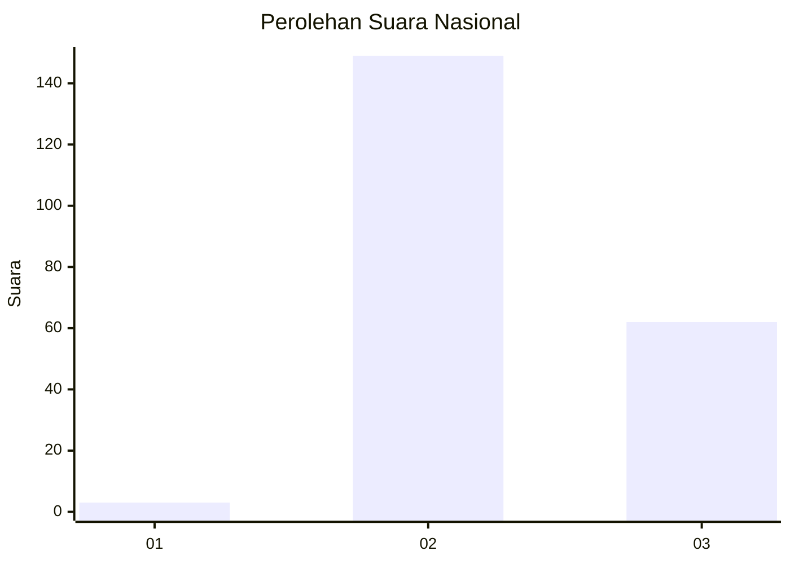

# Hasil

## Grafik

## Tabel

| No. | Nama Paslon    | Suara | Suara (raw) | Persentase |
|:--- |:-------------- | -----:| -----------:| ----------:|
| 1   | ANIES MUHAIMIN | 3     | [3][p-1]    | 1,40       |
| 2   | PRABOWO GIBRAN | 149   | [149][p-2]  | 69,63      |
| 3   | GANJAR MAHFUD  | 62    | [62][p-3]   | 28,97      |

[p-1]: https://github.com/gigit-pemilu/pemilu-2024/blob/main/pilpres/hitung-suara/sub/51-bali/sub/08-buleleng/sub/06-buleleng/sub/2002-anturan/sub/019-tps/sub/paslon-1.txt
[p-2]: https://github.com/gigit-pemilu/pemilu-2024/blob/main/pilpres/hitung-suara/sub/51-bali/sub/08-buleleng/sub/06-buleleng/sub/2002-anturan/sub/019-tps/sub/paslon-2.txt
[p-3]: https://github.com/gigit-pemilu/pemilu-2024/blob/main/pilpres/hitung-suara/sub/51-bali/sub/08-buleleng/sub/06-buleleng/sub/2002-anturan/sub/019-tps/sub/paslon-3.txt

## Foto C Plano

https://sirekap-obj-formc.kpu.go.id/e4ed/pemilu/ppwp/51/08/06/20/02/5108062002019-20240214-140950--3fd825c0-2198-406f-ab64-4f1b1bf7c4b0.jpg

https://sirekap-obj-formc.kpu.go.id/e4ed/pemilu/ppwp/51/08/06/20/02/5108062002019-20240214-141137--a309805d-2e70-4399-89b8-44632aa33354.jpg

https://sirekap-obj-formc.kpu.go.id/e4ed/pemilu/ppwp/51/08/06/20/02/5108062002019-20240214-141654--668f8624-4341-4dc8-9e61-61805f51ef84.jpg

## Metadata

| Key        | Value               |
| ---------- | ------------------- |
| Time Stamp | 2024-02-14 21:46:01 |

