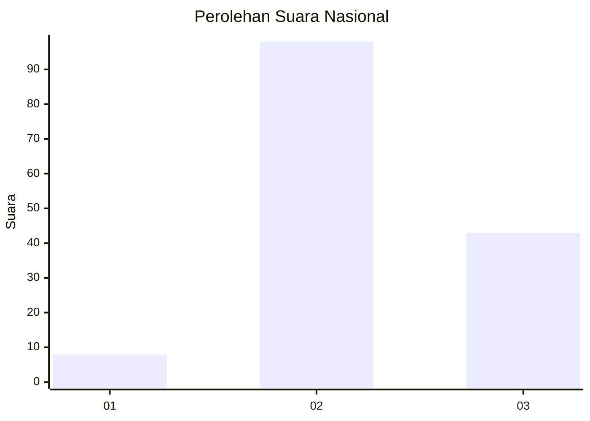
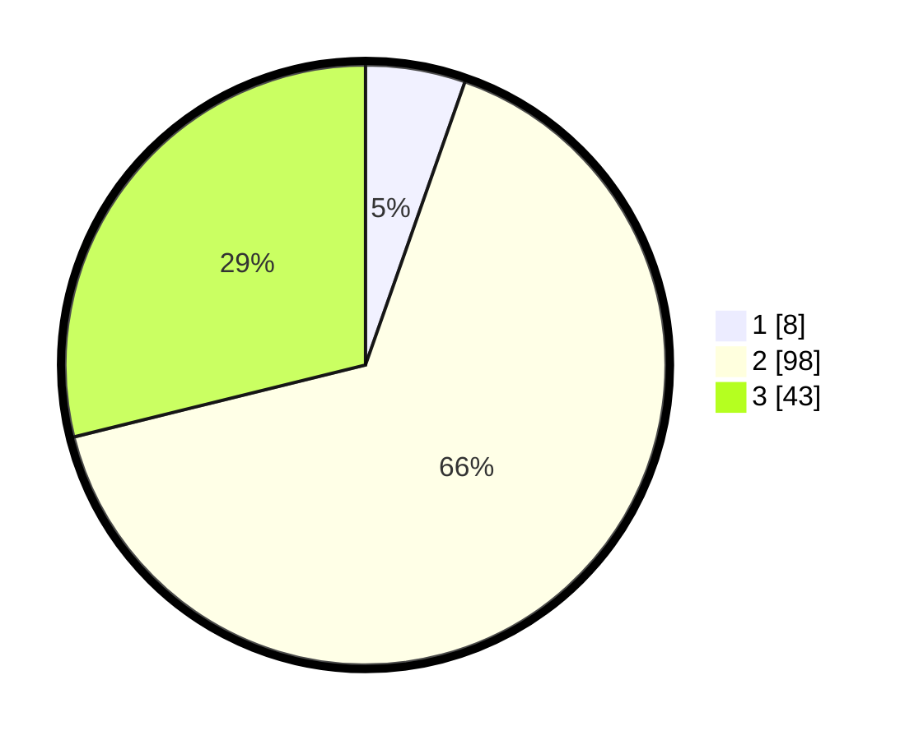

# Hasil

## Grafik

## Tabel

| No. | Nama Paslon    | Suara | Suara (raw) | Persentase |
|:--- |:-------------- | -----:| -----------:| ----------:|
| 1   | ANIES MUHAIMIN | 8     | [8][p-1]    | 5,37       |
| 2   | PRABOWO GIBRAN | 98    | [98][p-2]   | 65,77      |
| 3   | GANJAR MAHFUD  | 43    | [43][p-3]   | 28,86      |

[p-1]: https://github.com/gigit-pemilu/pemilu-2024/blob/main/pilpres/hitung-suara/sub/51-bali/sub/08-buleleng/sub/06-buleleng/sub/2003-tukadmungga/sub/010-tps/sub/paslon-1.txt
[p-2]: https://github.com/gigit-pemilu/pemilu-2024/blob/main/pilpres/hitung-suara/sub/51-bali/sub/08-buleleng/sub/06-buleleng/sub/2003-tukadmungga/sub/010-tps/sub/paslon-2.txt
[p-3]: https://github.com/gigit-pemilu/pemilu-2024/blob/main/pilpres/hitung-suara/sub/51-bali/sub/08-buleleng/sub/06-buleleng/sub/2003-tukadmungga/sub/010-tps/sub/paslon-3.txt

## Foto C Plano

https://sirekap-obj-formc.kpu.go.id/f659/pemilu/ppwp/51/08/06/20/03/5108062003010-20240214-234641--842c69b9-43de-402b-a3de-d70fdb6d45ca.jpg

https://sirekap-obj-formc.kpu.go.id/f659/pemilu/ppwp/51/08/06/20/03/5108062003010-20240214-234704--6396bfe9-a553-4fc8-b571-c8d3f4cb1013.jpg

https://sirekap-obj-formc.kpu.go.id/f659/pemilu/ppwp/51/08/06/20/03/5108062003010-20240214-234726--b35d3535-dbd2-4060-a505-2f1d32f792dd.jpg

## Metadata

| Key        | Value               |
| ---------- | ------------------- |
| Time Stamp | 2024-02-24 22:31:28 |

