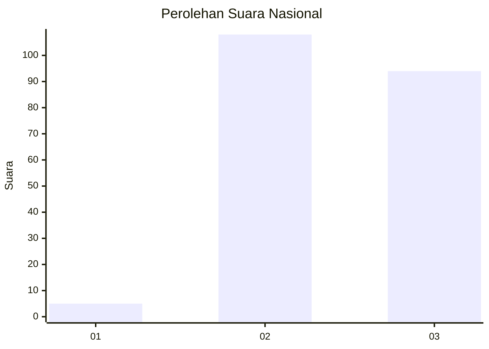
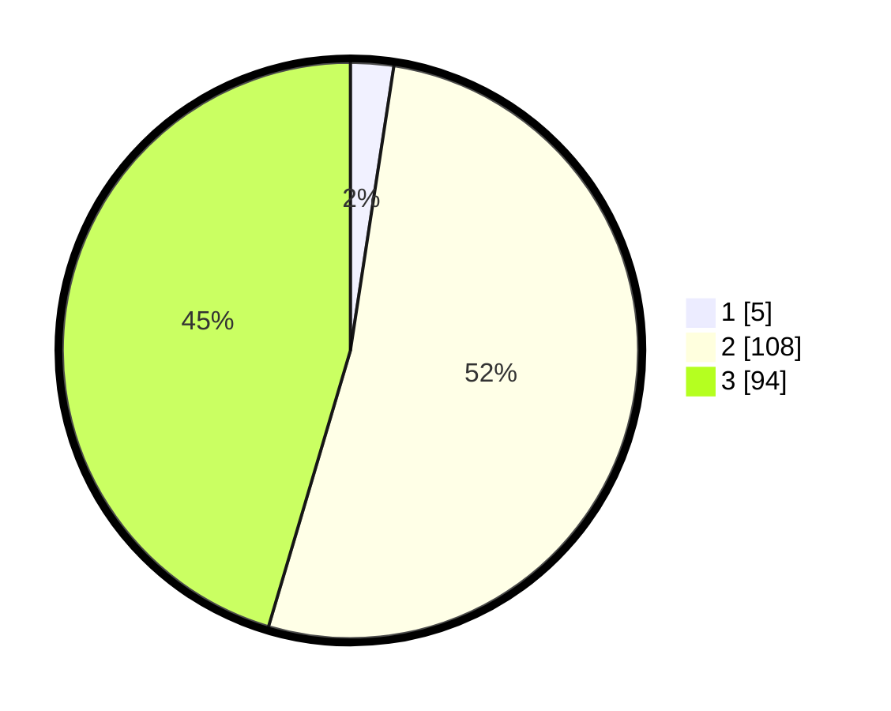

# Hasil

## Grafik

## Tabel

| No. | Nama Paslon    | Suara | Suara (raw) | Persentase |
|:--- |:-------------- | -----:| -----------:| ----------:|
| 1   | ANIES MUHAIMIN | 5     | [5][p-1]    | 2,42       |
| 2   | PRABOWO GIBRAN | 108   | [108][p-2]  | 52,17      |
| 3   | GANJAR MAHFUD  | 94    | [94][p-3]   | 45,41      |

[p-1]: https://github.com/gigit-pemilu/pemilu-2024/blob/main/pilpres/hitung-suara/sub/51-bali/sub/08-buleleng/sub/06-buleleng/sub/2004-pemaron/sub/004-tps/sub/paslon-1.txt
[p-2]: https://github.com/gigit-pemilu/pemilu-2024/blob/main/pilpres/hitung-suara/sub/51-bali/sub/08-buleleng/sub/06-buleleng/sub/2004-pemaron/sub/004-tps/sub/paslon-2.txt
[p-3]: https://github.com/gigit-pemilu/pemilu-2024/blob/main/pilpres/hitung-suara/sub/51-bali/sub/08-buleleng/sub/06-buleleng/sub/2004-pemaron/sub/004-tps/sub/paslon-3.txt

## Foto C Plano

https://sirekap-obj-formc.kpu.go.id/a4f0/pemilu/ppwp/51/08/06/20/04/5108062004004-20240214-225717--6087d7d4-9973-4acb-9a18-96b988604670.jpg

https://sirekap-obj-formc.kpu.go.id/a4f0/pemilu/ppwp/51/08/06/20/04/5108062004004-20240214-225723--1abac194-86e9-4fbf-b630-619ba3cfbe70.jpg

https://sirekap-obj-formc.kpu.go.id/a4f0/pemilu/ppwp/51/08/06/20/04/5108062004004-20240214-225729--2666d5a2-cfa7-4879-b443-586a5881dce1.jpg

## Metadata

| Key        | Value               |
| ---------- | ------------------- |
| Time Stamp | 2024-02-24 22:31:28 |

