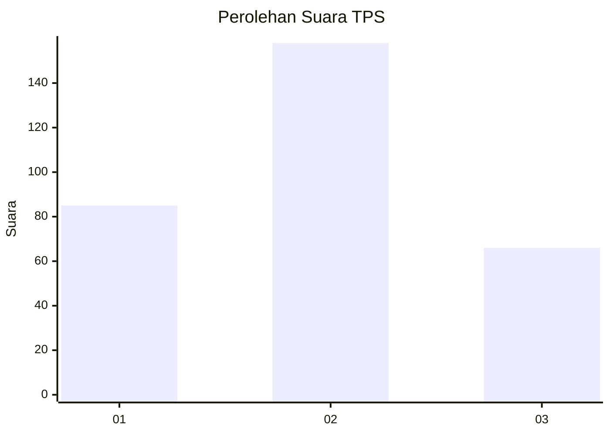
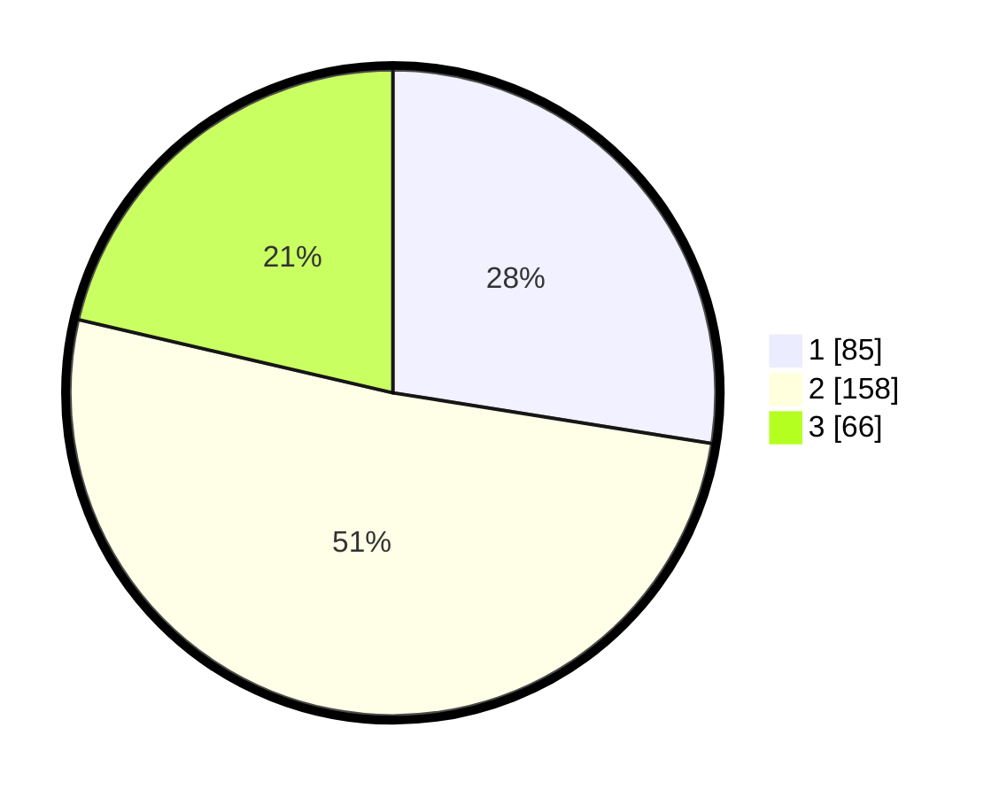

# Hasil

## Grafik

## Tabel

| No. | Nama Paslon    | Suara | Suara (raw) | Persentase |
|:--- |:-------------- | -----:| -----------:| ----------:|
| 1   | ANIES MUHAIMIN | 85    | [85][p-1]   | 27,51      |
| 2   | PRABOWO GIBRAN | 158   | [158][p-2]  | 51,13      |
| 3   | GANJAR MAHFUD  | 66    | [66][p-3]   | 21,36      |

[p-1]: https://github.com/gigit-pemilu/pemilu-2024-51-bali/blob/main/pilpres/hitung-suara/sub/51-bali/sub/08-buleleng/sub/06-buleleng/sub/2004-pemaron/sub/005-tps/sub/paslon-1.txt
[p-2]: https://github.com/gigit-pemilu/pemilu-2024-51-bali/blob/main/pilpres/hitung-suara/sub/51-bali/sub/08-buleleng/sub/06-buleleng/sub/2004-pemaron/sub/005-tps/sub/paslon-2.txt
[p-3]: https://github.com/gigit-pemilu/pemilu-2024-51-bali/blob/main/pilpres/hitung-suara/sub/51-bali/sub/08-buleleng/sub/06-buleleng/sub/2004-pemaron/sub/005-tps/sub/paslon-3.txt

## Foto C Plano

https://sirekap-obj-formc.kpu.go.id/5fb9/pemilu/ppwp/51/08/06/20/04/5108062004005-20240214-234733--3d2bf799-d298-4fcc-9b5d-aad87ebba722.jpg

https://sirekap-obj-formc.kpu.go.id/5fb9/pemilu/ppwp/51/08/06/20/04/5108062004005-20240214-234822--206bbc9d-f168-409a-831e-87bff94ee7d1.jpg

## Metadata

| Key        | Value               |
| ---------- | ------------------- |
| Time Stamp | 2024-02-17 18:30:00 |

